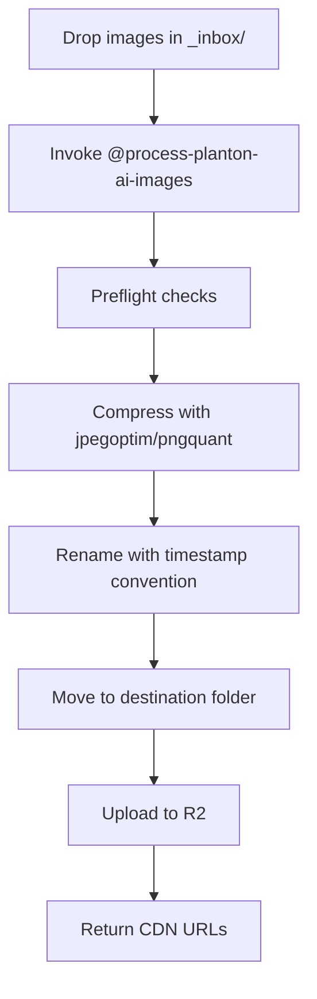

# Image Processing Pipeline for Planton.ai

**Date**: December 31, 2025
**Type**: Feature
**Components**: Build System, Content Management, Media, Documentation

## Summary

Implemented a comprehensive image processing pipeline that compresses, organizes, and uploads images to Cloudflare R2. The system includes a Python CLI tool with excellent developer experience, a cursor rule for AI-assisted processing, and migrates from the old `content/media/` structure to a new `content/assets/` organization with cleaner R2 URLs.

## Problem Statement

### Pain Points

- **Git repository bloat**: Raw screenshots (2-5 MB each) were committed directly, causing the repo to grow silently
- **Slow image delivery**: Unoptimized images served at full size, slowing page loads
- **Manual process**: No automation for compressing, naming, or organizing images
- **Fragmented storage**: Multiple R2 buckets (`planton-ai-media`, `planton-assets`) with unclear purposes
- **Redundant URLs**: Old URL pattern `assets.planton.ai/site/content/assets/images/...` was unnecessarily long

## Solution

Built a cursor rule-driven workflow backed by a Python CLI tool that automates the entire image lifecycle:



### Key Features

| Feature | Description |
|---------|-------------|
| Preflight checks | Verify jpegoptim, pngquant, and R2 credentials before processing |
| Smart compression | 60-70% size reduction for PNGs, 20-40% for JPEGs |
| Naming convention | `YYYY-MM-DD-HHMMSS-context-description.ext` |
| R2 mirror | `content/assets/` → `assets.planton.ai/site/` |
| Rich terminal UX | Colors, progress bars, helpful error messages |

### URL Structure (Simplified)

| Local Path | R2 URL |
|------------|--------|
| `content/assets/images/service-hub/x.png` | `https://assets.planton.ai/site/images/service-hub/x.png` |

## Implementation Details

### Python Tool Structure

```
tools/image_processor/
├── cli.py           # Main entry with Click + Rich
├── preflight.py     # Tool and auth verification
├── compressor.py    # JPEG/PNG compression
├── organizer.py     # Naming and file moves
├── uploader.py      # R2 sync with progress
├── config.py        # Bucket, paths, quality settings
└── requirements.txt # rich, click, Pillow, boto3
```

### Cursor Rule

Created `content/assets/_rules/process-planton-ai-images.mdc` that:
1. Analyzes context provided by the user
2. Determines appropriate naming and destination
3. Executes the Python tool
4. Reports resulting URLs for use in docs

### Folder Migration

Moved from `content/media/images/` to `content/assets/images/`:
- 9 root-level images
- 7 kubernetes-dashboard images
- 5 service-hub/deployment-environments images

### Documentation Updates

Updated 31 image references across 7 docs files to use new URL pattern:
- `public/docs/platform/getting-started.md`
- `public/docs/platform/connections.md`
- `public/docs/platform/platform-tour.md`
- `public/docs/platform/core-concepts.md`
- `public/docs/platform/index.md`
- `public/docs/service-hub/deployment-environments.md`
- `public/docs/service-hub/kubernetes-dashboard.md`

## Benefits

### For Developers
- **One-command processing**: Drop images, invoke rule, get URLs
- **Clear error messages**: Preflight checks tell you exactly what to fix
- **Consistent naming**: Timestamp prefix ensures uniqueness and chronological order

### For Repository
- **Smaller commits**: Compressed images before committing
- **Clean structure**: Single `content/assets/` location for all assets

### For Users
- **Faster page loads**: Optimized images served via Cloudflare CDN
- **Predictable URLs**: Simple mental model - `content/assets/X` → `assets.planton.ai/site/X`

## Files Changed

| File/Directory | Action | Purpose |
|----------------|--------|---------|
| `tools/image_processor/` | Created | Python CLI tool (7 files) |
| `content/assets/_rules/` | Created | Cursor rule + documentation |
| `content/assets/images/` | Created | New home for organized images |
| `content/media/` | Deleted | Migrated to content/assets/ |
| `Makefile` | Modified | Added sync-assets, check-images, inbox targets |
| `README.md` | Modified | Updated media management section |
| `public/docs/**/*.md` | Modified | Updated 31 image URLs |
| `.gitignore` | Modified | Added .venv/ |

## Prerequisites

```bash
# CLI tools
brew install jpegoptim pngquant

# Python environment
python3 -m venv .venv
source .venv/bin/activate
pip install -r tools/image_processor/requirements.txt

# R2 credentials
aws configure --profile r2
```

## Usage

```bash
# Check prerequisites
make check-images

# List inbox contents  
make inbox

# Sync assets to R2
make sync-assets

# Or invoke via cursor rule
@process-planton-ai-images
```

## Related Work

- Previous: Manual rclone sync to `planton-ai-media` bucket
- Reference: `planton-cloud/_changelog/2025-12/2025-12-30-191425-assets-and-downloads-r2-buckets.md` - R2 bucket consolidation

---

**Status**: ✅ Live
**Timeline**: ~3 hours

