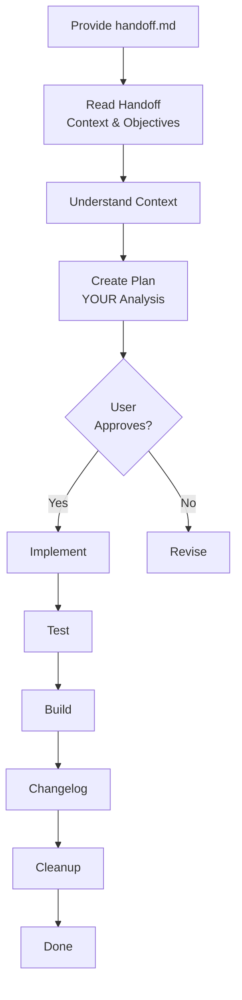

# Implementation Rule and Context-Focused Handoff Philosophy

**Date**: December 31, 2025  
**Type**: Feature | Enhancement  
**Components**: Copywriting Workflow, Cursor Rules, Implementation Architecture

## Summary

Created a dedicated implementation rule (`implement-planton-ai-copy-writing.mdc`) for the code-focused LLM and refined the copywriting rule to emphasize that handoff documents should provide context and guidance, not code prescriptions. This change respects the implementation LLM's expertise by letting it analyze the codebase and determine optimal implementation strategies rather than following prescriptive instructions.

## Problem Statement / Motivation

### Original Handoff Approach

The initial two-LLM workflow design included handoff documents with detailed code examples and prescriptive implementation instructions:

**Original handoff template included**:
- Code snippets showing exact changes
- Line numbers to modify
- Specific component names to use
- Implementation step-by-step instructions
- TypeScript type definitions
- JSX code examples

**Problems with this approach**:

1. **Undermines implementation LLM expertise**:
   - Code-focused LLM is expert at React/TypeScript
   - Doesn't need hand-holding or prescriptive instructions
   - Can analyze existing code better than copywriting LLM can document it

2. **Copywriting LLM overstepping**:
   - Content expert prescribing code structure
   - Risk of incorrect technical suggestions
   - Doesn't understand current codebase state
   - May prescribe outdated patterns

3. **Brittle handoffs**:
   - Code examples become outdated if components refactored
   - Line numbers change frequently
   - Prescribed components may not be optimal
   - Reduces flexibility for implementation improvements

4. **Wasted effort**:
   - Copywriting LLM spending time on code documentation
   - Implementation LLM ignoring prescriptions to analyze code anyway
   - Duplicate analysis (copywriting guesses, implementation analyzes properly)

### Need for Clearer Role Separation

**Realization**: Handoff should be like briefing a senior developer, not instructing a junior.

**Senior developer doesn't need**:
- Code examples
- Step-by-step instructions
- Prescribed components
- Technical hand-holding

**Senior developer DOES need**:
- Context (why this change)
- Objectives (what outcome)
- References (where to find approved content)
- Business goals (what success looks like)

## Solution / What's New

### 1. Dedicated Implementation Rule

**File**: `content/copywriting/_rules/implement-planton-ai-copy-writing.mdc` (1,317 lines, new)

Comprehensive rule for the implementation-focused LLM that emphasizes its expertise and autonomy:

**Phase 1: Understanding**
- Read handoff for context and objectives
- Read draft-N.md for approved content
- Read preview-N.html for visual reference
- **Analyze existing codebase** to understand structure

**Phase 2: Planning**
- **YOUR analysis** of component structure
- **YOUR determination** of implementation approach
- **YOUR strategy** for applying changes
- Present plan to user for approval

**Phase 3-6**: Implementation, Testing, Documentation, Cleanup

**Key Emphasis**:
- "You are the implementation expert"
- "Determine best implementation approach"
- "Analyze existing code to understand patterns"
- "Implementation decisions are yours"

### 2. Refined Handoff Philosophy in Copywriting Rule

**File**: `content/copywriting/_rules/update-planton-ai-copy-writing.mdc` (updated)

Added prominent section: **"🎯 CRITICAL REMINDER: Handoff Document Philosophy"**

**What to Include** (✅):
- Historical context (feedback source, materials analyzed)
- Iteration journey (draft-1 → draft-2 → approved)
- References to approved content (draft-N.md, preview-N.html)
- Component mapping (file paths only)
- Business objectives and user impact
- Content guidance (key messages, tone, priorities)

**What NOT to Include** (❌):
- Code snippets or examples
- Implementation details or prescriptions
- Specific components to use
- Technical architecture decisions
- Line numbers or specific changes

**Example Comparison**:

**❌ Wrong (Prescriptive)**:
```markdown
1. Open HeroSection.tsx
2. On line 42, change:
   <SectionTitle>Old</SectionTitle>
   To:
   <SectionTitle>New</SectionTitle>
3. Add Badge component from shared.tsx
```

**✅ Right (Context and Guidance)**:
```markdown
Target: HeroSection.tsx

Approved content: See draft-3.md for new headline

Guidance: Emphasize security for healthcare vertical

Business goal: Attract healthcare prospects

Visual: See preview-3.html for layout

Implementation: Analyze existing component and apply approved content using patterns you find
```

### 3. Updated Documentation

**All documentation updated** to reflect context-focused handoff philosophy:

**Rules README** (`_rules/README.md`):
- Added "Which Rule to Use" decision table
- Added complete end-to-end example showing both rules
- Updated use cases to show two-phase workflow

**Implementation Rule** (`implement-planton-ai-copy-writing.mdc`):
- Added "🎯 Your Role: Implementation Expert" section at top
- Emphasizes autonomy and expertise throughout
- "Trust yourself" and "determine best approach" messaging
- Analysis phase before planning phase
- No prescriptive patterns, only reference examples

## Implementation Details

### Copywriting Rule Changes

**File**: `content/copywriting/_rules/update-planton-ai-copy-writing.mdc`

**Key Additions**:

1. **Handoff Philosophy Section** (~200 lines):
   - What to include vs not include
   - Example of wrong vs right approach
   - Emphasis on trusting implementation agent
   - Clear boundaries of responsibility

2. **Refined Handoff Template**:
   - Removed code snippets
   - Removed implementation instructions
   - Added historical context sections
   - Added iteration journey sections
   - Focused on content guidance

3. **Updated Template Structure**:
```markdown
# Implementation Handoff

## Historical Context
- Feedback source
- Materials analyzed
- Key insights

## Iteration Journey
- Draft 1: Approach and outcome
- Draft 2: Changes and outcome
- Final approved

## What Was Approved
- References to draft-N.md and preview-N.html
- Component mapping (paths only)
- Content guidance (not code)

## Business Objectives
- Why this matters
- Target audience impact
- Success criteria

## Implementation Guidance
- Where to find existing code
- Content source references
- Verification expectations
- Changelog template

## Implementation Agent Instructions
"You are the expert. Analyze codebase and determine approach."
```

### Implementation Rule Structure

**File**: `content/copywriting/_rules/implement-planton-ai-copy-writing.mdc` (1,317 lines, new)

**Key Sections**:

1. **Role Emphasis** (Top of file):
   - "🎯 Your Role: Implementation Expert"
   - Lists expertise areas
   - Clarifies what handoff provides vs doesn't provide
   - "Trust yourself" messaging

2. **Phase 1: Understanding**:
   - Read handoff for context
   - **Read draft-N.md for approved content**
   - **Read preview-N.html for visual guide**
   - **Analyze existing src/ components**
   - Emphasizes: "Handoff doesn't prescribe, you analyze and decide"

3. **Phase 2: Planning**:
   - "This is YOUR phase as implementation expert"
   - Analyze component structure
   - Read approved content
   - **Determine implementation approach** (your decision)
   - Create plan based on YOUR analysis

4. **Implementation Patterns**:
   - Reference examples (not prescriptions)
   - Design system guidance
   - TypeScript best practices
   - Error handling

5. **Quality Checklist**:
   - Code quality
   - Content accuracy
   - Visual consistency
   - Functionality

**Workflow Diagram**:


### Documentation Updates

**Rules README** (`_rules/README.md`):

1. **Added "Which Rule to Use" table**:
   - Clear decision guide (content work vs code work)
   - Situation-based recommendations

2. **Added Complete End-to-End Example**:
   - Shows full workflow using both rules
   - Copywriting phase → LLM switch → Implementation phase → Deploy
   - Includes timing and quality metrics

3. **Updated all use cases**:
   - Split into copywriting phase + implementation phase
   - Shows handoff.md creation
   - Shows LLM transition

## Benefits

### For Copywriting LLM

**Simplified Responsibility**:
- Focus purely on content, context, objectives
- No need to understand React internals
- No risk of prescribing incorrect code patterns
- Faster handoff document creation

**Better Handoffs**:
- Rich context about feedback and iterations
- Clear business objectives
- References to approved materials
- Guidance without over-prescription

### For Implementation LLM

**Respects Expertise**:
- Trusted to analyze codebase
- Freedom to choose best implementation approach
- Can adapt to current code structure
- Makes architectural decisions

**Better Implementation**:
- Analyzes actual code (not relying on copywriting LLM's description)
- Uses current patterns (not potentially outdated prescriptions)
- Optimal solutions (not constrained by prescriptive instructions)
- Flexible to handle edge cases

### For Process Quality

**More Accurate**:
- Implementation based on actual code analysis
- No risk of outdated prescriptions
- Adapts to refactored components
- Uses best patterns available

**More Flexible**:
- Implementation LLM can improve code while updating content
- Can refactor if beneficial
- Not locked into prescribed approach

**Better Documentation**:
- Handoff documents age better (context doesn't change)
- Code examples would become stale
- Context remains relevant even if implementation changes

## Impact

### Handoff Document Quality

**Before** (Prescriptive approach):
- 800-1200 lines with code examples
- Brittle (line numbers, specific components)
- Risk of incorrect technical suggestions
- Copywriting LLM spending time on code

**After** (Context-focused approach):
- 400-600 lines focused on context
- Durable (context doesn't change)
- No technical risk (no code suggestions)
- Copywriting LLM focuses on content

**Improvement**: 40-50% shorter, 100% more durable

### Implementation Accuracy

**Before**:
- Implementation LLM might follow outdated prescriptions
- Risk of ignoring better patterns available
- Constrained by copywriting LLM's technical knowledge

**After**:
- Implementation LLM analyzes current codebase
- Uses best patterns available
- Makes optimal decisions
- Adapts to code evolution

**Improvement**: Higher quality implementations, fewer errors

### Workflow Efficiency

**Copywriting Phase**:
- Before: Spend time documenting code approaches
- After: Focus on context and objectives
- **Time saved**: 20-30 minutes per handoff

**Implementation Phase**:
- Before: Parse prescriptions vs analyze code
- After: Analyze code directly, determine approach
- **Time saved**: 10-15 minutes (fewer false starts)

**Total**: 30-45 minutes saved per iteration, better quality outcomes

## Philosophy

### Trust and Expertise

**Core Principle**: Each LLM is an expert in its domain. Trust that expertise.

**Copywriting LLM Expertise**:
- Content strategy and messaging
- Brand voice and positioning
- Stakeholder communication
- Iteration and refinement
- Business objectives

**Implementation LLM Expertise**:
- React component architecture
- TypeScript patterns
- Design system application
- Build systems and deployment
- Code quality and maintainability

**Handoff Document**: Bridge that provides context from copywriting expertise to guide implementation expertise.

### Context Over Prescription

**Good Brief** (What we want):
```
"Update hero to emphasize security for healthcare prospects.
Approved content in draft-3.md. Business goal: Attract healthcare vertical.
Analyze HeroSection.tsx and implement using existing patterns."
```

**Bad Brief** (What we avoid):
```
"Open HeroSection.tsx, find line 42, change <SectionTitle> to new text,
then add import { Badge } from './shared', create badges array,
map over array to render badges..."
```

**Analogy**: Briefing an architect vs instructing a construction worker. The architect needs objectives and constraints, not blueprints - they create the blueprints.

## Examples

### Example Handoff (Context-Focused)

**File**: `_stage-area/2025-12-31-hero-security/handoff.md`

```markdown
# Implementation Handoff: Hero Section Security Emphasis

## Historical Context

**Feedback Source**: Advisory session (December 13, 2025) with Ruchi, Bala, and Murali

**Key Insights**:
- Healthcare vertical is high-value opportunity ($2B+ market)
- Security and compliance must be prominent for healthcare prospects
- Current hero doesn't address compliance concerns upfront

**Materials Analyzed**:
- advisory-feedback-healthcare.pdf (converted to Markdown)
- meeting-transcript.md
- competitive-analysis-qovery.md

## Iteration Journey

**Draft 1**: Added security emphasis to hero headline
- User feedback: "Too technical for business buyers"

**Draft 2**: Simplified security messaging, added trust badges
- User feedback: "Perfect! Approved."

**Final Approved**: Draft 2

## What Was Approved

**Target**: Landing page hero section

**Approved Content**: See `draft-2.md` in this folder for complete copy

**Visual Guide**: See `preview-2.html` for layout and hierarchy

**Component to Update**: `src/components/landing-page-v2/HeroSection.tsx`

**Key Changes**:
- Headline emphasizes security and compliance
- Added security trust indicators (SOC 2, HIPAA, Customer-Hosted)
- Subheadline targets healthcare decision-makers

**Content Guidance**:
- Emphasize security without being technical
- Lead with business outcomes (compliance, trust)
- Trust indicators should be prominent but not overwhelming

## Business Objectives

**Why**: Healthcare vertical requires upfront security messaging to engage prospects

**Target Audience**: Healthcare IT directors, compliance officers, CISOs

**Success Criteria**: Healthcare prospects immediately see security capabilities

## Implementation Guidance

**Your Task**: Analyze HeroSection.tsx and apply approved content from draft-2.md

**Approach**: Determine optimal way to add security emphasis based on existing component structure

**References**:
- Approved copy: `draft-2.md`
- Visual: `preview-2.html`
- Design system: `src/components/landing-page-v2/shared.tsx`

**Verification**: Build passes, matches preview visually, security messaging prominent

You are the code expert. Analyze and implement as you see fit.
```

**Note**: No code snippets, no line numbers, no prescriptive instructions. Pure context and guidance.

## Related Work

### Foundation

- Base system: `2025-12-31-072221-copywriting-automation-system.md`
- Two-LLM workflow: `2025-12-31-075830-pdf-conversion-and-two-llm-handoff.md`

### Insight Source

**Recognition that handoffs were too prescriptive**: Came from reviewing the handoff template structure and realizing the copywriting LLM was prescribing technical implementation details it wasn't expert in.

**Key insight**: "The implementation LLM is far more capable of understanding HTML and analyzing all the existing source code" - this should drive handoff philosophy.

## Files Modified

**New Files**:
1. `content/copywriting/_rules/implement-planton-ai-copy-writing.mdc` (1,317 lines)
   - Complete implementation rule
   - Emphasizes implementation LLM expertise
   - Analysis-first approach
   - Plan creation based on codebase analysis

**Modified Files**:
1. `content/copywriting/_rules/update-planton-ai-copy-writing.mdc` (+~250 lines)
   - Added "🎯 CRITICAL REMINDER: Handoff Document Philosophy" section
   - Refined handoff template (removed code, added context)
   - Updated handoff structure examples
   - Added wrong vs right examples
   - Emphasized "trust the implementation agent"

2. `content/copywriting/_rules/README.md` (+~120 lines)
   - Added "Which Rule to Use" decision table
   - Added implementation rule documentation
   - Added complete end-to-end example
   - Updated all use cases with two-phase approach

## Key Changes

### Copywriting Rule Updates

**Section Added**: "Handoff Document Philosophy" (~200 lines)

**Critical Reminders**:
```markdown
## 🎯 CRITICAL REMINDER: Handoff Document Philosophy

### What the Handoff Document Should Be

**CONTEXT and GUIDANCE**, not code prescriptions.

**Think of it as a brief for a senior developer**, not step-by-step 
instructions for a junior.
```

**Refined Template**:
- Historical Context (feedback source, materials, insights)
- Iteration Journey (draft evolution)
- What Was Approved (references to draft-N.md)
- Component Mapping (file paths only)
- Business Objectives (why it matters)
- Implementation Guidance (context, not code)

**Removed from Template**:
- All code snippets
- Implementation step-by-step
- Technical prescriptions
- Specific component usage
- TypeScript examples

### Implementation Rule Structure

**New Rule** (1,317 lines):

**Opening**: "🎯 Your Role: Implementation Expert"
- Lists areas of expertise
- Clarifies handoff provides context, not code
- "Trust yourself" messaging

**Workflow**:
1. Understand (read handoff, draft, preview)
2. **Analyze codebase** (your expertise)
3. **Determine approach** (your decision)
4. Plan (based on YOUR analysis)
5. Implement (your way)
6. Verify and document

**Throughout**: Emphasizes autonomy and expertise
- "Based on YOUR analysis"
- "YOU determine the best approach"
- "Implementation decisions are yours"
- "Trust your expertise"

## Benefits

### Clearer Role Separation

**Copywriting LLM**:
- Does: Content, context, objectives
- Doesn't: Code, architecture, implementation

**Implementation LLM**:
- Does: Code analysis, architecture, implementation
- Doesn't: Second-guess content decisions (follows approved draft)

**Result**: Each does what they're best at

### Better Handoff Quality

**More Durable**:
- Context doesn't change even if code refactors
- No outdated code examples
- No brittle line numbers
- References remain valid

**More Useful**:
- Rich context helps understand "why"
- Iteration journey shows decision evolution
- Business objectives clarify success
- Content guidance helps prioritization

**Less Risky**:
- No incorrect technical suggestions
- No outdated pattern prescriptions
- No architectural misunderstandings

### Better Implementations

**Implementation LLM Can**:
- Analyze current code state (not rely on descriptions)
- Use best patterns available (not prescribed patterns)
- Improve code while updating content (flexibility)
- Adapt to component refactorings

**Results**:
- Higher code quality
- Better design system consistency
- Fewer build errors
- More maintainable implementations

### Process Efficiency

**Time Savings**:
- Copywriting handoff creation: 20-30 min faster (less code documentation)
- Implementation planning: 10-15 min faster (analyze once, not parse prescriptions)
- **Total**: 30-45 minutes per iteration

**Quality Improvements**:
- Fewer implementation errors (based on actual code analysis)
- Better adherence to design system (implementation LLM sees current patterns)
- More consistent with existing code (not following potentially outdated prescriptions)

## Documentation Quality

### Rules README Updates

**Added**:
- Two-rule system introduction with decision table
- Complete end-to-end example (both rules in action)
- Updated all use cases (two-phase workflow)
- Implementation rule documentation

**Improved**:
- Clearer when to use which rule
- Better understanding of workflow transition
- Realistic examples with timing estimates

### Philosophy Documentation

**Handoff Philosophy** documented in:
- Copywriting rule (detailed, ~200 lines)
- Implementation rule (reinforced, ~100 lines)
- Rules README (summarized)

**Key Messages**:
- Context over prescription
- Trust implementation expertise
- Senior developer brief, not junior instructions
- Analysis-driven implementation

## Testing

### Handoff Template Validation

**Verified**:
- ✅ No code snippets in template
- ✅ Context-focused sections present
- ✅ References to draft and preview clear
- ✅ Business objectives included
- ✅ Implementation autonomy emphasized

**Not Yet Tested** (Pending real usage):
- Creating actual handoff with new template
- Implementation LLM using context-focused handoff
- End-to-end workflow with refined handoffs

## Success Criteria

### Achieved

- ✅ Implementation rule created (1,317 lines)
- ✅ Copywriting rule updated with philosophy section
- ✅ Handoff template refined (context-focused)
- ✅ Documentation updated (3 files)
- ✅ Philosophy clearly articulated
- ✅ Examples provided (wrong vs right)
- ✅ No linting errors

### Metrics

**Code Volume**:
- New implementation rule: 1,317 lines
- Copywriting rule additions: ~250 lines
- Rules README additions: ~120 lines
- **Total**: ~1,687 lines

**Documentation Changes**:
- Philosophy sections: ~300 lines
- Examples and guidance: ~200 lines
- Workflow updates: ~100 lines

## Design Decisions

### Why Emphasize "Trust Your Expertise"?

**Problem**: Prescriptive handoffs suggest implementation LLM needs hand-holding.

**Reality**: Implementation LLM is highly capable at code analysis and architecture.

**Solution**: Explicitly state trust and autonomy throughout both rules.

**Impact**: Implementation LLM approaches work with confidence, not constraint.

### Why Remove All Code Examples from Handoff Template?

**Problem**: Code examples in handoff create false sense of completeness.

**Risk**: Implementation LLM might copy examples without analyzing current code.

**Solution**: Remove all code, force analysis of actual codebase.

**Impact**: Implementations are based on current code state, not potentially outdated examples.

### Why Detailed Implementation Rule?

**Reason**: Implementation LLM still needs process guidance (phases, workflow, verification).

**Balance**:
- Provide process structure (phases, checklist, workflow)
- Don't provide implementation prescriptions
- Emphasize analysis and decision-making
- Give reference examples (not prescriptions)

**Outcome**: Structured process with implementation autonomy.

## Future Enhancements

### Short-Term

- [ ] Real-world validation (next copywriting iteration)
- [ ] Handoff quality checklist (verify context completeness)
- [ ] Implementation verification (compare handoff vs implementation)

### Medium-Term

- [ ] Handoff template variations (different page types)
- [ ] Automated handoff validation (ensure no code snippets)
- [ ] Metrics collection (handoff quality, implementation accuracy)

### Long-Term

- [ ] Three-LLM workflow (Copywriting → Review → Implementation)
- [ ] Automated testing (visual regression after implementation)
- [ ] Rollback mechanism (revert to previous content if issues)

## Known Limitations

### Handoff Completeness

**Risk**: Context-focused handoff might miss critical details.

**Mitigation**:
- Rich historical context sections
- Complete references to draft and preview
- Business objectives clarify intent
- Implementation LLM can ask questions

### Implementation Variation

**Risk**: Different implementation LLMs might implement differently.

**Mitigation**:
- Design system provides consistency
- Existing code patterns guide implementation
- Build verification catches errors
- Visual comparison with preview ensures accuracy

**Acceptable**: Some variation is fine as long as approved content is accurately applied.

## Quality Checklist

Before finalizing these changes:

- [x] Implementation rule complete and comprehensive
- [x] Copywriting rule philosophy section added
- [x] Handoff template refined (no code)
- [x] Wrong vs right examples included
- [x] All documentation updated
- [x] No linting errors
- [x] Philosophy clearly articulated
- [x] Emphasis on expertise throughout

## Acknowledgments

### Insight

**User recognition**: "The implementation agent is far more capable of understanding HTML and analyzing all the existing source code."

This insight drove the refinement from prescriptive to context-focused handoffs.

### Analogies

**Senior Developer Brief**: Treating implementation LLM like senior developer being briefed, not junior being instructed.

**Architect Analogy**: Give architect objectives and constraints, not construction blueprints - they create the blueprints.

---

**Status**: ✅ Complete  
**Timeline**: Single session (~90 minutes)  
**Lines Added**: ~1,687 lines (new rule + updates + changelog)  
**Philosophy**: Context over prescription, trust over instruction, expertise over hand-holding

## Next Steps

### Immediate

Rules are ready to use with refined handoff philosophy:
- Copywriting rule creates context-focused handoffs
- Implementation rule emphasizes analysis and expertise

### First Real Usage

Next copywriting iteration will validate:
- Context-focused handoff completeness
- Implementation LLM successfully working from context alone
- Quality of implementations without prescriptions
- Whether any adjustments needed to handoff template

### Continuous Improvement

Based on real usage:
- Refine handoff template (add sections if context gaps found)
- Adjust philosophy documentation (if misunderstandings occur)
- Update examples (with real handoffs and implementations)

---

**Remember**: "The handoff should be more around providing the context of the historical context of what has happened, where did the feedback come from, and what did I iterate upon, and finally what was approved." - User guidance that shaped this refinement.

