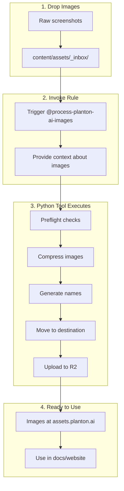

# Asset Processing Rules

Cursor rules for managing assets in the planton.ai website.

## Overview

This folder contains cursor rules that automate asset management workflows. These rules integrate with Python tools to provide a seamless experience for adding, processing, and publishing assets.

## Available Rules

| Rule | Purpose |
|------|---------|
| `process-planton-ai-images.mdc` | Process images from inbox: compress, rename, organize, upload to R2 |

## Architecture



## Image Processing Workflow

### Step 1: Add Images to Inbox

Drop screenshots or images into:
```
content/assets/_inbox/
```

This folder is gitignored (except README and .gitignore), so raw images won't bloat the repository.

### Step 2: Invoke the Rule with Context

In Cursor chat, invoke the rule and describe what the images are:

```
@process-planton-ai-images

I've added 3 screenshots showing the new deployment pipeline feature in Service Hub.
These are for the deployment-environments documentation page.
```

### Step 3: AI Determines Organization

Based on your context, the rule determines:
- **Context prefix**: e.g., `service-hub`
- **Description suffix**: e.g., `deployment-pipeline-overview`
- **Destination folder**: e.g., `content/assets/images/service-hub/deployment-environments/`

### Step 4: Processing Happens

The Python tool:
1. **Checks prerequisites** (jpegoptim, pngquant, R2 access)
2. **Compresses images** (lossless for JPEG, lossy for PNG)
3. **Renames with convention**: `YYYY-MM-DD-HHMMSS-context-description.ext`
4. **Moves to destination folder**
5. **Uploads to R2**

### Step 5: Get URLs

After processing, you receive R2 URLs ready for use:
```
https://assets.planton.ai/site/images/service-hub/deployment-environments/2025-12-31-103045-service-hub-pipeline-overview.png
```

## Naming Convention

```
YYYY-MM-DD-HHMMSS-context-description.ext
│          │       │       │
│          │       │       └── What the image shows
│          │       └── Feature area (e.g., service-hub, kubernetes-dashboard)
│          └── Timestamp (HHMMSS)
└── Date (YYYY-MM-DD)
```

**Examples:**
- `2025-12-31-103045-service-hub-deployment-pipeline-overview.png`
- `2025-12-31-143500-kubernetes-dashboard-pod-exec-terminal.png`
- `2025-12-31-201530-landing-page-hero-section.gif`

## Folder Structure

```
content/assets/
├── _inbox/               # Drop zone for raw images (gitignored)
│   ├── .gitignore
│   └── README.md
├── _rules/               # This folder - cursor rules
│   ├── process-images.mdc
│   └── README.md
└── images/               # Organized, processed images
    ├── service-hub/
    │   └── deployment-environments/
    ├── kubernetes-dashboard/
    ├── infra-hub/
    └── landing-page/
```

## R2 Bucket Mirror

The assets folder mirrors to R2:

| Local Path | R2 URL |
|------------|--------|
| `content/assets/images/service-hub/x.png` | `https://assets.planton.ai/site/images/service-hub/x.png` |

**Mental model**: If it's in `content/assets/`, it's available at `assets.planton.ai/site/`.

## Prerequisites

### CLI Tools

```bash
brew install jpegoptim pngquant awscli
```

### Python Dependencies

```bash
# Create virtual environment (one-time)
python3 -m venv .venv

# Activate and install
source .venv/bin/activate
pip install -r tools/image_processor/requirements.txt
```

### R2 Credentials

Configure AWS CLI with the R2 profile:

```bash
aws configure --profile r2
# Access Key ID: (from Cloudflare dashboard)
# Secret Access Key: (from Cloudflare dashboard)
# Region: auto
# Output format: json
```

## Troubleshooting

### Preflight Check Fails

Run the check command to see what's missing:
```bash
python -m tools.image_processor check
```

### No Images Found

Ensure images are directly in `_inbox/`, not in a subdirectory.

### R2 Access Denied

1. Verify AWS CLI profile: `aws configure list --profile r2`
2. Test bucket access: `aws s3 ls s3://planton-assets --profile r2 --endpoint-url https://074755a78d8e8f77c119a90a125e8a06.r2.cloudflarestorage.com`

## Manual Commands

For manual control, use the Python tool directly:

```bash
# Check prerequisites
python -m tools.image_processor check

# List inbox contents
python -m tools.image_processor inbox

# Process with specific context
python -m tools.image_processor process -c "service-hub" -d "feature-name"

# Sync assets to R2 (without processing)
python -m tools.image_processor sync

# Or via Makefile
make check-images
make inbox
make sync-assets
```

