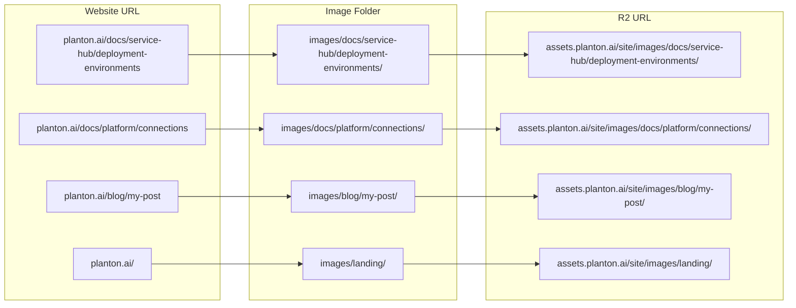
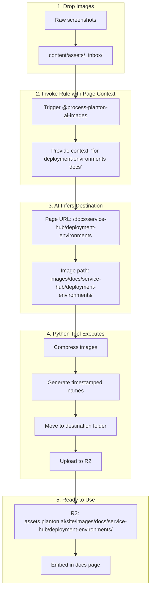

# Asset Processing Rules

Cursor rules for managing assets in the planton.ai website.

## Overview

This folder contains cursor rules that automate asset management workflows. These rules integrate with Python tools to provide a seamless experience for adding, processing, and publishing assets.

## Available Rules

| Rule | Purpose |
|------|---------|
| `process-planton-ai-images.mdc` | Process images from inbox: compress, rename, organize by URL structure, upload to R2 |

## Core Principle: URL-Mirrored Organization

**The folder structure for images mirrors the website URL where they are used.**

This is the single most important organizational principle. It creates a deterministic, predictable system where:

1. Given a page URL, you know exactly where its images live
2. Given an image path, you know exactly which page uses it
3. Cursor can infer the correct destination from context alone

### URL-to-Folder Mapping



### Mapping Table

| Website URL | Local Image Folder | R2 URL |
|-------------|-------------------|--------|
| `planton.ai/docs/service-hub/deployment-environments` | `content/assets/images/docs/service-hub/deployment-environments/` | `assets.planton.ai/site/images/docs/service-hub/deployment-environments/` |
| `planton.ai/docs/platform/connections` | `content/assets/images/docs/platform/connections/` | `assets.planton.ai/site/images/docs/platform/connections/` |
| `planton.ai/docs/service-hub/kubernetes-dashboard` | `content/assets/images/docs/service-hub/kubernetes-dashboard/` | `assets.planton.ai/site/images/docs/service-hub/kubernetes-dashboard/` |
| `planton.ai/blog/2025-01-my-post` | `content/assets/images/blog/2025-01-my-post/` | `assets.planton.ai/site/images/blog/2025-01-my-post/` |
| `planton.ai/` (landing) | `content/assets/images/landing/` | `assets.planton.ai/site/images/landing/` |

### Why This Matters

**For Humans:**
- Easy to find images for any page
- Clear organization without memorizing arbitrary conventions
- Simple cleanup when pages are removed

**For AI (Cursor):**
- Deterministic destination inference from context
- No guessing or ambiguity
- Better accuracy when processing images

**For Maintenance:**
- Images move with pages during refactoring
- Dead images are easy to identify
- Audit trails are natural

## Architecture



## Image Processing Workflow

### Step 1: Add Images to Inbox

Drop screenshots or images into:
```
content/assets/_inbox/
```

This folder is gitignored (except README and .gitignore), so raw images won't bloat the repository.

### Step 2: Invoke the Rule with Page Context

In Cursor chat, invoke the rule and specify which page the images are for:

```
@process-planton-ai-images

I've added 3 screenshots for the deployment environments documentation page.
These show the pipeline configuration and environment selector modal.
```

**Key context to provide:**
- Which page/URL the images are for
- What the images show (for naming)

### Step 3: AI Determines Organization

Based on your context, the rule:

1. **Identifies the target page URL**: `/docs/service-hub/deployment-environments`
2. **Mirrors the URL to image path**: `images/docs/service-hub/deployment-environments/`
3. **Generates descriptive filenames**: `2025-12-31-103045-pipeline-configuration.png`

### Step 4: Processing Happens

The Python tool:
1. **Checks prerequisites** (jpegoptim, pngquant, R2 access)
2. **Compresses images** (lossless for JPEG, lossy for PNG)
3. **Renames with convention**: `YYYY-MM-DD-HHMMSS-description.ext`
4. **Moves to URL-mirrored folder**
5. **Uploads to R2**

### Step 5: Get URLs

After processing, you receive R2 URLs that match the URL structure:
```
https://assets.planton.ai/site/images/docs/service-hub/deployment-environments/2025-12-31-103045-pipeline-configuration.png
```

Use this directly in your documentation page at `/docs/service-hub/deployment-environments`.

## Naming Convention

```
YYYY-MM-DD-HHMMSS-description.ext
│          │       │
│          │       └── What the image shows
│          └── Timestamp (HHMMSS)
└── Date (YYYY-MM-DD)
```

**Note:** Context (feature area) is encoded in the folder path, not the filename.

**Examples:**
- `2025-12-31-103045-pipeline-overview.png`
- `2025-12-31-143500-pod-exec-terminal.png`
- `2025-12-31-201530-hero-animation.gif`

## Folder Structure

```
content/assets/
├── _inbox/                         # Drop zone (gitignored)
│   ├── .gitignore
│   └── README.md
├── _rules/                         # Cursor rules (this folder)
│   ├── process-planton-ai-images.mdc
│   └── README.md
└── images/                         # URL-mirrored organization
    ├── docs/                       # Documentation pages
    │   ├── platform/
    │   │   ├── getting-started/
    │   │   ├── core-concepts/
    │   │   ├── connections/
    │   │   └── platform-tour/
    │   └── service-hub/
    │       ├── deployment-environments/
    │       └── kubernetes-dashboard/
    ├── blog/                       # Blog posts
    │   └── 2025-01-my-post/
    └── landing/                    # Landing page
```

## R2 Bucket Mirror

The assets folder mirrors to R2 with a consistent path:

| Local Path | R2 URL |
|------------|--------|
| `content/assets/images/docs/service-hub/deployment-environments/x.png` | `assets.planton.ai/site/images/docs/service-hub/deployment-environments/x.png` |

**Mental model**: 
- Website URL: `planton.ai/docs/service-hub/deployment-environments`
- Image URL: `assets.planton.ai/site/images/docs/service-hub/deployment-environments/x.png`

The `docs/service-hub/deployment-environments` part is identical.

## Prerequisites

### CLI Tools

```bash
brew install jpegoptim pngquant awscli
```

### Python Dependencies

```bash
# Create virtual environment (one-time)
python3 -m venv .venv

# Activate and install
source .venv/bin/activate
pip install -r tools/image_processor/requirements.txt
```

### R2 Credentials

Configure AWS CLI with the R2 profile:

```bash
aws configure --profile r2
# Access Key ID: (from Cloudflare dashboard)
# Secret Access Key: (from Cloudflare dashboard)
# Region: auto
# Output format: json
```

## Troubleshooting

### Preflight Check Fails

Run the check command to see what's missing:
```bash
python -m tools.image_processor check
```

### No Images Found

Ensure images are directly in `_inbox/`, not in a subdirectory.

### R2 Access Denied

1. Verify AWS CLI profile: `aws configure list --profile r2`
2. Test bucket access: `aws s3 ls s3://planton-assets --profile r2 --endpoint-url https://074755a78d8e8f77c119a90a125e8a06.r2.cloudflarestorage.com`

### Wrong Destination Folder

If images end up in the wrong folder, provide more specific context about which page they're for. Example:
```
@process-planton-ai-images

These screenshots are specifically for the /docs/platform/connections page,
showing the AWS credential creation flow.
```

## Manual Commands

For manual control, use the Python tool directly:

```bash
# Check prerequisites
python -m tools.image_processor check

# List inbox contents
python -m tools.image_processor inbox

# Process with URL-mirrored path
python -m tools.image_processor process \
  --context "docs/service-hub/deployment-environments" \
  --description "pipeline-overview"

# Sync assets to R2 (without processing)
python -m tools.image_processor sync

# Or via Makefile
make check-images
make inbox
make sync-assets
```
