# Copywriting Management

This directory manages the copywriting workflow for the planton.ai website. It provides a structured process for iterating on website content based on feedback, product changes, and market positioning updates.

## Purpose

The copywriting management system enables:

- **Systematic content updates**: Structured workflow from feedback to handoff document
- **Version control for copy**: Historical record of copywriting iterations
- **Review-friendly process**: HTML previews for non-technical stakeholders
- **Two-LLM architecture**: Specialized LLMs for content creation vs code implementation
- **Clean handoff**: Self-contained implementation documents for seamless transition

## Directory Structure

```
content/copywriting/
├── _rules/
│   └── update-planton-ai-copy-writing.mdc    # Cursor rule for copywriting workflow
├── _workspace/
│   ├── .gitignore                             # Ignores all workspace files
│   └── README.md                              # Workspace usage guide
├── _stage-area/
│   └── YYYY-MM-DD-description/                # Dated folders for each update
│       ├── draft-1.md                         # First draft of copy
│       ├── preview-1.html                     # HTML preview of draft-1
│       ├── draft-2.md                         # Revised draft (if needed)
│       └── preview-2.html                     # HTML preview of draft-2
└── README.md                                  # This file
```

## Workflow Overview

**Copywriting LLM → Implementation LLM**:

```mermaid
flowchart LR
    subgraph Input
        Materials[Feedback Materials<br/>Transcripts, PDFs, Notes]
    end

    subgraph Workspace
        Dump[_workspace/<br/>Temporary Storage]
    end

    subgraph CopywritingLLM[Copywriting LLM Phase]
        Stage[_stage-area/<br/>YYYY-MM-DD-description/]
        Draft[draft-N.md<br/>Content Drafts]
        Preview[preview-N.html<br/>Visual Previews]
        Review{Review &<br/>Feedback}
        Handoff[handoff.md<br/>Implementation Guide]
    end

    subgraph Transition[LLM Switch]
        Switch[User switches<br/>to Implementation LLM]
    end

    subgraph ImplementationLLM[Implementation LLM Phase]
        Read[Read handoff.md]
        Components[Update React<br/>Components]
        Verify[Verify Build]
    end

    subgraph Output
        Website[planton.ai<br/>Live Website]
    end

    Materials --> Dump
    Dump --> Stage
    Stage --> Draft
    Draft --> Preview
    Preview --> Review
    Review -->|Iterate| Draft
    Review -->|Approved| Handoff
    Handoff --> Switch
    Switch --> Read
    Read --> Components
    Components --> Verify
    Verify --> Website
```



## Two-LLM Architecture

This system uses **two specialized LLMs** for optimal results:

### LLM 1: Copywriting-Focused

**Expertise**: Content creation, messaging, brand voice, stakeholder communication

**Responsibilities**:
- Analyze feedback materials
- Create content drafts
- Generate HTML previews
- Iterate based on feedback
- Create handoff documents

**Phases**: 1-4 (Preparation → Analysis → Staging/Iteration → Handoff)

### LLM 2: Implementation-Focused

**Expertise**: React development, TypeScript, component architecture, build systems

**Responsibilities**:
- Read handoff documents
- Update React components
- Maintain design system consistency
- Verify builds
- Generate changelogs
- Clean workspace

**Phases**: 5-6 (Implementation → Verification)

### Why Two LLMs?

**Better Results**: Each LLM focuses on what it does best
- Content LLM doesn't need to understand React internals
- Implementation LLM doesn't need copywriting context

**Clean Separation**: Handoff document provides complete context transfer
- No lost context between phases
- Self-contained implementation guide
- Clear ownership and responsibilities

**Flexible Workflow**: User controls the transition
- Review handoff document before switching
- Can pause between phases
- Different timezones or team members can handle each phase

## The Six-Phase Process

### Phase 1: Preparation (User)

**What**: Gather all materials related to the copywriting update

**Where**: Dump files into `_workspace/`

**Materials**:

- Meeting transcripts (Markdown, TXT)
- Advisory feedback (PDF, DOCX, Markdown)
- Product update notes
- Competitive analysis
- Customer feedback
- Research reports
- Images and screenshots

**Example**:

```bash
content/copywriting/_workspace/
├── advisory-meeting-transcript.md
├── customer-feedback.pdf
├── competitor-analysis.md
└── product-update-notes.txt
```

### Phase 2: Analysis

**What**: Understand what needs to change and why

**Trigger**: Invoke `@update-planton-ai-copy-writing` rule with context

**Example**:

```
@update-planton-ai-copy-writing

I've dumped the advisory feedback and meeting transcript in _workspace.
We need to update the landing page hero section to emphasize security
and compliance based on the healthcare vertical feedback.
```

**What Happens**:

- Rule reads all files in `_workspace/`
- Extracts key insights and themes
- Identifies target pages and sections
- Summarizes findings for your confirmation
- Creates dated stage folder

### Phase 3: Staging & Iteration

**What**: Generate drafts with HTML previews, iterate based on feedback

**Outputs**:

- `draft-N.md`: Structured markdown content
- `preview-N.html`: Styled HTML preview

**Iteration Types**:

**Minor Changes** (Update existing draft):

- Wording tweaks
- Clarifications
- Small additions
- Corrections

**Major Changes** (Create new draft):

- Different approach or angle
- Structural changes
- > 50% content revision
- Fundamental messaging shift

**Review Process**:

1. Open `preview-N.html` in browser
2. Review content, structure, messaging
3. Provide feedback
4. Rule updates or creates new draft
5. Repeat until approved

### Phase 4: Handoff Document Generation (Copywriting LLM)

**What**: Create self-contained implementation guide

**Trigger**: User approves final draft

**What Happens**:

- Rule creates `handoff.md` in stage folder
- Includes complete context and objectives
- Embeds all approved content
- Provides component mapping table
- Documents implementation instructions
- Includes verification checklist
- Pre-writes changelog template

**Output**: `_stage-area/YYYY-MM-DD-description/handoff.md`

**End of Copywriting Phase**: User switches to implementation-focused LLM

---

## Implementation Phase (Separate LLM)

**Architecture**: Two-LLM workflow for specialized expertise.

**Why**: Content creation requires different skills than code implementation. Using specialized LLMs for each phase produces better results.

### Phase 5: Component Implementation (Implementation LLM)

**What**: Update React components based on handoff document

**Input**: `handoff.md` provided by user

**Process**:

- Implementation LLM reads handoff document
- Maps draft sections to React components
- Updates or creates components in `src/`
- Maintains design system consistency
- Preserves TypeScript types and MUI patterns

**Example Mapping** (from handoff.md):

| Draft Section    | Component File                                       |
| ---------------- | ---------------------------------------------------- |
| Hero             | `src/components/landing-page-v2/HeroSection.tsx`     |
| Problem/Solution | `src/components/landing-page-v2/ProblemSolution.tsx` |
| Infra Hub        | `src/components/landing-page-v2/InfraHub.tsx`        |
| Service Hub      | `src/components/landing-page-v2/ServiceHub.tsx`      |
| Customer Stories | `src/components/landing-page-v2/CustomerStories.tsx` |
| Pricing          | `src/components/pricing/plans.tsx`                   |

### Phase 6: Verification (Implementation LLM)

**What**: Ensure changes work correctly and document them

**Steps**:

1. **Build Verification**: Run `make build` to check for errors
2. **Changelog Generation**: Use template from `handoff.md`
3. **Workspace Cleanup**: Remove files from `_workspace/` (keep .gitignore and README.md)
4. **Summary**: Provide overview of changes and next steps

**Next Steps After Verification**:

```bash
# Test locally
yarn dev

# Open browser to http://localhost:3000

# When satisfied, commit changes
git add .
git commit -m "feat: update landing page hero section"

# Push to trigger GitHub Pages deployment
git push origin main
```

## Using the Copywriting Rule

### Basic Usage

1. **Prepare workspace**:

   ```bash
   # Copy your materials to workspace
   cp ~/Downloads/advisory-feedback.pdf content/copywriting/_workspace/
   cp ~/Documents/meeting-notes.md content/copywriting/_workspace/
   ```

2. **Trigger rule with context**:

   ```
   @update-planton-ai-copy-writing

   Context: [Explain what needs to change and why]
   Target: [Which page(s) to update]
   Materials: [Brief description of workspace contents]
   ```

3. **Review draft**:

   - Open `preview-N.html` in browser
   - Provide feedback in chat

4. **Iterate until satisfied**:

   - Minor changes: Rule updates existing draft
   - Major changes: Rule creates new draft

5. **Approve draft**:

   ```
   Looks good! Approved for implementation.
   ```

6. **Handoff document created**:

   - Rule automatically creates `handoff.md` 
   - Contains complete implementation context
   - Ready for implementation LLM

7. **Switch to implementation LLM**:

   - Open new chat or switch LLM model
   - Provide `handoff.md` as context
   - Request implementation

8. **Implementation LLM executes**:

   - Updates React components
   - Verifies build
   - Creates changelog
   - Cleans workspace

### Example Scenarios

#### Scenario 1: Update Hero Messaging

**Preparation**:

```bash
# Create notes file
echo "Update hero to emphasize multi-cloud capabilities" > content/copywriting/_workspace/update-notes.md
```

**Trigger**:

```
@update-planton-ai-copy-writing

Update the landing page hero section to emphasize multi-cloud
capabilities (AWS, GCP, Azure, Cloudflare). Current messaging
focuses too much on generic DevOps automation.
```

**Review → Approve → Implement**

#### Scenario 2: Complete Page Redesign

**Preparation**:

```bash
# Copy competitive analysis
cp ~/research/qovery-comparison.pdf content/copywriting/_workspace/

# Copy advisory feedback
cp ~/meetings/dec-advisory-session.md content/copywriting/_workspace/
```

**Trigger**:

```
@update-planton-ai-copy-writing

Complete redesign of the pricing page based on:
1. Competitive analysis (Qovery, Terraform Cloud) in workspace
2. Advisory feedback on enterprise positioning
3. Need for clearer tier differentiation

Target: Pricing page
Focus: Enterprise tier, usage metering clarity, ROI calculator
```

**Review → Iterate → Approve → Implement**

#### Scenario 3: Add Customer Story

**Preparation**:

```bash
# Create customer story file
cat > content/copywriting/_workspace/rad-cube-story.md << EOF
# RAD Cube Technologies Customer Story

- Company: IT consulting firm
- Team: 3 DevOps engineers, 15 developers
- Use case: Standardized client onboarding
- Result: 5x faster environment setup (2 weeks → 2 hours)
- Quote: "Planton eliminated repetitive Terraform work. Our DevOps team now focuses on architecture."
EOF
```

**Trigger**:

```
@update-planton-ai-copy-writing

Add new customer story to landing page Customer Stories section.
Details in _workspace/rad-cube-story.md.
```

**Review → Approve → Implement**

## Best Practices

### Workspace Organization

**Do**:

- ✅ Use descriptive file names (`advisory-feedback-healthcare.pdf`)
- ✅ Include dates in file names when relevant (`2025-12-13-meeting-transcript.md`)
- ✅ Keep related materials together
- ✅ Include README or notes file explaining context

**Don't**:

- ❌ Use generic names (`feedback.txt`, `notes.md`)
- ❌ Mix unrelated updates in same workspace session
- ❌ Leave materials in workspace after implementation

### Providing Feedback

**Effective Feedback**:

```
The security messaging in Section 3 is too technical. Simplify for
business buyers:
- Remove "mTLS" and "zero-trust architecture" jargon
- Focus on outcomes: "Your data stays in your cloud account"
- Add analogy: "Like having a vault inside your building, not a third-party storage facility"
```

**Less Effective Feedback**:

```
Section 3 is too technical
```

**Clarity Helps**:

- Be specific about what to change
- Explain why (audience, messaging, clarity)
- Provide examples or alternatives when possible
- Indicate if it's minor edit vs major redo

### Review Checklist

Before approving a draft:

- [ ] **Accuracy**: All facts, metrics, customer names correct
- [ ] **Consistency**: Messaging aligns with brand voice and positioning document
- [ ] **Clarity**: Technical audience can understand benefits
- [ ] **Completeness**: All sections addressed, no placeholders
- [ ] **Visual direction**: Clear guidance for web developer
- [ ] **Links**: CTAs point to correct destinations
- [ ] **Grammar**: No typos or grammatical errors

### Component Updates

When implementation happens, verify:

- [ ] **Design system**: Components use `shared.tsx` patterns
- [ ] **Responsive**: Layout works on mobile, tablet, desktop
- [ ] **TypeScript**: No type errors, proper interfaces
- [ ] **MUI**: Material-UI components used correctly
- [ ] **Build**: `make build` passes without errors

## Common Questions

### Q: Can I update multiple pages in one session?

**A**: Yes, but it's better to do one page at a time for clarity. If updating multiple pages, clearly separate sections in your draft and be explicit about which components to update.

### Q: What if I don't know which component handles a section?

**A**: The rule will figure it out. Just describe the page and section clearly. For example: "Update the landing page pricing section" is enough—the rule will map to `PricingSimplified.tsx`.

### Q: How do I know if my feedback warrants draft-2 vs updating draft-1?

**A**:

- **Update draft-1**: Tweaks, corrections, clarifications, <50% content change
- **Create draft-2**: Different approach, structural changes, >50% content change
- **Not sure?**: The rule will assess or ask you

### Q: Can I see previous versions after implementation?

**A**: Yes! Historical drafts remain in `_stage-area/YYYY-MM-DD-description/` folders. These are committed to git, so you have full version history.

### Q: What if the build fails after implementation?

**A**: The rule will detect build errors and attempt to fix them. If it can't, it will report the errors and you can:

1. Ask the rule to fix specific errors
2. Manually fix and re-run build
3. Roll back changes if needed

### Q: How do I clean up old stage folders?

**A**: Keep them for historical reference. If storage becomes an issue, manually delete folders older than 6-12 months. Always keep at least the most recent 3-5 iterations.

## Maintenance

### Workspace Cleanup

After each implementation, `_workspace/` is automatically cleaned. Only `.gitignore` and `README.md` remain. This ensures:

- No accidentally committed temporary files
- Clean slate for next iteration
- No confusion about which materials are current

### Stage Area Growth

`_stage-area/` folders are kept for historical reference. Typical growth:

- ~2-5 MB per iteration (draft + HTML)
- ~10-20 iterations per year
- ~50-100 MB per year

**Cleanup strategy**:

- Keep all folders for current year
- Keep significant iterations from previous years
- Delete minor iterations older than 12 months

## Technical Details

### File Structure

**Draft Markdown** (`draft-N.md`):

```markdown
---
page: landing
sections: [hero, problem-solution]
date: 2025-12-31
version: 1
status: draft
---

# Landing Page Copywriting Update

## Metadata

[Context and rationale]

## Section 1: Hero

[Content with visual direction notes]

## Section 2: Problem/Solution

[Content with component mapping notes]
```

**HTML Preview** (`preview-N.html`):

- Styled with dark theme matching planton.ai aesthetic
- Professional typography and spacing
- Responsive layout
- Semantic HTML structure
- No external dependencies (inline CSS)

### Component Mapping

The rule maps draft sections to React components using:

1. **Pattern matching**: Section names to component file names
2. **Directory structure**: Landing page vs pricing vs other pages
3. **Existing code analysis**: Read components to understand structure
4. **Design system**: Follow patterns from `shared.tsx`

### Build Process

After implementation:

```bash
# TypeScript compilation and linting
make build

# This runs:
# - yarn lint (ESLint checks)
# - yarn build (Next.js static export)
# - Outputs to ./out directory
```

## Related Documentation

- **Cursor Rule**: `content/copywriting/_rules/update-planton-ai-copy-writing.mdc`
- **Workspace Guide**: `content/copywriting/_workspace/README.md`
- **Writing Guidelines**: `planton-cloud/.cursor/rules/writing/general-writing-guidelines.mdc`
- **Positioning Doc**: `planton-cloud/_business/marketing/positioning/what-is-planton.md`
- **Design System**: `src/components/landing-page-v2/shared.tsx`

## Support

For issues or questions:

1. Review this README
2. Check the cursor rule documentation
3. Look at previous iterations in `_stage-area/`
4. Consult writing guidelines
5. Ask for help with specific examples

---

**Last Updated**: December 31, 2025  
**Maintained By**: Planton Team
