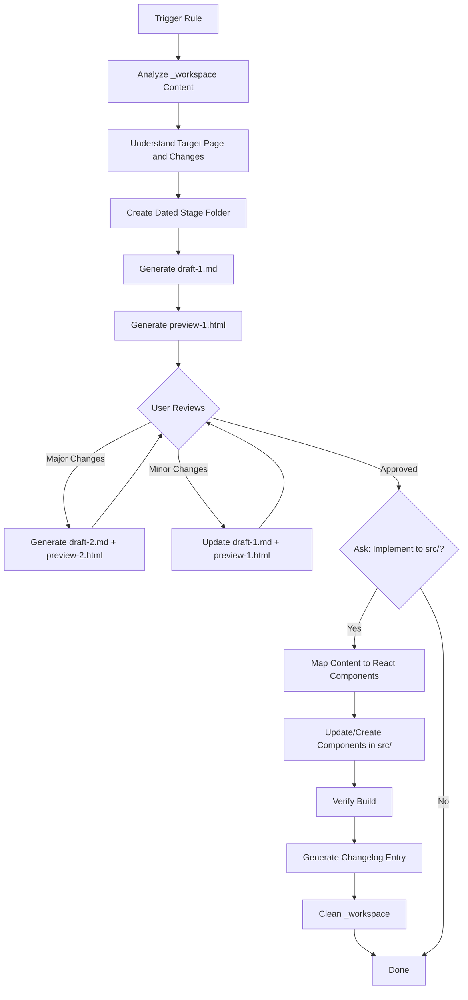

# Copywriting Rules

This directory contains cursor rules for automating copywriting updates on the planton.ai website.

## Purpose

Cursor rules in this directory provide structured, repeatable workflows for content updates. They guide the AI through complex multi-step processes from analyzing feedback to implementing code changes.

## Available Rules

### `update-planton-ai-copy-writing.mdc`

**Type**: Action Rule

**Purpose**: Automate the complete copywriting update workflow from feedback analysis to React component implementation.

**When to Use**:

- Product repositioning or messaging changes
- New platform capabilities requiring website updates
- Advisory feedback driving content refinement
- Competitive positioning adjustments
- Customer story additions or updates

**Quick Start**:



**Basic Usage**:

```
1. Dump materials into content/copywriting/_workspace/
   - Meeting transcripts
   - Advisory feedback
   - Research documents
   - Context notes

2. Trigger the rule:
   @update-planton-ai-copy-writing

   [Provide context: what needs to change, which page(s), why]

3. Review HTML preview in browser

4. Iterate with feedback or approve for implementation

5. Confirm implementation when prompted
```

**What It Handles**:

- ✅ Analyzes materials in `_workspace/`
- ✅ Creates dated stage folder in `_stage-area/`
- ✅ Generates draft markdown with structured content
- ✅ Creates styled HTML preview for review
- ✅ Iterates based on feedback (minor updates or major redos)
- ✅ Maps approved content to React components
- ✅ Updates source code in `src/` directories
- ✅ Verifies build passes without errors
- ✅ Generates changelog entries
- ✅ Cleans workspace automatically

## Rule Workflow Details

### Phase 1: Analysis

**Input**: Files in `_workspace/`

**Process**:

- Reads all materials (PDFs, markdown, images, transcripts)
- Extracts key themes and insights
- Identifies target pages and sections
- Summarizes findings for confirmation

**Output**: Analysis summary with proposed changes

### Phase 2: Staging

**Input**: Confirmed scope from Phase 1

**Process**:

- Creates folder: `_stage-area/YYYY-MM-DD-description/`
- Generates `draft-1.md` with structured content
- Creates `preview-1.html` with styled visualization
- Follows `@general-writing-guidelines.mdc`

**Output**: Draft + HTML preview ready for review

### Phase 3: Iteration

**Input**: User feedback on draft

**Process**:

- **Minor changes** (<50% content): Updates `draft-1.md`
- **Major changes** (>50% content): Creates `draft-2.md`
- Regenerates HTML preview
- Repeats until user approves

**Output**: Approved final draft

### Phase 4: Implementation

**Input**: Approval to implement

**Process**:

- Maps draft sections to React components
- Updates or creates components in `src/`
- Maintains design system consistency
- Preserves TypeScript types and MUI patterns

**Output**: Updated source code

### Phase 5: Verification

**Input**: Updated source code

**Process**:

- Runs `make build` for verification
- Generates changelog entry
- Cleans `_workspace/` (removes all except .gitignore and README.md)

**Output**: Verified changes, documented, workspace cleaned

## Common Use Cases

### 1. Hero Section Update

**Scenario**: Advisory feedback suggests emphasizing security for healthcare market.

**Materials**: Advisory feedback PDF, meeting transcript

**Steps**:

```bash
# 1. Prepare
cp ~/feedback/advisory-healthcare.pdf content/copywriting/_workspace/

# 2. Trigger
@update-planton-ai-copy-writing

Update landing page hero to emphasize security and compliance.
Target: Hero section only.
Reason: Healthcare vertical feedback from advisory session.

# 3. Review preview-1.html, iterate, approve
# 4. Implementation updates: src/components/landing-page-v2/HeroSection.tsx
```

### 2. Complete Page Redesign

**Scenario**: Competitor analysis drives pricing page restructure.

**Materials**: Competitor screenshots, pricing analysis, market research

**Steps**:

```bash
# 1. Prepare multiple materials
cp ~/research/* content/copywriting/_workspace/

# 2. Trigger with comprehensive context
@update-planton-ai-copy-writing

Complete pricing page redesign based on competitive analysis.
Target: Entire pricing page.
Key changes:
- Clearer tier differentiation
- Enterprise tier emphasis
- ROI calculator prominence
- Usage metering clarity

# 3. Expect multiple iteration rounds (draft-2, draft-3)
# 4. Implementation updates multiple components in src/components/pricing/
```

### 3. Customer Story Addition

**Scenario**: New customer success story needs to be featured.

**Materials**: Customer interview notes, metrics, quotes

**Steps**:

```bash
# 1. Create customer story document
cat > content/copywriting/_workspace/customer-story.md << EOF
# RAD Cube Technologies
- IT consulting firm
- 5x faster deployments
- Quote: "Planton eliminated DevOps bottlenecks"
EOF

# 2. Trigger
@update-planton-ai-copy-writing

Add new customer story to landing page.
Customer: RAD Cube Technologies
Placement: Customer Stories section

# 3. Simple approval flow (usually single draft)
# 4. Implementation: src/components/landing-page-v2/CustomerStories.tsx
```

## Tips for Effective Usage

### Provide Clear Context

**Good**:

```
@update-planton-ai-copy-writing

Update hero section to emphasize multi-cloud capabilities.

Target: Landing page hero
Why: Current messaging focuses on generic DevOps, missing key differentiator
Key points: AWS, GCP, Azure, Cloudflare support
Competitive context: Qovery is Kubernetes-only, we're multi-cloud
```

**Less Effective**:

```
@update-planton-ai-copy-writing

Update the hero section
```

### Organize Workspace Materials

**Good Structure**:

```
_workspace/
├── 2025-12-31-advisory-feedback.pdf
├── meeting-transcript-healthcare.md
├── competitor-analysis.md
└── context-notes.md  # ← Explains intent
```

**Less Organized**:

```
_workspace/
├── file1.pdf
├── notes.txt
└── stuff.md
```

### Give Specific Feedback

**Clear Feedback**:

```
Section 2 (Problem/Solution):
- Too technical for business buyers
- Remove "Kubernetes orchestration" jargon
- Focus on outcome: "Deploy in <1 hour vs weeks"
- Add cost comparison: $450/month vs $12,500/month
```

**Vague Feedback**:

```
Section 2 needs work
```

### Know When to Iterate vs Redo

**Update draft-1** when:

- Fixing typos or grammar
- Clarifying messaging
- Adding small details
- Changing specific phrases

**Create draft-2** when:

- Changing overall approach
- Restructuring sections
- Different audience focus
- Fundamental messaging shift

## Component Mapping Reference

The rule maps draft sections to these React components:

### Landing Page

| Section              | Component Path                                            |
| -------------------- | --------------------------------------------------------- |
| Hero                 | `src/components/landing-page-v2/HeroSection.tsx`          |
| Problem/Solution     | `src/components/landing-page-v2/ProblemSolution.tsx`      |
| Infra Hub            | `src/components/landing-page-v2/InfraHub.tsx`             |
| Service Hub          | `src/components/landing-page-v2/ServiceHub.tsx`           |
| Open Standards       | `src/components/landing-page-v2/OpenStandards.tsx`        |
| Open Source          | `src/components/landing-page-v2/OpenSourceFoundation.tsx` |
| Agent Fleet          | `src/components/landing-page-v2/AgentFleet.tsx`           |
| Customer Stories     | `src/components/landing-page-v2/CustomerStories.tsx`      |
| Pricing (simplified) | `src/components/landing-page-v2/PricingSimplified.tsx`    |
| Built by DevOps      | `src/components/landing-page-v2/BuiltByDevOps.tsx`        |
| Security             | `src/components/landing-page-v2/SecurityCompliance.tsx`   |
| Final CTA            | `src/components/landing-page-v2/FinalCTA.tsx`             |

### Pricing Page

| Section       | Component Path                          |
| ------------- | --------------------------------------- |
| Pricing Tiers | `src/components/pricing/plans.tsx`      |
| Calculator    | `src/components/pricing/calculator.tsx` |
| FAQs          | `src/components/pricing/faqs.tsx`       |

### Design System

All components use: `src/components/landing-page-v2/shared.tsx`

**Colors**: Purple-blue gradient (#7c3aed → #0ea5e9), accent green (#10b981)  
**Typography**: Consistent size hierarchy, Inter font family  
**Layout**: MUI Grid2 responsive system  
**Components**: Section, Card, Badge, Button variants

## Troubleshooting

### Rule doesn't understand intent

**Problem**: Analysis misidentifies target or changes needed.

**Solution**:

1. Add `context-notes.md` to `_workspace/` with explicit explanation
2. When triggering rule, provide more detailed context
3. Remove unrelated materials that might confuse

### Preview HTML doesn't look right

**Problem**: HTML preview has broken layout or missing styles.

**Solution**:

- Check browser console for errors
- Try different browser
- Report issue if consistent

### Build fails after implementation

**Problem**: TypeScript errors or build failures.

**Solution**:

1. Rule will attempt to fix automatically
2. If not fixed, review error messages
3. Common fixes:
   - Import paths (check `shared.tsx` exports)
   - TypeScript types (verify prop interfaces)
   - Component names (check for typos)

### Unclear if changes warrant draft-2

**Problem**: Unsure whether to update draft-1 or create draft-2.

**Solution**: Rule will assess scope and ask if uncertain. General guideline:

- Minor (update draft-1): <50% content change, same approach
- Major (create draft-2): >50% content change, different approach

### Workspace materials not analyzed

**Problem**: Rule doesn't seem to read all files.

**Solution**:

- Ensure files are in `_workspace/` (not subdirectories)
- Check file formats are supported (PDF, MD, TXT, PNG, JPG)
- Verify files aren't corrupted
- Try adding summary in `context-notes.md`

## Best Practices

### Before Triggering

- [ ] All relevant materials dumped to `_workspace/`
- [ ] Context file explaining intent (optional but helpful)
- [ ] Clear understanding of which page(s) to update
- [ ] Brief notes on why changes are needed

### During Review

- [ ] Open HTML preview in full browser (not editor preview)
- [ ] Review all sections, not just changed ones
- [ ] Check consistency with brand voice
- [ ] Verify customer names, metrics, quotes are accurate
- [ ] Consider mobile/responsive view

### Before Approving

- [ ] All feedback addressed
- [ ] Content follows `@general-writing-guidelines.mdc`
- [ ] Visual direction clear for web developer
- [ ] Component mapping notes included
- [ ] No placeholders or TODOs remain

### After Implementation

- [ ] Test locally with `yarn dev`
- [ ] Verify responsive layouts work
- [ ] Check links and CTAs function
- [ ] Review changelog entry for accuracy
- [ ] Workspace cleaned automatically

## Integration with Development Workflow

### Local Testing

```bash
# After implementation
cd /path/to/planton.ai
yarn dev

# Open browser
http://localhost:3000

# Test all updated pages
```

### Committing Changes

```bash
# Stage changes
git add content/copywriting/_stage-area/
git add src/components/
git add _changelog/

# Commit with conventional commit format
git commit -m "feat: update landing page hero section"

# Push to trigger deployment
git push origin main
```

### Deployment

Changes deploy automatically via GitHub Pages workflow:

- Push to `main` branch triggers build
- Static export generated
- Published to https://planton.ai
- Typically 3-5 minutes from push to live

## Related Documentation

- **Main Copywriting README**: `../README.md` - Complete workflow overview
- **Workspace Guide**: `../_workspace/README.md` - Materials preparation
- **Writing Guidelines**: `planton-cloud/.cursor/rules/writing/general-writing-guidelines.mdc`
- **Positioning Document**: `planton-cloud/_business/marketing/positioning/what-is-planton.md`
- **Changelog Examples**: `_changelog/2025-12/` - Format reference

## Rule Metadata

**File**: `update-planton-ai-copy-writing.mdc`  
**Type**: Action Rule  
**Scope**: Website copywriting automation  
**Phases**: 5 (Analysis → Staging → Iteration → Implementation → Verification)  
**Automation Level**: High (manual review at iteration phase)  
**Git Integration**: Yes (auto-cleanup workspace, creates stage folders, generates changelogs)

## Support

For issues with the rule:

1. **Review rule documentation**: Read `update-planton-ai-copy-writing.mdc` for detailed guidance
2. **Check examples**: Look at previous iterations in `_stage-area/`
3. **Consult writing guidelines**: Ensure content follows established patterns
4. **Ask specific questions**: Provide context and examples when seeking help

For general copywriting workflow questions, see `../README.md`.

---

**Last Updated**: December 31, 2025  
**Maintained By**: Planton Team
