```mermaid
flowchart TD
    Start[Trigger Rule<br/>Provide handoff.md] --> Read[Read Handoff Document]
    Read --> Understand[Understand Objective<br/>& Context]
    Understand --> Plan[Create Implementation Plan]
    Plan --> Approve{User Approves<br/>Plan?}
    Approve -->|Yes| Implement[Update React Components]
    Approve -->|No| Revise[Revise Plan]
    Revise --> Plan
    Implement --> Test[Test Locally<br/>yarn dev]
    Test --> Build[Verify Build<br/>make build]
    Build --> BuildOK{Build<br/>Passes?}
    BuildOK -->|No| Fix[Fix Errors]
    Fix --> Build
    BuildOK -->|Yes| Changelog[Create Changelog]
    Changelog --> Cleanup[Clean _workspace]
    Cleanup --> Done[✅ Complete]
```

# Copywriting Rules

This directory contains cursor rules for automating copywriting updates on the planton.ai website.

## Purpose

Cursor rules in this directory provide structured, repeatable workflows for content updates. They guide the AI through complex multi-step processes from analyzing feedback to implementing code changes.

## Available Rules

### Two-Rule System for Two-LLM Workflow

The copywriting workflow uses **two specialized cursor rules** for two specialized LLMs:

1. **`update-planton-ai-copy-writing.mdc`** - Copywriting phase (content creation)
2. **`implement-planton-ai-copy-writing.mdc`** - Implementation phase (code updates)

**Which Rule to Use?**

| Situation | Rule to Use |
|-----------|-------------|
| Starting a new copywriting update | `@update-planton-ai-copy-writing` |
| Have feedback materials to analyze | `@update-planton-ai-copy-writing` |
| Creating content drafts | `@update-planton-ai-copy-writing` |
| Iterating on copy based on review | `@update-planton-ai-copy-writing` |
| **Received handoff.md, ready to code** | `@implement-planton-ai-copy-writing` |
| Updating React components | `@implement-planton-ai-copy-writing` |
| Need to verify build | `@implement-planton-ai-copy-writing` |
| Creating changelog from template | `@implement-planton-ai-copy-writing` |

**Simple Rule**: 
- **Content work** → Use `@update-planton-ai-copy-writing`
- **Code work** → Use `@implement-planton-ai-copy-writing`

---

### `update-planton-ai-copy-writing.mdc`

**Type**: Action Rule (Copywriting-Focused LLM)

**Purpose**: Automate copywriting updates through content creation, iteration, and handoff document generation. Uses a **two-LLM architecture** where this rule creates content and handoff documents, and a separate implementation-focused LLM handles React component updates.

**Why Two LLMs**: Specialized LLMs excel at different tasks. Content creation requires different expertise than code implementation.

**When to Use**:

- Product repositioning or messaging changes
- New platform capabilities requiring website updates
- Advisory feedback driving content refinement
- Competitive positioning adjustments
- Customer story additions or updates

**Quick Start**:

**Copywriting LLM (This Rule)**:

```mermaid
flowchart TD
    Start[Trigger Rule] --> PDFCheck{PDFs in workspace?}
    PDFCheck -->|Yes| ConvertPDF[Convert to Markdown]
    PDFCheck -->|No| Analyze
    ConvertPDF --> Analyze[Analyze _workspace Content]
    Analyze --> Context[Understand Target & Changes]
    Context --> CreateFolder[Create Dated Stage Folder]
    CreateFolder --> Draft1[Generate draft-1.md]
    Draft1 --> HTML1[Generate preview-1.html]
    HTML1 --> Review{User Reviews}
    Review -->|Major Changes| Draft2[Generate draft-2.md + preview-2.html]
    Review -->|Minor Changes| UpdateDraft1[Update draft-1.md + preview-1.html]
    Draft2 --> Review
    UpdateDraft1 --> Review
    Review -->|Approved| Handoff[Create handoff.md]
    Handoff --> Notify[Notify: Ready for<br/>Implementation LLM]
    Notify --> Done[🎉 Copywriting Complete]
```


**Implementation LLM (Separate Session)**:

```mermaid
flowchart TD
    Start[User provides<br/>handoff.md] --> Read[Read handoff document]
    Read --> Implement[Update React Components]
    Implement --> Build[Verify Build]
    Build --> Changelog[Create Changelog]
    Changelog --> Cleanup[Clean _workspace]
    Cleanup --> Done[✅ Implementation Complete]
```


**Basic Usage**:

```
Copywriting Phase (Copywriting LLM):

1. Dump materials into content/copywriting/_workspace/
   - Meeting transcripts (Markdown, TXT)
   - Advisory feedback (PDF - auto-converts to Markdown)
   - Research documents
   - Context notes

2. Trigger the rule:
   @update-planton-ai-copy-writing
   
   [Provide context: what needs to change, which page(s), why]

3. Review HTML preview in browser

4. Iterate with feedback until satisfied

5. Approve draft - rule creates handoff.md automatically

6. Switch to implementation-focused LLM

---

Implementation Phase (Implementation LLM - Separate Session):

1. Provide handoff.md as context to implementation LLM

2. Request implementation following handoff document

3. Implementation LLM:
   - Updates React components
   - Verifies build
   - Creates changelog
   - Cleans workspace
```

**What This Rule Handles (Copywriting LLM)**:

- ✅ Converts PDF files to Markdown automatically
- ✅ Analyzes materials in `_workspace/`
- ✅ Creates dated stage folder in `_stage-area/`
- ✅ Generates draft markdown with structured content
- ✅ Creates styled HTML preview for review
- ✅ Iterates based on feedback (minor updates or major redos)
- ✅ Creates comprehensive handoff document for implementation LLM

**What Implementation LLM Handles (Separate Session)**:

- ✅ Reads handoff document
- ✅ Maps approved content to React components
- ✅ Updates source code in `src/` directories
- ✅ Verifies build passes without errors
- ✅ Generates changelog entries
- ✅ Cleans workspace automatically

## PDF Conversion

### Automatic PDF to Markdown Conversion

The rule automatically converts PDF files to Markdown before analyzing workspace content.

**Why**: The AI cannot directly read PDF files. Advisory feedback, meeting notes, and research documents are often provided as PDFs.

**How It Works**:


**Dependencies Required**:

```bash
# Install once (via Homebrew)
brew install poppler pandoc
```

- **Poppler**: Provides `pdftotext` for text extraction
- **Pandoc**: Converts text to clean Markdown

**What Happens**:
1. Rule detects `*.pdf` files in `_workspace/`
2. Runs `python3 content/copywriting/_rules/pdf_converter/convert_pdf.py`
3. For each PDF:
   - Extracts text using `pdftotext`
   - Converts to Markdown using `pandoc`
   - Creates `.md` file with same name
4. Original PDFs preserved for reference
5. Analysis phase proceeds with Markdown files

**Supported**:
- ✅ Text-based PDFs (advisories, reports, meeting notes)
- ✅ Multi-page documents
- ✅ Simple layouts and tables

**Not Supported**:
- ❌ Scanned PDFs (require OCR: `brew install ocrmypdf`)
- ❌ Encrypted/password-protected PDFs
- ⚠️ Complex multi-column layouts (may need manual cleanup)

**Manual Conversion**:

You can run the converter independently before triggering the rule:

```bash
# Convert all PDFs in workspace
python3 content/copywriting/_rules/pdf_converter/convert_pdf.py

# Then trigger the rule
@update-planton-ai-copy-writing
```

**For Details**: See [`pdf_converter/README.md`](pdf_converter/README.md)

---

### `implement-planton-ai-copy-writing.mdc`

**Type**: Action Rule (Implementation-Focused LLM)

**Purpose**: Implement approved copywriting changes by updating React components based on handoff documents from the copywriting phase.

**When to Use**:

- After receiving `handoff.md` from copywriting phase
- Ready to update React components in `src/`
- Need to implement approved content changes
- Want to verify build and deploy changes

**Quick Start**:



**Basic Usage**:

```
1. Receive handoff document from copywriting phase
   Location: content/copywriting/_stage-area/YYYY-MM-DD-description/handoff.md

2. Trigger the rule:
   @implement-planton-ai-copy-writing
   
   Stage folder: content/copywriting/_stage-area/YYYY-MM-DD-description/
   
   Please implement the changes described in the handoff document.

3. Review implementation plan (presented by rule)

4. Approve plan - rule updates React components

5. Automatic execution:
   - Updates src/ components
   - Tests locally (yarn dev)
   - Verifies build (make build)
   - Creates changelog
   - Cleans workspace
   
6. Review summary and test changes
```

**What This Rule Handles**:

- ✅ Reads and understands handoff document
- ✅ Creates detailed implementation plan
- ✅ Updates React components in `src/`
- ✅ Maintains TypeScript types and MUI patterns
- ✅ Preserves design system consistency
- ✅ Tests locally (yarn dev)
- ✅ Verifies build passes (make build)
- ✅ Creates changelog from template
- ✅ Cleans workspace automatically
- ✅ Provides comprehensive implementation summary

**Files Modified**: Components in `src/components/` and `src/app/`

**Handoff Document Required**: This rule expects `handoff.md` created by the copywriting rule

---

## Handoff Document

### What is handoff.md?

The handoff document is a **self-contained implementation guide** created automatically when you approve a draft. It contains everything the implementation LLM needs to update the website without requiring context from the copywriting process.

**Purpose**: Enable clean separation between copywriting (content creation) and implementation (code changes) by using specialized LLMs for each task.

**Contents**:
- Overview and objective
- Complete context (why this change matters)
- Full approved content from drafts
- Component mapping (which files to update)
- Detailed implementation instructions
- Design system reference
- Verification checklist
- Pre-written changelog template
- Reference materials list

**Location**: `_stage-area/YYYY-MM-DD-description/handoff.md`

**When Created**: Automatically after user approves final draft

**Structure**:

```markdown
# Implementation Handoff: [Description]

## Overview
[What needs to be implemented]

## Objective  
[Clear implementation goal]

## Context
[Why this change matters]

## Approved Content
[Complete copy for each section]

## Component Mapping
[Table of files to update]

## Implementation Instructions
[Step-by-step guidance]

## Verification Steps
[How to test and verify]

## Post-Implementation
[Changelog template, cleanup steps]
```

**Self-Contained**: The implementation LLM receives ONLY the handoff document - no conversation history, no draft files. Everything needed is in one file.

## Rule Workflow Details

### Phase 1: Analysis

**Input**: Files in `_workspace/`

**Process**:

- **PDF Conversion** (automatic): Converts any PDF files to Markdown first
  - Uses `pdftotext` (Poppler) + `pandoc` conversion pipeline
  - See `pdf_converter/README.md` for details
  - Requires: `brew install poppler pandoc`
- Reads all materials (Markdown including converted PDFs, images, transcripts)
- Extracts key themes and insights
- Identifies target pages and sections
- Summarizes findings for confirmation

**Output**: Analysis summary with proposed changes

### Phase 2: Staging

**Input**: Confirmed scope from Phase 1

**Process**:

- Creates folder: `_stage-area/YYYY-MM-DD-description/`
- Generates `draft-1.md` with structured content
- Creates `preview-1.html` with styled visualization
- Follows `@general-writing-guidelines.mdc`

**Output**: Draft + HTML preview ready for review

### Phase 3: Iteration

**Input**: User feedback on draft

**Process**:

- **Minor changes** (<50% content): Updates `draft-1.md`
- **Major changes** (>50% content): Creates `draft-2.md`
- Regenerates HTML preview
- Repeats until user approves

**Output**: Approved final draft

### Phase 4: Handoff Document Generation

**Input**: User approval of draft

**Process**:

- Creates `handoff.md` in stage folder
- Includes complete context and approved content
- Provides component mapping table
- Documents implementation instructions
- Embeds design system reference
- Includes verification checklist
- Pre-writes changelog template

**Output**: Comprehensive self-contained handoff document

**End of Copywriting LLM**: User switches to implementation-focused LLM for next phase.

---

## Implementation LLM Workflow (Separate Session)

**Note**: The following phases are handled by a separate implementation-focused LLM, not this copywriting rule.

### Phase 5: Implementation (Implementation LLM)

**Input**: `handoff.md` from copywriting phase

**Process**:

- Reads and understands handoff document
- Maps draft sections to React components
- Updates or creates components in `src/`
- Maintains design system consistency
- Preserves TypeScript types and MUI patterns

**Output**: Updated source code

### Phase 6: Verification (Implementation LLM)

**Input**: Updated source code

**Process**:

- Runs `make build` for verification
- Generates changelog entry from template
- Cleans `_workspace/` (removes all except .gitignore and README.md)
- Provides implementation summary

**Output**: Verified changes, documented, workspace cleaned

## Complete End-to-End Example

### Scenario: Landing Page Hero Security Update

**Complete workflow using both rules:**

#### Step 1: Copywriting Phase (Copywriting LLM)

```bash
# Prepare materials
cp ~/feedback/advisory-healthcare.pdf content/copywriting/_workspace/

# Trigger copywriting rule
@update-planton-ai-copy-writing

Update landing page hero to emphasize security and compliance.
Target: Hero section only.
Reason: Healthcare vertical feedback from advisory session.

# Copywriting LLM:
# - Converts PDF to Markdown automatically
# - Analyzes feedback
# - Creates draft-1.md + preview-1.html
# - User reviews: "Too technical, simplify for business buyers"
# - Updates draft-1.md with simpler messaging
# - User approves: "Perfect!"
# - Creates handoff.md automatically

✅ Handoff document created!
Location: _stage-area/2025-12-31-hero-security/handoff.md
Ready for implementation LLM.
```

#### Step 2: LLM Switch

```
User opens new chat or switches to implementation-focused LLM
```

#### Step 3: Implementation Phase (Implementation LLM)

```bash
# Trigger implementation rule
@implement-planton-ai-copy-writing

Stage folder: content/copywriting/_stage-area/2025-12-31-hero-security/
Please implement the changes described in the handoff document.

# Implementation LLM:
# - Reads handoff.md
# - Creates implementation plan
# - Presents plan: "Update HeroSection.tsx with security badges"
# - User approves plan
# - Updates src/components/landing-page-v2/HeroSection.tsx
# - Tests locally (yarn dev)
# - Runs make build ✅
# - Creates changelog
# - Cleans workspace

✅ Implementation complete!
Updated: HeroSection.tsx
Build: Passed
Changelog: _changelog/2025-12/2025-12-31-123045-hero-security.md
```

#### Step 4: Deploy

```bash
# Commit and push (or create PR)
@commit-planton-ai-changes
git push origin main

# GitHub Pages deploys automatically
# Live at https://planton.ai in 3-5 minutes
```

**Total Time**: 
- Copywriting phase: 1-2 hours (review and iteration)
- Implementation phase: 15-30 minutes (code updates and verification)
- **Total**: ~2-2.5 hours (vs 4-6 hours with single LLM)

**Quality**:
- Better content (specialized copywriting LLM)
- Better code (specialized implementation LLM)
- Fewer errors (clear handoff document)
- Complete documentation (handoff + changelog)

---

## Common Use Cases

### 1. Hero Section Update (Single Component)

**Scenario**: Advisory feedback suggests emphasizing security for healthcare market.

**Materials**: Advisory feedback PDF, meeting transcript

**Copywriting Phase**:

```bash
cp ~/feedback/advisory-healthcare.pdf content/copywriting/_workspace/

@update-planton-ai-copy-writing

Update landing page hero to emphasize security and compliance.
Target: Hero section only.
Reason: Healthcare vertical feedback from advisory session.

# Review → Iterate → Approve → handoff.md created
```

**Implementation Phase** (New LLM Session):

```bash
@implement-planton-ai-copy-writing

Stage folder: content/copywriting/_stage-area/2025-12-31-hero-security/

# Plan → Approve → Updates HeroSection.tsx → Build ✅ → Done
```

**Result**: Single component updated in ~30 minutes

### 2. Complete Page Redesign (Multiple Components)

**Scenario**: Competitor analysis drives pricing page restructure.

**Materials**: Competitor screenshots, pricing analysis, market research

**Copywriting Phase** (Expect multiple iterations):

```bash
cp ~/research/* content/copywriting/_workspace/

@update-planton-ai-copy-writing

Complete pricing page redesign based on competitive analysis.
Target: Entire pricing page.
Key changes:
- Clearer tier differentiation
- Enterprise tier emphasis
- ROI calculator prominence
- Usage metering clarity

# Multiple iterations: draft-1 → draft-2 → draft-3
# Final approval → handoff.md created
```

**Implementation Phase** (New LLM Session):

```bash
@implement-planton-ai-copy-writing

Stage folder: content/copywriting/_stage-area/2025-12-31-pricing-redesign/

# Plan shows multiple components (plans.tsx, calculator.tsx, faqs.tsx)
# Approve → Updates all components → Build ✅ → Done
```

**Result**: Multiple components updated in ~1-2 hours

### 3. Customer Story Addition (Focused Update)

**Scenario**: New customer success story needs to be featured.

**Materials**: Customer interview notes, metrics, quotes

**Copywriting Phase** (Quick iteration):

```bash
cat > content/copywriting/_workspace/customer-story.md << EOF
# RAD Cube Technologies
- IT consulting firm
- 5x faster deployments
- Quote: "Planton eliminated DevOps bottlenecks"
EOF

@update-planton-ai-copy-writing

Add new customer story to landing page.
Customer: RAD Cube Technologies
Placement: Customer Stories section

# Single draft usually sufficient
# Approve → handoff.md created
```

**Implementation Phase** (New LLM Session):

```bash
@implement-planton-ai-copy-writing

Stage folder: content/copywriting/_stage-area/2025-12-31-customer-story-rad-cube/

# Simple plan: Add story to CustomerStories.tsx
# Approve → Updates component → Build ✅ → Done
```

**Result**: Focused update completed in ~20-30 minutes

## Tips for Effective Usage

### Provide Clear Context

**Good**:

```
@update-planton-ai-copy-writing

Update hero section to emphasize multi-cloud capabilities.

Target: Landing page hero
Why: Current messaging focuses on generic DevOps, missing key differentiator
Key points: AWS, GCP, Azure, Cloudflare support
Competitive context: Qovery is Kubernetes-only, we're multi-cloud
```

**Less Effective**:

```
@update-planton-ai-copy-writing

Update the hero section
```

### Organize Workspace Materials

**Good Structure**:

```
_workspace/
├── 2025-12-31-advisory-feedback.pdf
├── meeting-transcript-healthcare.md
├── competitor-analysis.md
└── context-notes.md  # ← Explains intent
```

**Less Organized**:

```
_workspace/
├── file1.pdf
├── notes.txt
└── stuff.md
```

### Give Specific Feedback

**Clear Feedback**:

```
Section 2 (Problem/Solution):
- Too technical for business buyers
- Remove "Kubernetes orchestration" jargon
- Focus on outcome: "Deploy in <1 hour vs weeks"
- Add cost comparison: $450/month vs $12,500/month
```

**Vague Feedback**:

```
Section 2 needs work
```

### Know When to Iterate vs Redo

**Update draft-1** when:

- Fixing typos or grammar
- Clarifying messaging
- Adding small details
- Changing specific phrases

**Create draft-2** when:

- Changing overall approach
- Restructuring sections
- Different audience focus
- Fundamental messaging shift

## Component Mapping Reference

The rule maps draft sections to these React components:

### Landing Page

| Section              | Component Path                                            |
| -------------------- | --------------------------------------------------------- |
| Hero                 | `src/components/landing-page-v2/HeroSection.tsx`          |
| Problem/Solution     | `src/components/landing-page-v2/ProblemSolution.tsx`      |
| Infra Hub            | `src/components/landing-page-v2/InfraHub.tsx`             |
| Service Hub          | `src/components/landing-page-v2/ServiceHub.tsx`           |
| Open Standards       | `src/components/landing-page-v2/OpenStandards.tsx`        |
| Open Source          | `src/components/landing-page-v2/OpenSourceFoundation.tsx` |
| Agent Fleet          | `src/components/landing-page-v2/AgentFleet.tsx`           |
| Customer Stories     | `src/components/landing-page-v2/CustomerStories.tsx`      |
| Pricing (simplified) | `src/components/landing-page-v2/PricingSimplified.tsx`    |
| Built by DevOps      | `src/components/landing-page-v2/BuiltByDevOps.tsx`        |
| Security             | `src/components/landing-page-v2/SecurityCompliance.tsx`   |
| Final CTA            | `src/components/landing-page-v2/FinalCTA.tsx`             |

### Pricing Page

| Section       | Component Path                          |
| ------------- | --------------------------------------- |
| Pricing Tiers | `src/components/pricing/plans.tsx`      |
| Calculator    | `src/components/pricing/calculator.tsx` |
| FAQs          | `src/components/pricing/faqs.tsx`       |

### Design System

All components use: `src/components/landing-page-v2/shared.tsx`

**Colors**: Purple-blue gradient (#7c3aed → #0ea5e9), accent green (#10b981)  
**Typography**: Consistent size hierarchy, Inter font family  
**Layout**: MUI Grid2 responsive system  
**Components**: Section, Card, Badge, Button variants

## Troubleshooting

### Rule doesn't understand intent

**Problem**: Analysis misidentifies target or changes needed.

**Solution**:

1. Add `context-notes.md` to `_workspace/` with explicit explanation
2. When triggering rule, provide more detailed context
3. Remove unrelated materials that might confuse

### Preview HTML doesn't look right

**Problem**: HTML preview has broken layout or missing styles.

**Solution**:

- Check browser console for errors
- Try different browser
- Report issue if consistent

### Build fails after implementation

**Problem**: TypeScript errors or build failures.

**Solution**:

1. Rule will attempt to fix automatically
2. If not fixed, review error messages
3. Common fixes:
   - Import paths (check `shared.tsx` exports)
   - TypeScript types (verify prop interfaces)
   - Component names (check for typos)

### Unclear if changes warrant draft-2

**Problem**: Unsure whether to update draft-1 or create draft-2.

**Solution**: Rule will assess scope and ask if uncertain. General guideline:

- Minor (update draft-1): <50% content change, same approach
- Major (create draft-2): >50% content change, different approach

### Workspace materials not analyzed

**Problem**: Rule doesn't seem to read all files.

**Solution**:

- Ensure files are in `_workspace/` (not subdirectories)
- Check file formats are supported (PDF, MD, TXT, PNG, JPG)
- Verify files aren't corrupted
- Try adding summary in `context-notes.md`

### PDF conversion fails

**Problem**: Error converting PDF files to Markdown.

**Solutions**:

**Missing dependencies**:
```bash
# Install required tools
brew install poppler pandoc

# Verify installation
which pdftotext
which pandoc
```

**Scanned PDF (no text extracted)**:
```bash
# Install OCR tool
brew install ocrmypdf

# Convert scanned PDF to text-based
ocrmypdf input.pdf output.pdf

# Place output.pdf in _workspace and re-run rule
```

**Messy output**:
- Review generated `.md` file
- Manually clean up formatting
- Complex layouts may need manual editing

**For troubleshooting**: See `pdf_converter/README.md`

## Best Practices

### Before Triggering

- [ ] All relevant materials dumped to `_workspace/`
- [ ] Context file explaining intent (optional but helpful)
- [ ] Clear understanding of which page(s) to update
- [ ] Brief notes on why changes are needed

### During Review

- [ ] Open HTML preview in full browser (not editor preview)
- [ ] Review all sections, not just changed ones
- [ ] Check consistency with brand voice
- [ ] Verify customer names, metrics, quotes are accurate
- [ ] Consider mobile/responsive view

### Before Approving

- [ ] All feedback addressed
- [ ] Content follows `@general-writing-guidelines.mdc`
- [ ] Visual direction clear for web developer
- [ ] Component mapping notes included
- [ ] No placeholders or TODOs remain

### After Implementation

- [ ] Test locally with `yarn dev`
- [ ] Verify responsive layouts work
- [ ] Check links and CTAs function
- [ ] Review changelog entry for accuracy
- [ ] Workspace cleaned automatically

## Integration with Development Workflow

### Local Testing

```bash
# After implementation
cd /path/to/planton.ai
yarn dev

# Open browser
http://localhost:3000

# Test all updated pages
```

### Committing Changes

```bash
# Stage changes
git add content/copywriting/_stage-area/
git add src/components/
git add _changelog/

# Commit with conventional commit format
git commit -m "feat: update landing page hero section"

# Push to trigger deployment
git push origin main
```

### Deployment

Changes deploy automatically via GitHub Pages workflow:

- Push to `main` branch triggers build
- Static export generated
- Published to https://planton.ai
- Typically 3-5 minutes from push to live

## Related Documentation

- **Main Copywriting README**: `../README.md` - Complete workflow overview
- **Workspace Guide**: `../_workspace/README.md` - Materials preparation
- **Writing Guidelines**: `planton-cloud/.cursor/rules/writing/general-writing-guidelines.mdc`
- **Positioning Document**: `planton-cloud/_business/marketing/positioning/what-is-planton.md`
- **Changelog Examples**: `_changelog/2025-12/` - Format reference

## Rule Metadata

### Copywriting Rule

**File**: `update-planton-ai-copy-writing.mdc`  
**Type**: Action Rule (Copywriting-Focused LLM)  
**Scope**: Content creation and handoff document generation  
**Phases**: 4 (PDF Conversion → Analysis → Staging/Iteration → Handoff)  
**Output**: handoff.md (self-contained implementation guide)  
**LLM**: Specialized for content, messaging, brand voice

### Implementation Rule

**File**: `implement-planton-ai-copy-writing.mdc`  
**Type**: Action Rule (Implementation-Focused LLM)  
**Scope**: React component updates and build verification  
**Phases**: 6 (Understanding → Planning → Implementation → Testing → Documentation → Cleanup)  
**Input**: handoff.md from copywriting phase  
**Output**: Updated src/ components, changelog, cleaned workspace  
**LLM**: Specialized for React, TypeScript, build systems

### Combined Workflow

**Automation Level**: High (manual review at iteration and plan approval)  
**Git Integration**: Yes (auto-cleanup workspace, creates changelogs, stage folders)  
**Two-LLM Architecture**: Clean separation between content and code

## Support

For issues with the rule:

1. **Review rule documentation**: Read `update-planton-ai-copy-writing.mdc` for detailed guidance
2. **Check examples**: Look at previous iterations in `_stage-area/`
3. **Consult writing guidelines**: Ensure content follows established patterns
4. **Ask specific questions**: Provide context and examples when seeking help

For general copywriting workflow questions, see `../README.md`.

---

**Last Updated**: December 31, 2025  
**Maintained By**: Planton Team
