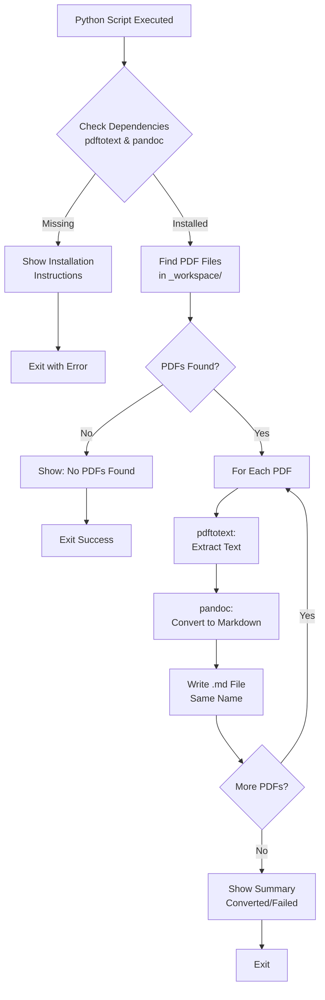
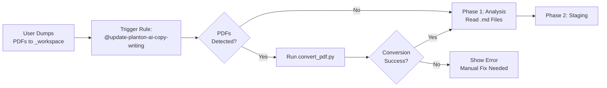

# PDF to Markdown Converter

Automated tool for converting PDF files to Markdown format in the copywriting workflow.

## Purpose

The copywriting automation workflow often receives feedback materials in PDF format (advisory feedback, meeting notes, research documents). This tool automatically converts PDFs to Markdown so the AI can read and process them during the analysis phase.

## Why This Tool Exists

**Problem**: The AI cannot directly read PDF files. Advisory feedback, customer interviews, and research documents are often provided as PDFs.

**Solution**: Automated conversion pipeline that:
- Detects PDF files in `_workspace/`
- Extracts text using `pdftotext` (from Poppler)
- Converts to clean Markdown using `pandoc`
- Outputs `.md` files in the same location
- Preserves original PDFs for reference

## How It Works



## Dependencies

### Required Tools

**Poppler** (provides `pdftotext`):
- Extracts text from PDF files
- Handles most text-based PDFs
- Install: `brew install poppler`

**Pandoc**:
- Converts plain text to Markdown
- Cleans up formatting
- Install: `brew install pandoc`

### Installation

```bash
# Install both dependencies
brew install poppler pandoc
```

### Verification

Check if tools are installed:

```bash
# Check pdftotext
which pdftotext

# Check pandoc
which pandoc

# Or run the converter (will check automatically)
python3 content/copywriting/_rules/pdf_converter/convert_pdf.py
```

## Usage

### Automatic (via Cursor Rule)

The `@update-planton-ai-copy-writing` rule automatically runs this tool when it detects PDF files in `_workspace/`.

**Workflow**:
1. Dump PDF files to `_workspace/`
2. Trigger `@update-planton-ai-copy-writing`
3. Rule detects PDFs
4. Automatically runs `convert_pdf.py`
5. PDFs converted to `.md` files
6. Analysis phase proceeds with Markdown files

### Manual

Run the script directly from the command line:

```bash
# From planton.ai root directory
python3 content/copywriting/_rules/pdf_converter/convert_pdf.py
```

**Or** from the pdf_converter directory:

```bash
cd content/copywriting/_rules/pdf_converter
./convert_pdf.py
```

## Input/Output

### Input

- **Location**: `content/copywriting/_workspace/*.pdf`
- **Formats**: Text-based PDF files
- **Limitations**: Scanned PDFs require OCR (not supported)

### Output

- **Location**: Same directory as input PDF
- **Format**: Markdown (`.md`)
- **Naming**: Same filename with `.md` extension

**Example**:
```
Before:
  _workspace/advisory-feedback.pdf

After:
  _workspace/advisory-feedback.pdf  (kept for reference)
  _workspace/advisory-feedback.md   (new)
```

## Terminal Output

The script provides formatted terminal output with clear status indicators:

### Success Output

```
======================================================================
  📑 PDF to Markdown Converter
  Planton.ai Copywriting Workflow
======================================================================

🔍 Checking dependencies...
  ✅ All dependencies installed

📂 Workspace: content/copywriting/_workspace

📋 Found 2 PDF file(s)

Processing: advisory-feedback.pdf
----------------------------------------------------------------------
  📄 Extracting text from: advisory-feedback.pdf
  🔄 Converting to Markdown...
  ✅ Created: advisory-feedback.md

Processing: meeting-transcript.pdf
----------------------------------------------------------------------
  📄 Extracting text from: meeting-transcript.pdf
  🔄 Converting to Markdown...
  ✅ Created: meeting-transcript.md

======================================================================
  📊 CONVERSION SUMMARY
======================================================================

  Total PDF files:         2
  Successfully converted:  2 ✅

======================================================================
```

### Error: Missing Dependencies

```
======================================================================
  ❌ MISSING DEPENDENCIES
======================================================================

The following tools are required but not installed:

  • pdftotext (from Poppler)
  • pandoc

----------------------------------------------------------------------
  📦 INSTALLATION
----------------------------------------------------------------------

Install the missing dependencies using Homebrew:

  brew install poppler pandoc

----------------------------------------------------------------------
  📖 MORE INFO
----------------------------------------------------------------------

  Poppler: https://poppler.freedesktop.org/
  Pandoc:  https://pandoc.org/

======================================================================
```

### Warning: Scanned PDF

```
Processing: scanned-document.pdf
----------------------------------------------------------------------
  📄 Extracting text from: scanned-document.pdf
  ⚠️  Warning: No text extracted from scanned-document.pdf
      This might be a scanned PDF requiring OCR
```

## Technical Details

### Conversion Pipeline

**Step 1: Text Extraction** (`pdftotext`)
```bash
pdftotext input.pdf -
```
- Extracts text to stdout
- Preserves layout where possible
- Fast and reliable for text-based PDFs

**Step 2: Markdown Conversion** (`pandoc`)
```bash
pandoc -t markdown --wrap=none
```
- Converts plain text to Markdown
- `--wrap=none` prevents unwanted line breaks
- Produces clean, readable Markdown

**Step 3: File Output**
- Writes to `.md` file
- UTF-8 encoding
- Same directory as source PDF

### Error Handling

**Dependency Check**:
- Verifies `pdftotext` and `pandoc` exist in PATH
- Shows installation instructions if missing
- Exits with error code 1

**Conversion Errors**:
- Catches subprocess errors
- Shows stderr output
- Continues with next PDF
- Reports failed conversions in summary

**Empty Text**:
- Detects when no text extracted
- Warns about scanned PDFs
- Suggests OCR may be needed

## Limitations

### Not Supported

**Scanned PDFs**:
- PDFs that are images of documents
- Requires OCR (Optical Character Recognition)
- Workaround: Use `ocrmypdf` first:
  ```bash
  brew install ocrmypdf
  ocrmypdf scanned.pdf ocred.pdf
  # Then run convert_pdf.py
  ```

**Complex Layouts**:
- Multi-column layouts may not convert cleanly
- Tables might lose formatting
- Images are not extracted

**Encrypted PDFs**:
- Password-protected PDFs not supported
- Remove encryption first

### Workarounds

**For scanned PDFs**:
```bash
# Install OCR tool
brew install ocrmypdf

# Convert scanned PDF to text-based PDF
ocrmypdf input.pdf output.pdf

# Then run converter
python3 content/copywriting/_rules/pdf_converter/convert_pdf.py
```

**For complex layouts**:
- Manual cleanup may be needed
- Review generated Markdown
- Edit for clarity if layout is messy

## Integration with Copywriting Workflow

### Workflow Integration



### Automatic Execution

The cursor rule checks for PDFs at the start of Phase 1 (Analysis):

1. **Scan workspace**: Look for `*.pdf` files
2. **Run converter**: Execute `convert_pdf.py`
3. **Check results**: Verify `.md` files created
4. **Proceed**: Continue with analysis using Markdown files

### Manual Execution

You can run the converter independently:

```bash
# Before triggering the rule
python3 content/copywriting/_rules/pdf_converter/convert_pdf.py

# Then trigger the rule
@update-planton-ai-copy-writing
```

## File Structure

```
content/copywriting/_rules/pdf_converter/
├── convert_pdf.py          # Main conversion script (executable)
└── README.md               # This file
```

## Exit Codes

- **0**: Success (all PDFs converted)
- **1**: Error (missing dependencies or conversion failures)

## Common Issues

### Issue: "command not found: pdftotext"

**Cause**: Poppler not installed

**Solution**:
```bash
brew install poppler
```

### Issue: "command not found: pandoc"

**Cause**: Pandoc not installed

**Solution**:
```bash
brew install pandoc
```

### Issue: "No text extracted"

**Cause**: PDF is scanned (image-based)

**Solutions**:
1. Use OCR:
   ```bash
   brew install ocrmypdf
   ocrmypdf input.pdf output.pdf
   ```
2. Manually copy text from PDF
3. Request text-based version from source

### Issue: "Messy Markdown output"

**Cause**: Complex PDF layout (multi-column, tables)

**Solutions**:
1. Manually clean up Markdown
2. Simplify PDF layout if possible
3. Extract specific sections only

## Best Practices

### Before Conversion

- **Verify PDFs are text-based**: Try copying text from PDF viewer
- **Check file sizes**: Very large PDFs may take time
- **Organize files**: Use descriptive names for easier tracking

### After Conversion

- **Review Markdown**: Check output for readability
- **Clean up if needed**: Fix formatting issues manually
- **Preserve PDFs**: Keep originals for reference

### When to Use

**Good for**:
- Advisory feedback documents
- Meeting notes and transcripts
- Research papers and reports
- Customer interview summaries
- Competitive analysis documents

**Not ideal for**:
- Scanned documents (use OCR first)
- Image-heavy PDFs
- Complex diagrams or charts
- Encrypted PDFs

## Testing

Test the converter manually:

```bash
# 1. Create test PDF in workspace
cp ~/test.pdf content/copywriting/_workspace/

# 2. Run converter
python3 content/copywriting/_rules/pdf_converter/convert_pdf.py

# 3. Check output
cat content/copywriting/_workspace/test.md

# 4. Clean up
rm content/copywriting/_workspace/test.*
```

## Troubleshooting

### Debug Mode

For verbose output, modify the script:

```python
# Add debugging
print(f"DEBUG: PDF path: {pdf_path}")
print(f"DEBUG: Output path: {output_path}")
```

### Check Dependencies Manually

```bash
# Check versions
pdftotext -v
pandoc --version

# Test pdftotext
pdftotext test.pdf - | head -20

# Test pandoc
echo "Test text" | pandoc -t markdown
```

## Related Documentation

- **Main Workflow**: `../../README.md` - Complete copywriting workflow
- **Cursor Rule**: `../update-planton-ai-copy-writing.mdc` - Automation rule
- **Workspace Guide**: `../../_workspace/README.md` - Materials preparation

---

**Script**: `convert_pdf.py` (Python 3)  
**Dependencies**: Poppler (pdftotext), Pandoc  
**Maintained By**: Planton Team

