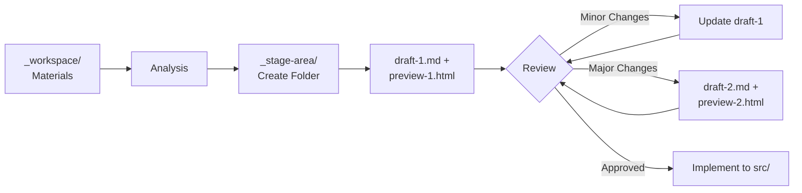

# Copywriting Stage Area

This directory contains staged drafts and HTML previews for copywriting updates before they're implemented on the website.

## Purpose

The stage area serves as a **review and iteration space** between analyzing feedback and implementing code changes. It allows you to:

- **Review content visually**: HTML previews show how copy will look
- **Iterate safely**: Refine drafts without touching source code
- **Maintain history**: All iterations are preserved as dated folders
- **Get stakeholder approval**: Non-technical reviewers can read HTML previews

## What's Inside

Each copywriting update creates a dated folder:

```
_stage-area/
├── 2025-12-19-landing-page-revamp-devops-in-a-box-positioning/
│   ├── draft-1.md
│   ├── preview-1.html
│   ├── draft-2.md
│   └── preview-2.html
├── 2025-12-31-hero-security-compliance/
│   ├── draft-1.md
│   └── preview-1.html
└── 2026-01-05-pricing-page-enterprise-focus/
    ├── draft-1.md
    └── preview-1.html
```

### Folder Naming

**Format**: `YYYY-MM-DD-description`

- **Date prefix**: When the update was started
- **Description**: Kebab-case summary (max 50 characters)

**Examples**:

- `2025-12-31-landing-hero-security-focus`
- `2025-12-31-pricing-enterprise-tier`
- `2025-12-31-customer-story-rad-cube`

### Files in Each Folder

**Draft Markdown** (`draft-N.md`):

- Structured content with sections
- Metadata (target page, sections, reason)
- Visual direction notes for designers
- Component mapping notes for developers

**HTML Preview** (`preview-N.html`):

- Styled visualization of draft content
- Dark theme matching planton.ai aesthetic
- Professional typography and layout
- No external dependencies (inline CSS)
- Open directly in browser for review

## Workflow Integration



### Iteration Logic

**Update existing draft** (draft-1.md):

- Minor wording changes
- Clarifications
- Small additions
- Same overall approach

**Create new draft** (draft-2.md, draft-3.md, etc.):

- Different messaging angle
- Structural changes
- Major content revision
- Fundamental approach shift

All drafts and previews remain in the folder for reference.

## How to Review

### Open HTML Preview

**From command line**:

```bash
open content/copywriting/_stage-area/YYYY-MM-DD-description/preview-1.html
```

**From file manager**:

- Navigate to the dated folder
- Double-click `preview-1.html`
- Opens in your default browser

### What to Check

- [ ] **Accuracy**: Facts, metrics, customer names correct
- [ ] **Clarity**: Messaging clear and concise
- [ ] **Consistency**: Aligns with brand voice and positioning
- [ ] **Completeness**: All sections addressed, no placeholders
- [ ] **Visual direction**: Clear guidance for implementation

### Provide Feedback

**Specific feedback works best**:

```
Section 2 (Problem/Solution):
- Too technical for business buyers
- Remove "Kubernetes orchestration" jargon
- Focus on outcome: "Deploy in <1 hour vs weeks"
```

**After feedback**: Rule updates or creates new draft based on scope.

## Git and History

### Committed to Git

Unlike `_workspace/` (gitignored), stage area folders **are committed**:

- ✅ Provides historical record of copywriting iterations
- ✅ Shows evolution of messaging over time
- ✅ Captures context and rationale in draft metadata
- ✅ Preserves approved content for reference

### Storage Considerations

**Typical growth**:

- ~2-5 MB per iteration (draft + HTML)
- ~10-20 iterations per year
- ~50-100 MB per year total

**Cleanup strategy**:

- Keep all folders for current year
- Keep significant iterations from previous years
- Delete minor iterations older than 12 months (if needed)

## After Implementation

Once a draft is implemented:

1. **Folder remains**: Historical record preserved
2. **Workspace cleaned**: Materials removed from `_workspace/`
3. **Changelog created**: Entry in `_changelog/YYYY-MM/`
4. **Code updated**: React components in `src/` modified

The stage folder serves as a reference for what was changed and why.

## Finding Previous Iterations

**By date**:

```bash
ls -la content/copywriting/_stage-area/ | grep "2025-12"
```

**By description**:

```bash
find content/copywriting/_stage-area/ -name "*landing-hero*"
```

**View specific draft**:

```bash
cat content/copywriting/_stage-area/2025-12-31-hero-security/draft-1.md
```

## Stage Area vs Workspace

| Aspect        | `_workspace/`                | `_stage-area/`                 |
| ------------- | ---------------------------- | ------------------------------ |
| **Purpose**   | Input materials              | Staged drafts                  |
| **Content**   | Transcripts, PDFs, feedback  | Markdown drafts, HTML previews |
| **Git**       | Ignored (temporary)          | Committed (historical)         |
| **Lifecycle** | Cleaned after implementation | Preserved indefinitely         |
| **Review**    | Raw materials                | Polished content for approval  |

## Related Documentation

- **Rules README**: `../_rules/README.md` - Using the copywriting rule
- **Main README**: `../README.md` - Complete workflow overview
- **Workspace README**: `../_workspace/README.md` - Materials preparation

---

**Status**: Active stage area for copywriting iterations  
**Git Tracked**: Yes (all folders committed)  
**Maintained By**: Planton Team
