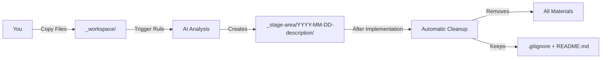

# Copywriting Workspace

This directory is a temporary staging area for materials related to copywriting updates. It serves as the input for the copywriting automation workflow.

## Purpose

The `_workspace` directory:

- **Collects feedback materials**: Meeting transcripts, advisory feedback, research notes
- **Provides context**: All materials the AI needs to understand what to change
- **Temporary storage**: Contents are cleaned up after implementation
- **Gitignored**: Nothing here gets committed (except `.gitignore` and this `README.md`)

## What Goes Here

### Accepted Materials

**Meeting Transcripts**:

- `.md` (Markdown transcripts)
- `.txt` (Plain text transcripts)
- Raw transcription files from Otter.ai, Fireflies, etc.

**Feedback Documents**:

- `.pdf` (Advisory feedback, presentation slides)
- `.docx` (Word documents with feedback)
- `.md` (Markdown notes from stakeholders)

**Research & Analysis**:

- Competitive analysis documents
- Market research reports
- Customer interview notes
- Survey results

**Visual Materials**:

- `.png`, `.jpg`, `.jpeg` (Screenshots, mockups, diagrams)
- `.pdf` (Annotated designs, wireframes)

**Notes & Context**:

- Planning documents
- Strategy notes
- Product update announcements
- Feature requirement docs

### Not Recommended

- ❌ Unrelated files (code, configs, random downloads)
- ❌ Personal or sensitive information (passwords, API keys)
- ❌ Large media files (videos, high-res images >10MB)
- ❌ Binary files that can't be parsed (executables, archives)

## How to Use

### Step 1: Dump Materials

Copy all relevant files into this directory:

```bash
# From command line
cp ~/Downloads/advisory-feedback.pdf content/copywriting/_workspace/
cp ~/Documents/meeting-transcript.md content/copywriting/_workspace/
cp ~/Desktop/competitor-analysis.pdf content/copywriting/_workspace/

# Or drag and drop in your file manager
```

### Step 2: Organize (Optional)

While not required, organization helps:

```bash
content/copywriting/_workspace/
├── advisory-feedback-2025-12-13.pdf
├── meeting-transcript-healthcare-vertical.md
├── competitor-qovery-analysis.md
├── customer-feedback-iorta.txt
└── context-notes.md
```

**Naming Best Practices**:

- Use descriptive names: `advisory-feedback-healthcare.pdf` (not `feedback.pdf`)
- Include dates when relevant: `2025-12-13-meeting-transcript.md`
- Use lowercase and hyphens: `customer-story-rad-cube.md`

### Step 3: Add Context File (Recommended)

Create a `context.md` or `notes.md` file summarizing the materials:

```markdown
# Copywriting Update Context

**Date**: December 31, 2025  
**Update Type**: Landing page hero section  
**Reason**: Healthcare vertical targeting

## Materials Included

1. **advisory-feedback-2025-12-13.pdf**

   - Feedback from Bala (Milestone) and Murali (DevSecOps)
   - Key theme: Emphasize security and compliance for healthcare market

2. **meeting-transcript-healthcare-vertical.md**

   - Discussion with Ruchi about vertical strategy
   - HIPAA and SOC 2 certification importance highlighted

3. **competitor-qovery-analysis.md**
   - How Qovery positions security
   - Our differentiation: customer-hosted runners, open source transparency

## Key Insights

- Healthcare market needs upfront security messaging
- SOC 2 certification critical for enterprise deals
- Current hero doesn't address compliance concerns
- Competitors lead with security in healthcare pitches

## Desired Changes

- Update hero headline to include "enterprise security"
- Add security trust badges (SOC 2, HIPAA ready)
- Highlight customer-hosted deployment option
- Move compliance section higher on page

## Target Audience

- Healthcare IT decision makers
- Compliance officers at hospitals/clinics
- CISOs evaluating DevOps platforms
```

This context file helps the AI understand your intent and makes the analysis phase faster and more accurate.

## Workflow Integration



### Automatic Cleanup

After successful implementation:

1. **All files removed**: Every file in `_workspace/` except `.gitignore` and `README.md`
2. **No manual work**: Cleanup is automatic
3. **Clean slate**: Ready for next copywriting iteration

**Before implementation**:

```bash
content/copywriting/_workspace/
├── .gitignore
├── README.md
├── advisory-feedback.pdf
├── meeting-transcript.md
└── context-notes.md
```

**After implementation**:

```bash
content/copywriting/_workspace/
├── .gitignore
└── README.md
```

### Why Cleanup Matters

- **No git bloat**: Temporary materials don't clutter repository history
- **Clear state**: Next iteration starts fresh
- **No confusion**: Always know what materials are "current"
- **Privacy**: Sensitive feedback materials aren't committed

## Example Scenarios

### Scenario 1: Advisory Feedback Session

**Context**: You had an advisory meeting with strategic advisors who provided feedback on product positioning.

**Materials to Dump**:

1. Meeting transcript (`.md` or `.txt`)
2. Presentation slides from meeting (`.pdf`)
3. Your notes summarizing feedback (`.md`)
4. Any emails or follow-up materials (`.pdf` or `.md`)

**Example Workspace**:

```bash
_workspace/
├── 2025-12-13-advisory-meeting-transcript.md
├── advisory-presentation-deck.pdf
├── notes-from-ruchi-feedback.md
└── followup-email-bala.pdf
```

### Scenario 2: Customer Feedback

**Context**: Customer shared pain points and feature requests that impact messaging.

**Materials to Dump**:

1. Customer interview notes
2. Support tickets or feature requests
3. Email thread with customer
4. Screenshots of customer's current setup

**Example Workspace**:

```bash
_workspace/
├── iorta-technext-interview-notes.md
├── feature-request-compliance-dashboard.pdf
├── email-thread-soc2-questions.txt
└── screenshot-current-landing-page-feedback.png
```

### Scenario 3: Competitive Analysis

**Context**: You researched competitors and want to update positioning accordingly.

**Materials to Dump**:

1. Competitor website screenshots
2. Your analysis document
3. Pricing comparison spreadsheet (exported as PDF or CSV)
4. Feature comparison matrix

**Example Workspace**:

```bash
_workspace/
├── qovery-landing-page-screenshot.png
├── terraform-cloud-pricing-screenshot.png
├── competitive-analysis-summary.md
└── feature-comparison-matrix.pdf
```

### Scenario 4: Product Update

**Context**: Engineering shipped a major feature that needs to be reflected on the website.

**Materials to Dump**:

1. Feature announcement or spec
2. Technical documentation
3. Customer beta feedback
4. Marketing brief from product team

**Example Workspace**:

```bash
_workspace/
├── agent-fleet-feature-spec.md
├── technical-docs-specialized-agents.pdf
├── beta-customer-feedback-agent-fleet.md
└── marketing-brief-positioning-agents.md
```

## File Format Tips

### Markdown Files (`.md`)

Best for:

- Meeting notes
- Your own analysis
- Structured feedback
- Context documentation

**Example**:

```markdown
# Advisory Feedback - Healthcare Vertical

## Key Themes

1. **Security Emphasis**: Current messaging doesn't address compliance
2. **Trust Indicators**: Need SOC 2 and HIPAA badges visible
3. **Customer-Hosted**: Self-hosted option is unique differentiator

## Specific Suggestions

- Bala: "Lead with security in the hero for healthcare"
- Murali: "Three deployment topologies should be above the fold"
- Ruchi: "Use customer story from regulated industry"

## Next Steps

Update landing page hero section and security section.
```

### PDF Files (`.pdf`)

Best for:

- Presentation slides
- Formal reports
- Email attachments from stakeholders
- Annotated screenshots

**Tip**: Add a context note explaining what's in the PDF:

```markdown
# context-notes.md

## advisory-feedback-2025-12-13.pdf

- Slides from Bala's presentation on healthcare market opportunity
- Pages 3-5 contain messaging recommendations
- Page 8 has competitive positioning suggestions
```

### Text Files (`.txt`)

Best for:

- Raw transcripts
- Simple notes
- Copy-pasted content

**Example**:

```
Meeting Transcript - Healthcare Vertical Strategy
Date: December 13, 2025

[00:00] Ruchi: The healthcare market is $2B+ opportunity
[02:15] Bala: Security and compliance must be front and center
[05:30] Murali: HIPAA BAA is table stakes for hospital deployments
[12:00] Discussion about customer-hosted deployment model
[18:45] Action item: Update landing page to emphasize security
```

### Image Files (`.png`, `.jpg`)

Best for:

- Screenshots of competitor sites
- Wireframes or mockups
- Annotated designs
- Visual feedback

**Tip**: Name images descriptively:

- `qovery-hero-section-screenshot.png` ✅
- `IMG_1234.png` ❌

## Common Mistakes to Avoid

### ❌ Mistake 1: Not Providing Enough Context

**Bad**:

```bash
_workspace/
└── feedback.pdf
```

**Good**:

```bash
_workspace/
├── advisory-feedback-healthcare-2025-12-13.pdf
└── context-notes.md  # Explains what's in the PDF
```

### ❌ Mistake 2: Dumping Unrelated Files

**Bad**:

```bash
_workspace/
├── advisory-feedback.pdf
├── random-code-snippet.ts      # Not relevant
├── my-todo-list.txt            # Not relevant
└── vacation-photos.zip         # Definitely not relevant
```

**Good**:

```bash
_workspace/
├── advisory-feedback-healthcare.pdf
├── meeting-transcript.md
└── competitor-analysis.md
```

### ❌ Mistake 3: No Explanation of Intent

Just dumping materials without explaining what you want changed leaves the AI guessing.

**Bad**:

```
# Just files, no explanation
_workspace/
├── some-feedback.pdf
└── notes.txt
```

**Good**:

```
# Files + context
_workspace/
├── advisory-feedback.pdf
├── meeting-transcript.md
└── UPDATE-INTENT.md  # ← Explains what to change and why
```

**UPDATE-INTENT.md**:

```markdown
# Update Intent

**Target**: Landing page hero section  
**Change**: Emphasize security and compliance for healthcare vertical  
**Why**: Advisory feedback indicates healthcare is high-value market but current
messaging doesn't address compliance concerns upfront  
**Key Messages**: SOC 2, HIPAA ready, customer-hosted deployment, zero vendor lock-in
```

### ❌ Mistake 4: Leaving Files After Implementation

While cleanup is automatic, don't manually add files back after cleanup.

**After Cleanup** (correct state):

```bash
_workspace/
├── .gitignore
└── README.md
```

If you need to reference old materials, find them in:

- `_stage-area/YYYY-MM-DD-description/` (drafts and context)
- `_changelog/YYYY-MM/` (implementation details)
- Git history (if materials were processed before gitignore setup)

## Troubleshooting

### Issue: AI Can't Parse My PDF

**Symptoms**: Analysis summary says "Unable to extract text from PDF"

**Causes**:

- PDF is scanned image (not text-based)
- PDF has copy protection
- PDF contains only images

**Solutions**:

1. Use OCR tool to extract text, save as `.txt`
2. Manually copy-paste key content into `.md` file
3. Provide summary in context file

### Issue: AI Misunderstands Intent

**Symptoms**: Analysis summary identifies wrong target or wrong changes

**Causes**:

- Materials are ambiguous
- No context file explaining intent
- Multiple conflicting themes in materials

**Solutions**:

1. Add `context-notes.md` with clear explanation
2. Remove unrelated materials
3. When triggering rule, provide explicit context:

   ```
   @update-planton-ai-copy-writing

   Focus on the hero section update (ignore the pricing feedback for now).
   Target: Landing page hero only.
   Key change: Add security messaging for healthcare vertical.
   ```

### Issue: Too Many Materials, Analysis is Slow

**Symptoms**: Analysis phase takes a long time

**Causes**:

- Large PDF files (>10MB)
- Many image files
- Very long transcripts

**Solutions**:

1. Extract only relevant sections from large PDFs
2. Resize or compress images
3. Create summary document highlighting key points
4. Split into multiple smaller updates

## Git and Version Control

### What's Gitignored

The `.gitignore` file in this directory contains:

```gitignore
# Ignore everything in _workspace except .gitignore and README.md
*
!.gitignore
!README.md
```

This means:

- ✅ `.gitignore` is committed
- ✅ `README.md` is committed
- ❌ Everything else is ignored (not committed)

### Why Gitignore Matters

**Privacy**: Advisory feedback and customer transcripts may contain sensitive information that shouldn't be in public git history.

**Repository Size**: Temporary materials (PDFs, images, transcripts) would bloat the repository if committed.

**Clarity**: Git history should show code and documentation changes, not temporary working materials.

### Where Materials End Up

Materials aren't lost—they inform the drafts:

1. **Analysis phase**: AI reads materials from `_workspace/`
2. **Drafts created**: Key insights captured in `_stage-area/YYYY-MM-DD-description/`
3. **Drafts committed**: Stage area drafts and HTMLs are committed to git
4. **Historical record**: Drafts show what changed and why (without exposing raw materials)

## FAQ

**Q: Do I have to organize files in any particular way?**  
A: No. The AI reads all files regardless of structure. Organization just helps you.

**Q: What if I have 10+ files?**  
A: That's fine. The AI will process all of them. Consider adding a context file summarizing the key themes.

**Q: Can I add files after triggering the rule?**  
A: Yes, but you'll need to trigger the rule again. It only reads files present when triggered.

**Q: What if I make a mistake and add wrong files?**  
A: Just delete them from `_workspace/` and trigger the rule again with clarifying context.

**Q: Are materials deleted immediately after the rule triggers?**  
A: No. Cleanup happens after successful implementation (Phase 5). Materials remain through staging and iteration phases.

**Q: Can I manually clean workspace before implementation?**  
A: You can, but it's not necessary. Automatic cleanup ensures nothing is missed.

**Q: What if cleanup fails?**  
A: The rule will report the error. You can manually delete files (except `.gitignore` and `README.md`).

**Q: Can I keep certain files after cleanup?**  
A: The rule always cleans everything except `.gitignore` and `README.md`. If you want to preserve materials, copy them elsewhere before implementation.

## Related Documentation

- **Parent README**: `content/copywriting/README.md` (workflow overview)
- **Cursor Rule**: `content/copywriting/_rules/update-planton-ai-copy-writing.mdc`
- **Stage Area**: `content/copywriting/_stage-area/` (output drafts and HTML previews)

---

**Status**: Active workspace, ready for materials  
**Last Cleaned**: [Automatically cleaned after each implementation]  
**Maintained By**: Planton Team
