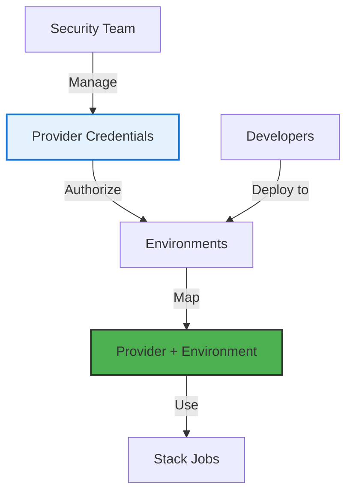
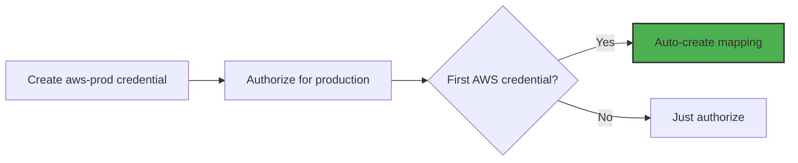

# Credentials and Mappings

## Your Cloud Authentication Command Center

Remember the last time you accidentally deployed to production instead of staging because you had the wrong AWS credentials exported? Or when the new developer couldn't deploy because they didn't have access to the credentials? Credentials and Mappings solves these problems permanently.

This system separates the concerns of who can SEE credentials (security team) from who can USE credentials (developers), while ensuring the right credentials are always used for the right environment automatically.

> **Credentials Philosophy**: Developers should be able to deploy without ever seeing a secret. Security teams should control access without becoming bottlenecks.

## The Authentication Challenge

In a typical organization, you might have:
- Multiple AWS accounts (dev, staging, prod, audit)
- Several GCP projects for different teams
- Azure subscriptions per department
- Kubernetes clusters everywhere

Managing who can deploy what, where, with which credentials becomes a nightmare. That's where our mapping system shines.

## How Credential Management Works

### The Three-Layer System



1. **Credentials**: The actual secrets (AWS keys, GCP service accounts, etc.)
2. **Authorization**: Which environments can use which credentials
3. **Mapping**: Which credential is DEFAULT for each provider/environment pair

### Key Concepts

**Credential Ownership**
- Created and managed by security/DevOps team
- Encrypted at rest and in transit
- Never exposed to end users
- Audited on every access

**Authorization vs Mapping**
- **Authorization**: "This credential CAN be used in production"
- **Mapping**: "This credential IS the default for AWS in production"

**Automatic Selection**
- Stack Jobs automatically get the right credentials
- No manual credential management needed
- Override capability when required

## Provider Credentials

### AWS Credentials

```yaml
apiVersion: connect.planton.cloud/v1
kind: AwsCredential
metadata:
  name: aws-production
  org: acmecorp
spec:
  # Option 1: IAM User (simple but less secure)
  accessKeyId: ${AWS_ACCESS_KEY_ID}
  secretAccessKey: ${AWS_SECRET_ACCESS_KEY}
  
  # Option 2: Assume Role (recommended)
  assumeRole:
    roleArn: arn:aws:iam::123456789:role/planton-cloud
    externalId: "acmecorp-prod-1234"
    sessionDuration: 3600
    
  # Default region for operations
  region: us-east-1
  
  # Account metadata (for clarity)
  accountId: "123456789"
  accountAlias: "acmecorp-production"
```

### GCP Credentials

```yaml
apiVersion: connect.planton.cloud/v1
kind: GcpCredential
metadata:
  name: gcp-data-project
  org: acmecorp
spec:
  # Service account key (base64 encoded)
  serviceAccountKeyBase64: ${GCP_SA_KEY_BASE64}
  
  # Project information
  projectId: acmecorp-data-prod
  projectNumber: "987654321"
  
  # Workload identity (for GKE)
  workloadIdentity:
    enabled: true
    serviceAccount: planton-cloud@acmecorp-data.iam
```

### Azure Credentials

```yaml
apiVersion: connect.planton.cloud/v1
kind: AzureCredential
metadata:
  name: azure-enterprise
  org: acmecorp
spec:
  # Service principal
  subscriptionId: ${AZURE_SUBSCRIPTION_ID}
  tenantId: ${AZURE_TENANT_ID}
  clientId: ${AZURE_CLIENT_ID}
  clientSecret: ${AZURE_CLIENT_SECRET}
  
  # Optional: Managed identity
  useManagedIdentity: false
```

### Kubernetes Credentials

```yaml
apiVersion: connect.planton.cloud/v1
kind: KubernetesCredential
metadata:
  name: prod-eks-cluster
  org: acmecorp
spec:
  # Option 1: Kubeconfig (simple)
  kubeconfigBase64: ${KUBECONFIG_BASE64}
  
  # Option 2: Individual fields (secure)
  endpoint: https://k8s.example.com
  certificateAuthorityData: ${CA_CERT_BASE64}
  authentication:
    # Token-based
    token: ${SERVICE_ACCOUNT_TOKEN}
    
    # Or client certificate
    clientCertificateData: ${CLIENT_CERT_BASE64}
    clientKeyData: ${CLIENT_KEY_BASE64}
    
    # Or AWS EKS
    eksCluster:
      clusterName: prod-cluster
      region: us-east-1
```

## Authorization: Sharing Credentials

When creating credentials, authorize them for specific environments:

```yaml
# During credential creation
apiVersion: connect.planton.cloud/v1
kind: AwsCredential
metadata:
  name: aws-dev-account
  org: acmecorp
spec:
  # ... credential details ...
  
  # Authorize for environments
  authorizedEnvironments:
    - development
    - testing
```

Or authorize after creation:

```bash
# Authorize credential for environment
planton credential authorize aws-prod \
  --env production \
  --reason "Production AWS account for main workloads"

# Revoke authorization
planton credential revoke aws-prod \
  --env staging \
  --reason "Staging should use separate account"
```

## Provider Credential Mapping

The mapping determines which credential is used by default:

### How Mappings Work

```yaml
# Created automatically when first credential is authorized
apiVersion: infra-hub.planton.cloud/v1
kind: ProviderCredentialMapping
metadata:
  name: production-aws-mapping
  org: acmecorp
spec:
  environment: production
  provider: aws
  credentialId: awscred_0123456789
```

Only ONE credential can be mapped per provider per environment:
- ✅ Production + AWS → aws-prod-credential
- ✅ Production + GCP → gcp-prod-credential  
- ❌ Production + AWS → Can't have two mappings!

### Automatic Mapping

First authorized credential becomes the default:



### Manual Mapping Changes

Switch default credentials:

```bash
# List current mappings
planton env describe production

# Output:
Environment: production
Provider Mappings:
  aws: aws-account-123 (aws-prod-credential)
  gcp: project-xyz (gcp-prod-credential)
  
Authorized Credentials:
  aws: [aws-prod-credential, aws-backup-credential]
  gcp: [gcp-prod-credential]

# Change AWS mapping
planton credential map aws-backup-credential \
  --env production \
  --reason "Switching to backup account for migration"
```

## Stack Job Credential Selection

When a Stack Job runs, here's how credentials are selected:

### 1. Automatic Selection (Default)

```yaml
# Developer deploys RDS to production
apiVersion: infra-hub.planton.cloud/v1
kind: AwsRds
metadata:
  name: app-database
  env: production  # This determines credential selection
```

Stack Job automatically:
1. Identifies provider needed (AWS)
2. Looks up environment (production)
3. Finds mapping (production + AWS → aws-prod-credential)
4. Injects credential into Terraform/Pulumi

### 2. Override Selection

```yaml
# Use specific credential
apiVersion: infra-hub.planton.cloud/v1
kind: AwsRds
metadata:
  name: audit-database
  env: production
  annotations:
    credential-override: aws-audit-account  # Must be authorized
```

### 3. Cross-Environment Resources

```yaml
# S3 bucket in prod account, accessible from staging
apiVersion: infra-hub.planton.cloud/v1
kind: AwsS3Bucket
metadata:
  name: shared-artifacts
  env: staging  # Deployed TO staging
spec:
  # But created IN production account
  providerCredentialOverride: aws-prod-credential
  
  # Grant staging access
  bucketPolicy:
    allowCrossAccount:
      - account: staging-account-id
        permissions: ["GetObject", "ListBucket"]
```

## Real-World Patterns

### Multi-Account AWS Strategy

Common setup for AWS organizations:

```yaml
# 1. Security Account (holds all credentials)
kind: AwsCredential
metadata:
  name: aws-security
spec:
  assumeRole:
    roleArn: arn:aws:iam::111111111:role/security-admin
---
# 2. Dev Account
kind: AwsCredential
metadata:
  name: aws-dev
spec:
  assumeRole:
    roleArn: arn:aws:iam::222222222:role/planton-deploy
    sourceCredential: aws-security  # Chain from security
---
# 3. Prod Account  
kind: AwsCredential
metadata:
  name: aws-prod
spec:
  assumeRole:
    roleArn: arn:aws:iam::333333333:role/planton-deploy
    sourceCredential: aws-security
```

Map to environments:
```bash
planton credential map aws-dev --env development
planton credential map aws-dev --env testing  
planton credential map aws-prod --env staging
planton credential map aws-prod --env production
```

### GCP Project Per Environment

```yaml
# Development Project
kind: GcpCredential
metadata:
  name: gcp-dev
spec:
  projectId: acmecorp-dev
  serviceAccountKeyBase64: ${DEV_SA_KEY}
authorizedEnvironments: [development, testing]
---
# Production Project
kind: GcpCredential
metadata:
  name: gcp-prod
spec:
  projectId: acmecorp-prod
  serviceAccountKeyBase64: ${PROD_SA_KEY}
authorizedEnvironments: [staging, production]
```

### Kubernetes Multi-Cluster

```yaml
# Regional clusters
kind: KubernetesCredential
metadata:
  name: k8s-us-east
spec:
  eksCluster:
    clusterName: prod-us-east
    region: us-east-1
---
kind: KubernetesCredential
metadata:
  name: k8s-eu-west
spec:
  eksCluster:
    clusterName: prod-eu-west
    region: eu-west-1
```

Environment with multi-region:
```yaml
kind: Environment
metadata:
  name: production-global
spec:
  regions:
    - name: us-east
      primary: true
      kubernetesCredential: k8s-us-east
    - name: eu-west
      kubernetesCredential: k8s-eu-west
```

## Security Best Practices

### 1. Principle of Least Privilege

```yaml
# Dev credential - limited permissions
kind: AwsCredential
metadata:
  name: aws-dev-limited
spec:
  assumeRole:
    roleArn: arn:aws:iam::${ACCOUNT}:role/dev-deployer
    policyArns:
      - arn:aws:iam::aws:policy/PowerUserAccess
    inlinePolicies:
      - name: DenyDangerous
        policy: |
          {
            "Version": "2012-10-17",
            "Statement": [{
              "Effect": "Deny",
              "Action": [
                "iam:*",
                "organizations:*",
                "account:*"
              ],
              "Resource": "*"
            }]
          }
```

### 2. Credential Rotation

```yaml
# Annotation-driven rotation
kind: AwsCredential
metadata:
  name: aws-prod
  annotations:
    rotation-period: "90d"
    last-rotated: "2024-01-15"
    next-rotation: "2024-04-15"
spec:
  # ... credential details ...
  
# Rotation policy
kind: CredentialRotationPolicy
spec:
  automatic: true
  notifyDaysBefore: 14
  recipients: ["security@acmecorp.com"]
```

### 3. Audit and Compliance

Track credential usage:

```bash
# Credential usage audit
planton audit credential aws-prod --days 30

# Output:
Credential: aws-prod
Period: 2024-01-15 to 2024-02-15

Usage by Environment:
- production: 1,234 stack jobs
- staging: 0 stack jobs (not authorized)

Usage by Resource Type:
- aws_rds: 45 deployments
- aws_eks_cluster: 12 deployments
- aws_s3_bucket: 178 deployments

Access Patterns:
- Peak usage: 14:00-16:00 UTC
- Unique users: 23
- Failed authentications: 0
```

### 4. Emergency Access

Break-glass procedures:

```yaml
# Emergency credential with extra logging
kind: AwsCredential
metadata:
  name: aws-emergency
  annotations:
    purpose: "Emergency break-glass access"
    notify-on-use: "security@acmecorp.com,ops@acmecorp.com"
spec:
  assumeRole:
    roleArn: arn:aws:iam::${ACCOUNT}:role/emergency-admin
  restrictions:
    maxUsesPerDay: 1
    requiresMFA: true
    notificationRequired: true
```

## Troubleshooting Credential Issues

### "No credential mapped for provider"

```bash
# Check environment mappings
planton env describe production

# If no mapping exists, create one
planton credential map aws-prod --env production
```

### "Credential not authorized for environment"

```bash
# Check authorizations
planton credential describe aws-prod

# Authorize if needed
planton credential authorize aws-prod --env production
```

### "Invalid credentials" during Stack Job

```bash
# Test credential directly
planton credential test aws-prod

# Check credential details (without secrets)
planton credential describe aws-prod --verbose

# Verify AWS-specific
aws sts get-caller-identity \
  --profile planton-test-aws-prod
```

### "Multiple credentials available"

```bash
# List all authorized credentials
planton env describe production --show-all-credentials

# Explicitly set mapping
planton credential map preferred-credential --env production
```

## Monitoring and Alerts

### Key Metrics

```yaml
# Prometheus metrics
credential_usage_total{credential="aws-prod", environment="production"}
credential_auth_failures{credential="aws-prod", reason="expired"}
credential_rotation_days_remaining{credential="aws-prod"}
mapping_changes_total{environment="production", provider="aws"}
```

### Important Alerts

```yaml
# Credential expiring soon
alert: CredentialExpiringSoon
expr: credential_rotation_days_remaining < 14
annotations:
  summary: "Credential {{ $labels.credential }} expires in {{ $value }} days"

# Unusual credential usage
alert: UnexpectedCredentialUsage
expr: rate(credential_usage_total[1h]) > 10 * rate(credential_usage_total[24h:1h])
annotations:
  summary: "Unusual spike in credential {{ $labels.credential }} usage"

# Failed authentications
alert: CredentialAuthFailures
expr: increase(credential_auth_failures[5m]) > 3
annotations:
  summary: "Multiple auth failures for {{ $labels.credential }}"
```

## Best Practices Summary

### DO:
- ✅ Use separate credentials per environment
- ✅ Authorize only what's needed
- ✅ Rotate credentials regularly
- ✅ Monitor credential usage
- ✅ Use assume-role over static keys
- ✅ Document credential purpose

### DON'T:
- ❌ Share credentials across environments
- ❌ Give developers direct credential access
- ❌ Use personal AWS accounts
- ❌ Ignore rotation schedules
- ❌ Over-authorize credentials
- ❌ Hard-code credentials anywhere

## What's Next?

Master credentials and explore:

- **[Security & Compliance](/docs/infra-hub/security)** - Advanced security patterns
- **[Multi-Cloud Strategy](/docs/infra-hub/multi-cloud)** - Managing multiple providers
- **[Disaster Recovery](/docs/infra-hub/disaster-recovery)** - Credential backup strategies
- **[Cost Management](/docs/infra-hub/cost-management)** - Track costs by credential

> **Remember**: Good credential management is invisible—developers deploy without thinking about it, security teams sleep well at night, and everything just works.
