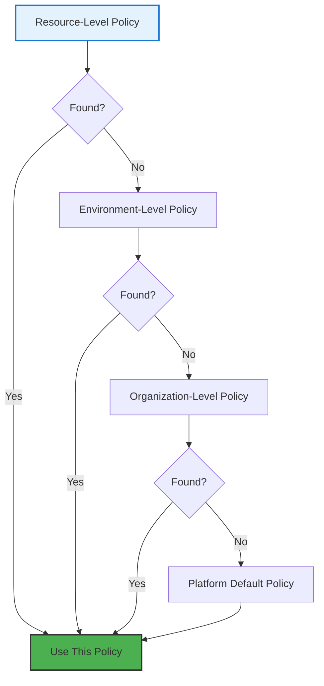

# Flow Control

## Your Infrastructure Deployment Governance

Remember the anxiety of running `terraform apply` in production? The careful dance of plan, review, approve, apply? Flow Control takes that manual process and makes it policy—automatic, consistent, and auditable. It's governance without the bottleneck.

Flow Control in Planton Cloud lets you define exactly how infrastructure changes should flow through your organization. Want manual approvals for production? Automatic deployments for dev? Skip the plan step for trusted modules? Flow Control makes it happen.

> **Flow Control Philosophy**: Infrastructure changes should follow your organization's processes, not the other way around. Define the rules once, apply them everywhere.

## What is Flow Control Policy?

A Flow Control Policy is a set of rules that govern how Stack Jobs execute. Think of it as your infrastructure's deployment pipeline configuration—but applied automatically based on context.

### Core Controls

```yaml
apiVersion: infra-hub.planton.cloud/v1
kind: FlowControlPolicy
metadata:
  name: production-careful
spec:
  selector:
    kind: environment
    id: production
  flowControl:
    # Require manual trigger
    isManual: false
    
    # Disable automatic triggers  
    disableOnLifecycleEvents: false
    
    # Skip refresh step
    skipRefresh: false
    
    # Require preview/plan
    previewBeforeUpdateOrDestroy: true
    
    # Pause for approval
    pauseBetweenPreviewAndUpdateOrDestroy: true
```

Each control serves a specific governance need:

### 🎯 `isManual`
**What it does**: Requires manual approval to START the Stack Job  
**Use when**: You want to review WHAT will be deployed before it begins  
**Example**: "All production deployments must be manually initiated"

### 🔄 `disableOnLifecycleEvents`
**What it does**: Prevents automatic Stack Job creation on config changes  
**Use when**: You want to batch changes or deploy on a schedule  
**Example**: "Collect all staging changes and deploy together at 6 PM"

### ⚡ `skipRefresh`
**What it does**: Skips the state refresh step to save time  
**Use when**: You know the infrastructure hasn't drifted  
**Example**: "Dev environments don't need drift detection"

### 👁️ `previewBeforeUpdateOrDestroy`
**What it does**: Always run plan/preview before making changes  
**Use when**: You want to see changes before they happen (always!)  
**Example**: "Never apply blind—always show the plan first"

### ⏸️ `pauseBetweenPreviewAndUpdateOrDestroy`
**What it does**: Requires manual approval AFTER seeing the plan  
**Use when**: Human review is required for safety  
**Example**: "Production changes need sign-off after review"

## Policy Hierarchy and Resolution

Flow Control Policies follow a strict hierarchy. The most specific policy wins:



### Resolution Example

```yaml
# 1. Platform Default (least specific)
kind: FlowControlPolicy
metadata:
  name: platform-default
spec:
  selector:
    kind: platform
    id: planton_cloud
  flowControl:
    previewBeforeUpdateOrDestroy: true
    pauseBetweenPreviewAndUpdateOrDestroy: false

# 2. Organization Override
kind: FlowControlPolicy  
metadata:
  name: acmecorp-standard
spec:
  selector:
    kind: organization
    id: acmecorp
  flowControl:
    previewBeforeUpdateOrDestroy: true
    pauseBetweenPreviewAndUpdateOrDestroy: false
    skipRefresh: true  # Org wants faster deployments

# 3. Environment Override
kind: FlowControlPolicy
metadata:
  name: production-careful
spec:
  selector:
    kind: environment
    id: prod-env
  flowControl:
    previewBeforeUpdateOrDestroy: true
    pauseBetweenPreviewAndUpdateOrDestroy: true  # Prod needs approval

# 4. Resource Override (most specific)
kind: FlowControlPolicy
metadata:
  name: critical-database-extra-careful
spec:
  selector:
    kind: aws_rds
    id: billing-database
  flowControl:
    isManual: true  # This specific database needs extra care
    previewBeforeUpdateOrDestroy: true
    pauseBetweenPreviewAndUpdateOrDestroy: true
```

Resolution for different resources:
- `billing-database` RDS → Uses resource-specific policy (most restrictive)
- Any other prod resource → Uses production environment policy  
- Staging resources → Uses organization policy (faster)
- Resources in new environments → Fall back to platform default

## Common Flow Control Patterns

### The Development Speed Pattern

Optimize for velocity in development:

```yaml
apiVersion: infra-hub.planton.cloud/v1
kind: FlowControlPolicy
metadata:
  name: dev-fast
spec:
  selector:
    kind: environment
    id: development
  flowControl:
    isManual: false                           # Auto-trigger
    disableOnLifecycleEvents: false           # Deploy on push
    skipRefresh: true                         # Skip drift check
    previewBeforeUpdateOrDestroy: true        # Still preview
    pauseBetweenPreviewAndUpdateOrDestroy: false  # But don't wait
```

**Result**: Push config → See plan → Auto-apply (typically < 2 minutes)

### The Production Safety Pattern

Maximum safety for critical environments:

```yaml
apiVersion: infra-hub.planton.cloud/v1
kind: FlowControlPolicy
metadata:
  name: prod-safe
spec:
  selector:
    kind: environment
    id: production
  flowControl:
    isManual: false                           # Auto-create job
    disableOnLifecycleEvents: false           # Track all changes
    skipRefresh: false                        # Always check drift
    previewBeforeUpdateOrDestroy: true        # Always plan first
    pauseBetweenPreviewAndUpdateOrDestroy: true   # Require approval
```

**Result**: Push config → Refresh → Plan → ⏸️ Wait for approval → Apply

### The Batch Deployment Pattern

Collect changes and deploy together:

```yaml
apiVersion: infra-hub.planton.cloud/v1
kind: FlowControlPolicy
metadata:
  name: batch-deployments
spec:
  selector:
    kind: environment
    id: staging
  flowControl:
    isManual: false
    disableOnLifecycleEvents: true  # Don't auto-trigger
    skipRefresh: false
    previewBeforeUpdateOrDestroy: true
    pauseBetweenPreviewAndUpdateOrDestroy: false
```

**Usage**:
```bash
# Changes accumulate during the day
# Then deploy all at once
planton stack-job create --env staging --all-pending
```

### The Critical Resource Pattern

Extra protection for specific resources:

```yaml
apiVersion: infra-hub.planton.cloud/v1
kind: FlowControlPolicy
metadata:
  name: payment-database-protection
spec:
  selector:
    kind: postgres_kubernetes
    id: payment-db
  flowControl:
    isManual: true                            # Manual trigger only
    disableOnLifecycleEvents: false
    skipRefresh: false
    previewBeforeUpdateOrDestroy: true
    pauseBetweenPreviewAndUpdateOrDestroy: true   # Two approvals!
```

**Result**: Config change → Nothing happens → Manual trigger → Approve start → Plan → Approve apply

## Advanced Flow Control

### Conditional Policies

Apply different policies based on change type:

```yaml
# Future capability - showing the vision
apiVersion: infra-hub.planton.cloud/v1
kind: FlowControlPolicy
metadata:
  name: smart-production
spec:
  selector:
    kind: environment
    id: production
  flowControl:
    # Base policy
    previewBeforeUpdateOrDestroy: true
    
    # Conditional overrides
    conditions:
      - if: "change.type == 'scale'"  # Just changing replicas
        then:
          pauseBetweenPreviewAndUpdateOrDestroy: false
          
      - if: "change.risk == 'high'"   # Dangerous changes
        then:
          isManual: true
          requireApprovers: ["platform-team", "security-team"]
```

### Time-Based Policies

Different rules for different times:

```yaml
apiVersion: infra-hub.planton.cloud/v1
kind: FlowControlPolicy
metadata:
  name: business-hours-only
spec:
  selector:
    kind: environment
    id: production
  flowControl:
    schedule:
      # During business hours - normal flow
      - hours: "9-17"
        days: "mon-fri"
        timezone: "America/New_York"
        policy:
          pauseBetweenPreviewAndUpdateOrDestroy: true
          
      # After hours - lock down
      - hours: "0-9,17-24"
        days: "mon-fri"
        policy:
          isManual: true  # Require explicit trigger
          
      # Weekends - emergency only
      - days: "sat-sun"
        policy:
          disableOnLifecycleEvents: true
```

### Approval Workflows

Configure who can approve what:

```yaml
apiVersion: infra-hub.planton.cloud/v1
kind: FlowControlPolicy
metadata:
  name: tiered-approvals
spec:
  selector:
    kind: organization
    id: acmecorp
  flowControl:
    pauseBetweenPreviewAndUpdateOrDestroy: true
    approvalRules:
      # Small changes - one approver
      - if: "estimatedCost < 100"
        approvers: 
          minRequired: 1
          fromTeams: ["dev-team", "ops-team"]
          
      # Medium changes - team lead
      - if: "estimatedCost < 1000"
        approvers:
          minRequired: 1
          fromTeams: ["team-leads"]
          
      # Large changes - multiple approvals
      - if: "estimatedCost >= 1000"
        approvers:
          minRequired: 2
          fromTeams: ["platform-team", "finance"]
```

## Implementing Flow Control

### Step 1: Assess Your Needs

Questions to answer:
- Which environments need protection?
- What changes require approval?
- Who should approve what?
- How fast do you need to move?

### Step 2: Start with Defaults

Begin with simple environment-based policies:

```yaml
# Development - optimize for speed
apiVersion: infra-hub.planton.cloud/v1
kind: FlowControlPolicy
metadata:
  name: dev-default
spec:
  selector:
    kind: environment
    id: development
  flowControl:
    skipRefresh: true
    previewBeforeUpdateOrDestroy: true
    pauseBetweenPreviewAndUpdateOrDestroy: false
---
# Production - optimize for safety
apiVersion: infra-hub.planton.cloud/v1
kind: FlowControlPolicy
metadata:
  name: prod-default
spec:
  selector:
    kind: environment
    id: production
  flowControl:
    skipRefresh: false
    previewBeforeUpdateOrDestroy: true
    pauseBetweenPreviewAndUpdateOrDestroy: true
```

### Step 3: Add Specific Overrides

Target critical resources:

```yaml
# Databases always need approval
apiVersion: infra-hub.planton.cloud/v1
kind: FlowControlPolicy
metadata:
  name: database-protection
spec:
  selector:
    kind: postgres_kubernetes  # Applies to ALL PostgreSQL
    id: "*"  # Wildcard
  flowControl:
    previewBeforeUpdateOrDestroy: true
    pauseBetweenPreviewAndUpdateOrDestroy: true
```

### Step 4: Monitor and Adjust

Track policy effectiveness:

```bash
# See which policies are being used
planton flow-control-policy usage --days 7

# Example output:
Policy: prod-default
- Applied to: 45 stack jobs
- Approvals required: 45
- Average wait time: 23 minutes
- Rejected: 3

Policy: dev-default  
- Applied to: 312 stack jobs
- Auto-approved: 312
- Average execution: 3 minutes
```

## Flow Control in Action

### Scenario 1: Emergency Fix

Production is down, you need to deploy NOW:

```bash
# Override flow control for emergency
planton apply -f fix.yaml \
  --override-flow-control \
  --reason "INCIDENT-123: Database connection fix" \
  --approver "@oncall-lead"

# Creates audit record of override
# Notifies security team
# Proceeds with deployment
```

### Scenario 2: Risky Migration

Major infrastructure change needs extra eyes:

```yaml
# Temporary stricter policy
apiVersion: infra-hub.planton.cloud/v1
kind: FlowControlPolicy
metadata:
  name: migration-extra-careful
  annotations:
    expires: "2024-02-01"  # Auto-remove after migration
spec:
  selector:
    kind: aws_eks_cluster
    id: main-cluster
  flowControl:
    isManual: true
    previewBeforeUpdateOrDestroy: true
    pauseBetweenPreviewAndUpdateOrDestroy: true
    approvalRules:
      - approvers:
          minRequired: 2
          fromUsers: ["cto@company.com", "platform-lead@company.com"]
```

### Scenario 3: Automated Testing

Allow CI/CD to deploy without approvals:

```yaml
apiVersion: infra-hub.planton.cloud/v1
kind: FlowControlPolicy
metadata:
  name: ci-automation
spec:
  selector:
    kind: environment
    id: ci-temp-*  # Matches temporary CI environments
  flowControl:
    skipRefresh: true  # Fast
    previewBeforeUpdateOrDestroy: false  # Trust the automation
    pauseBetweenPreviewAndUpdateOrDestroy: false
  conditions:
    - if: "triggeredBy.type == 'service-account'"
      then:
        disableOnLifecycleEvents: false  # Allow auto-trigger
```

## Best Practices

### 1. Start Conservative

Begin with restrictive policies and relax as you gain confidence:
```yaml
# Week 1: Everything needs approval
pauseBetweenPreviewAndUpdateOrDestroy: true

# Week 4: Dev environments can auto-deploy
# Week 8: Staging can auto-deploy small changes
# Keep production protected
```

### 2. Document Policies

Include context in your policies:
```yaml
metadata:
  name: production-standard
  annotations:
    description: |
      Standard production policy requiring approval for all changes.
      Exceptions require CTO approval and must be documented.
    last-reviewed: "2024-01-15"
    policy-owner: "platform-team@company.com"
```

### 3. Regular Reviews

Audit policy usage quarterly:
- Which policies slow down development?
- Which prevented incidents?
- What patterns emerge from rejections?

### 4. Emergency Procedures

Have a break-glass process:
```yaml
# emergency-override.yaml
apiVersion: infra-hub.planton.cloud/v1
kind: FlowControlPolicy
metadata:
  name: emergency-override
  annotations:
    requires-approval: "security-team"
spec:
  selector:
    kind: environment
    id: production
  flowControl:
    # Minimal checks during emergency
    skipRefresh: true
    previewBeforeUpdateOrDestroy: true
    pauseBetweenPreviewAndUpdateOrDestroy: false
```

## Monitoring Flow Control

### Metrics to Track

```yaml
# Prometheus metrics
flow_control_approval_wait_time{policy="prod-default"} 
flow_control_rejections{policy="prod-default", reason="risk"}
flow_control_overrides{environment="production"}
stack_job_duration{flow_control_policy="dev-default"}
```

### Alerts to Configure

```yaml
# Alert on unusual patterns
alert: HighApprovalRejectionRate
expr: rate(flow_control_rejections[1h]) > 0.3
annotations:
  summary: "High rejection rate may indicate policy too restrictive"

alert: LongApprovalWaitTime  
expr: flow_control_approval_wait_time > 3600
annotations:
  summary: "Approvals taking over 1 hour"
```

## What's Next?

Master Flow Control, then explore:

- **[Credentials & Mappings](/docs/infra-hub/credentials-and-mappings)** - Connect policies to the right environments
- **[Stack Jobs Deep Dive](/docs/infra-hub/stack-jobs)** - See how policies affect execution
- **[Compliance & Audit](/docs/infra-hub/compliance)** - Use policies for regulatory compliance
- **[Policy Templates](/docs/infra-hub/policy-templates)** - Pre-built policies for common scenarios

> **Remember**: Flow Control is about finding the right balance between speed and safety. Start with safety, optimize for speed where it makes sense.
