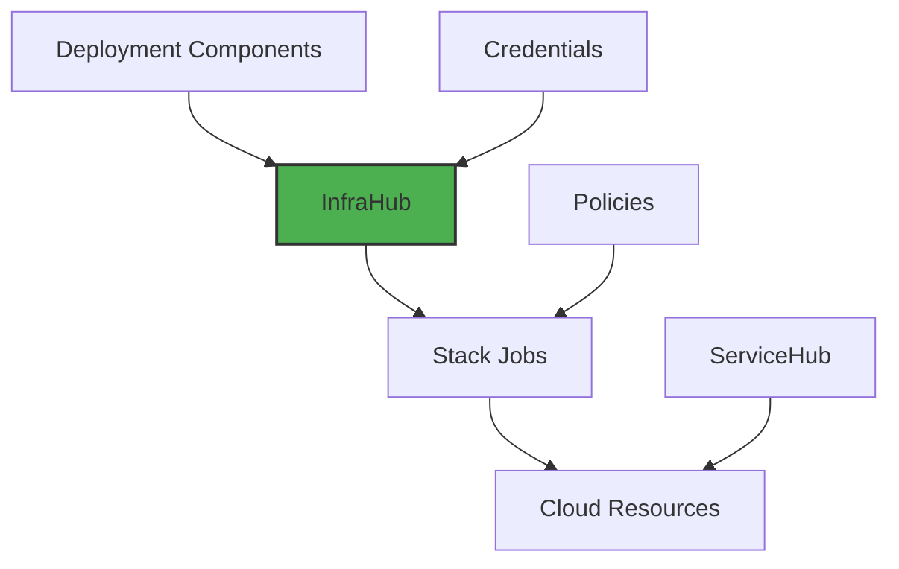

# InfraHub

## Your Infrastructure Control Center

Remember the last time you had to provision cloud infrastructure? The YAML files, the state management, the manual approvals, the fear of running `terraform destroy` in production? InfraHub transforms that experience into something as simple as pushing code.

InfraHub is Planton Cloud's infrastructure provisioning and management platform. It's where declarative configurations meet automated workflows, where Terraform and Pulumi modules become one-click deployments, and where complex multi-cloud setups feel manageable.

> **The InfraHub Promise:** Define your infrastructure once, deploy it anywhere, manage it effortlessly. No more infrastructure-as-code learning curves or state file nightmares.

## What InfraHub Does

Think of InfraHub as your infrastructure orchestration platform that handles the entire lifecycle of cloud resources:

### 📦 Deployment Components
**Browse, select, and deploy cloud resources**  
A visual catalog of pre-built infrastructure components ready to deploy across AWS, GCP, Azure, and Kubernetes.

### 🔄 Stack Jobs
**Automated infrastructure workflows**  
Every configuration change triggers an automated workflow that plans, validates, and applies infrastructure changes safely.

### 🎛️ Flow Control
**Governance without friction**  
Configure approval gates, preview requirements, and deployment policies that match your organization's needs.

### 🔐 Credential Management
**Secure, automated authentication**  
Map provider credentials to environments once, and let the platform handle authentication for all deployments.

## The Infrastructure Experience You Deserve

InfraHub was born from a simple observation: infrastructure provisioning shouldn't require a PhD in cloud architecture. Here's how we've made it better:

### 1. **Visual Component Catalog**
```yaml
# Traditional approach
- Research Terraform modules
- Read documentation
- Copy boilerplate code
- Configure providers
- Set up state backends
- Write variable files
- Run terraform init/plan/apply
- Debug errors...

# InfraHub approach
- Browse catalog
- Fill out form
- Click deploy
- Done.
```

### 2. **Intelligent Orchestration**

We handle the complexity so you don't have to:

- **Auto-detect** the right credentials for your environment
- **Auto-select** Terraform or Pulumi based on your preferences
- **Auto-configure** state backends (no more S3 bucket setup!)
- **Auto-execute** multi-step workflows with proper sequencing
- **But also:** Full control when you need it with custom modules and policies

### 3. **Multi-Cloud, Multi-Tool**

Real organizations use multiple clouds and tools. InfraHub embraces this reality:

- Deploy to AWS, GCP, Azure, Kubernetes, and more
- Use Terraform or Pulumi modules interchangeably
- Mix platform-provided and custom modules
- Consistent experience across all providers

## How InfraHub Fits in Planton Cloud

InfraHub is the foundation layer of the Planton Cloud ecosystem:



- **ServiceHub** builds and deploys applications to infrastructure provisioned by InfraHub
- **InfraHub** provisions the infrastructure where everything runs
- **IAM** controls who can provision what
- **Audit** tracks every infrastructure change

## Getting Started

Ready to transform your infrastructure workflow? Here's your path:

### 1. [Understand Stack Jobs →](/docs/infra-hub/what-is-a-stack-job)
Learn the core execution model that powers InfraHub

### 2. [Deploy Your First Resource →](/docs/infra-hub/getting-started)
Step-by-step guide to provisioning infrastructure

### 3. [Explore Components →](/docs/infra-hub/deployment-components)
Browse the catalog of deployable cloud resources

## InfraHub by the Numbers

Here's what InfraHub enables under the hood:

- **50+ deployment components** across major cloud providers
- **< 5 minutes** to provision most resources
- **Zero** state file management required
- **Dual support** for Terraform and Pulumi
- **Multi-cloud** deployment capabilities
- **Complete auditability** of all infrastructure changes

## Why Teams Love InfraHub

> "We went from 2-week infrastructure provisioning cycles to same-day deployments. The catalog makes it so easy even our junior devs can spin up resources safely." - *Platform Engineering Lead*

> "Finally, infrastructure that works like code deployment should. Push config, get infrastructure. The flow control policies give us the governance we need without slowing us down." - *DevOps Manager*

> "The fact that we can use both Terraform and Pulumi modules is game-changing. We're not locked into one tool anymore." - *Cloud Architect*

## Common Use Cases

### Development Environments
Spin up complete development stacks in minutes:
- Kubernetes clusters with one click
- Databases with automatic backups
- Networking configured correctly by default

### Production Infrastructure
Deploy production-grade resources with confidence:
- Built-in best practices
- Automated security configurations
- Approval workflows for critical changes

### Multi-Cloud Strategy
Manage resources across providers consistently:
- Same workflow for AWS, GCP, and Azure
- Unified credential management
- Single pane of glass for all infrastructure

## Dive Deeper

Explore more InfraHub topics:

- **[What is a Stack Job?](/docs/infra-hub/what-is-a-stack-job)** - Core execution model
- **[Deployment Components](/docs/infra-hub/deployment-components)** - Available cloud resources
- **[Flow Control](/docs/infra-hub/flow-control)** - Managing deployment workflows
- **[Credentials & Mappings](/docs/infra-hub/credentials-and-mappings)** - Authentication and authorization
- **[Stack Jobs Deep Dive](/docs/infra-hub/stack-jobs)** - Advanced orchestration details
- **[Troubleshooting](/docs/infra-hub/troubleshooting)** - Common issues and solutions

---

> **Ready to provision?** Start with our [Getting Started Guide](/docs/infra-hub/getting-started) and deploy your first cloud resource in under 5 minutes.
