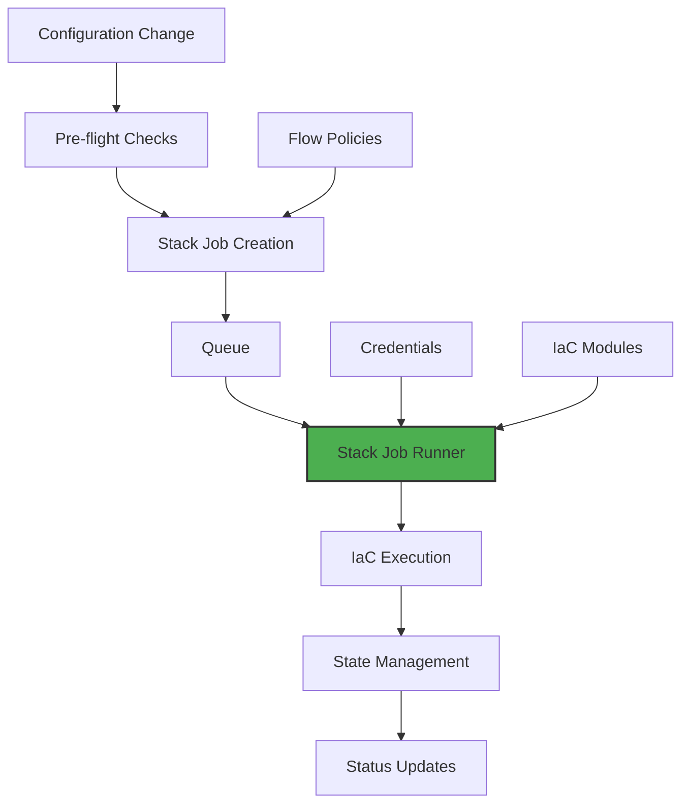

# Stack Jobs Deep Dive

## Master the Infrastructure Automation Engine

You've deployed your first resources and watched Stack Jobs in action. Now let's dive deep into how they work, how to optimize them, and how to handle complex scenarios. This guide is for when you need to go beyond the basics.

> **Stack Job Philosophy**: Infrastructure changes should be predictable, auditable, and reversible. Every Stack Job embodies these principles through careful orchestration and state management.

## The Complete Stack Job Architecture

Stack Jobs aren't just script runners—they're a sophisticated orchestration system:



Let's explore each component in detail.

## Pre-flight Checks: Failing Fast

Before a Stack Job is created, the system runs comprehensive pre-flight checks:

### 1. Credential Validation
```yaml
# System checks:
- Is there a credential mapped for this provider/environment?
- Does the credential have necessary permissions?
- Is the credential still valid (not expired)?
- Can we authenticate with the provider?
```

### 2. Module Resolution
```yaml
# Module selection logic:
if organization has custom module for resource:
  use custom module
elif organization has provisioner preference:
  use platform module for that provisioner
else:
  use platform default module
```

### 3. State Backend Verification
```yaml
# Backend checks:
- Is state backend configured for organization?
- Can we access the backend?
- Is there an existing state file?
- Is the state locked by another operation?
```

### 4. Flow Control Policy
```yaml
# Policy resolution hierarchy:
1. Check resource-specific policy
2. Check environment policy  
3. Check organization policy
4. Use platform default policy
```

If any pre-flight check fails, the Stack Job isn't created and you get immediate feedback.

## Stack Job Lifecycle in Detail

### Creation Phase

When creating a Stack Job, the system captures a complete snapshot:

```yaml
apiVersion: infra-hub.planton.cloud/v1
kind: StackJob
metadata:
  id: sj_01jsrnmwpnnc6n62h06xafcgxv
  name: eks_01jq5xe4z7farkgenqsh47c1h0
  org: acmecorp
  env: production
  version:
    id: ver-01jsrnmrwjn57drj0ekht8hb93
    message: "Scale EKS node group from 3 to 5 nodes"
spec:
  # Resource being changed
  apiResourceInfo:
    kind: aws_eks_cluster
    id: eks_01jq5xe4z7farkgenqsh47c1h0
    name: prod-api-cluster
    versionId: ver-01jsrnmrwjn57drj0ekht8hb93
    triggerEvent: updated
    eventCreatedBy: user@company.com
    
  # Everything needed to execute
  essentials:
    # IaC Configuration
    provisioner: terraform
    iacModule:
      id: iacmod_platform_eks_terraform
      gitRepo: github.com/project-planton/aws-eks
      branch: v2.3.0
      path: terraform
      
    # Authentication
    backendCredential:
      kind: terraform_backend_credential
      id: tfcred_s3_backend_prod
      config:
        bucket: acmecorp-terraform-state
        region: us-east-1
        
    providerCredential:
      kind: aws_credential
      id: awscred_prod_account
      
    # Execution
    stackJobRunner:
      id: sjr_platform_runner
      endpoint: runner.planton.cloud:443
      
    # Behavior
    flowControlPolicy:
      previewBeforeUpdate: true
      pauseBetweenPreviewAndUpdate: true
      skipRefresh: false
      
  # Computed operations
  operations:
    - init
    - refresh
    - plan
    - apply
```

### Execution Phase

The Stack Job Runner receives the job and begins execution:

#### Step 1: Workspace Preparation
```bash
# Creates isolated workspace
/tmp/stack-jobs/sj_01jsrnmwpnnc6n62h06xafcgxv/
├── module/          # Cloned IaC module
├── config/          # Generated tfvars/pulumi config
├── state/           # Local state cache
└── logs/            # Execution logs
```

#### Step 2: Module Download
```go
// Actual code from Stack Job Runner
func (r *Runner) cloneModule(job *StackJob) error {
    return git.Clone(git.CloneOptions{
        URL:      job.Spec.Essentials.IacModule.GitRepo,
        Branch:   job.Spec.Essentials.IacModule.Branch,
        Depth:    1,  // Shallow clone for speed
        Auth:     r.githubAuth,
        Progress: job.LogWriter,
    })
}
```

#### Step 3: Configuration Injection
The system transforms your resource spec into IaC variables:

```hcl
# Generated terraform.tfvars
metadata = {
  id   = "eks_01jq5xe4z7farkgenqsh47c1h0"
  name = "prod-api-cluster"
  org  = "acmecorp"
  env  = "production"
}

spec = {
  kubernetes_version = "1.28"
  node_groups = [{
    name           = "general"
    instance_types = ["t3.large"]
    min_size       = 5  # Changed from 3
    max_size       = 10
    desired_size   = 5  # Changed from 3
  }]
}

aws_credential = {
  access_key_id     = "INJECTED_AT_RUNTIME"
  secret_access_key = "INJECTED_AT_RUNTIME"
  region           = "us-east-1"
}
```

#### Step 4: Operation Execution

Each operation runs in sequence with careful error handling:

```go
// Simplified execution flow
for _, op := range job.Spec.Operations {
    switch op {
    case "init":
        err = terraform.Init(
            terraform.BackendConfig(backendCreds),
            terraform.PluginDir(sharedCache),
        )
    case "refresh":
        err = terraform.Refresh(
            terraform.Parallelism(10),
            terraform.Lock(true),
        )
    case "plan":
        plan, err = terraform.Plan(
            terraform.Out("tfplan"),
            terraform.DetailedExitCode(),
        )
        if plan.HasChanges() {
            job.RequireApproval()
        }
    case "apply":
        err = terraform.Apply(
            terraform.Plan("tfplan"),
            terraform.AutoApprove(),
            terraform.Lock(true),
        )
    }
    
    if err != nil {
        job.Fail(op, err)
        return
    }
}
```

### Completion Phase

After execution, the system:
1. Extracts outputs from Terraform/Pulumi
2. Updates resource status with outputs
3. Uploads logs to permanent storage
4. Cleans up temporary workspace
5. Notifies dependent systems

## What's Next?

Now that you understand Stack Jobs deeply:

- **[Flow Control](/docs/infra-hub/flow-control)** - Customize execution policies
- **[Deployment Components](/docs/infra-hub/deployment-components)** - Explore available resources
- **[Custom Modules](/docs/infra-hub/custom-modules)** - Build your own IaC modules
- **[Troubleshooting](/docs/infra-hub/troubleshooting)** - Solve common problems

> **Remember**: Stack Jobs are powerful but designed to be safe. The system prevents dangerous operations by default, so experiment confidently!
