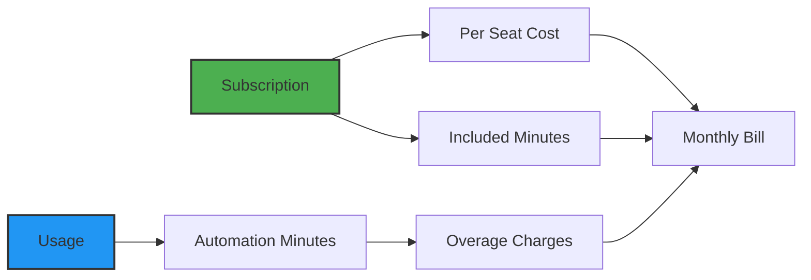

# Billing and Subscriptions

## Simple, Transparent Pricing for Modern Teams

We believe infrastructure automation should be accessible to everyone—from solo developers to large enterprises. That's why our pricing is straightforward: pay per developer seat, get generous automation minutes included, and scale as you grow.

> **The Pricing Promise**: No hidden fees, no surprise bills, no complex calculators. Just honest pricing that scales with your team.

## How Billing Works

Planton Cloud uses a hybrid pricing model that's both predictable and fair:



**Two components**:
1. **Subscription Fee**: Based on number of seats (team members)
2. **Usage Charges**: Based on automation minutes used

## Subscription Tiers

### Free Tier
**Perfect for**: Individual developers, small projects, evaluation

| Feature | Details |
|---------|----------|
| **Price** | $0 per seat |
| **Seats** | Unlimited |
| **Automation Minutes** | 100 minutes included |
| **Overage** | Not available (hard cap) |
| **Support** | Community |

**What's included**:
- Full platform access
- All cloud providers
- Basic integrations
- Community support

**Limitations**:
- Stops at 100 minutes (upgrade required)
- No priority support
- Basic SLA

### Plus Tier
**Perfect for**: Growing teams, production workloads

| Feature | Details |
|---------|----------|
| **Price** | $19 per seat/month |
| **Seats** | Pay per developer |
| **Automation Minutes** | 300 minutes included |
| **Overage** | $0.06 per minute |
| **Support** | Priority email |

**What's included**:
- Everything in Free
- 3x more automation minutes
- Overage billing (no hard stops)
- Priority email support
- Better SLA

**Best for**:
- Teams of 2-20 developers
- Regular deployments
- Production environments

### Pro Tier
**Perfect for**: Large teams, heavy automation users

| Feature | Details |
|---------|----------|
| **Price** | Custom (contact sales) |
| **Seats** | Unlimited |
| **Automation Minutes** | 1,000+ minutes included |
| **Overage** | $0.06 per minute |
| **Support** | Dedicated |

**What's included**:
- Everything in Plus
- Unlimited developer seats
- 10x more automation minutes
- Dedicated support
- Custom contracts
- Enterprise SLA

**Best for**:
- Large engineering organizations
- Heavy CI/CD users
- Enterprise requirements

## Understanding Automation Minutes

### What Are Automation Minutes?

Automation minutes track the compute time used by:
- **Build Minutes**: Creating container images in pipelines
- **Deployment Minutes**: Running Stack Jobs for infrastructure

They measure actual execution time, not wall clock time.

### What Counts as Minutes

#### Build Minutes (ServiceHub)
```
Git Push → Pipeline Starts → Timer Starts
  │
  ├─ Clone Repository (0.5 min)
  ├─ Build Container (3 min)
  ├─ Push to Registry (0.5 min)
  │
  └─ Timer Stops = 4 minutes used
```

#### Deployment Minutes (InfraHub)
```
Deploy Resource → Stack Job Starts → Timer Starts
  │
  ├─ Terraform Init (0.2 min)
  ├─ Terraform Plan (0.5 min)
  ├─ Terraform Apply (2.3 min)
  │
  └─ Timer Stops = 3 minutes used
```

### What Doesn't Count

- Viewing the console
- Managing team members
- Creating configurations
- Waiting for approvals
- Reading logs
- Platform overhead

### Tracking Usage

Monitor your usage in real-time:

1. Go to **Billing** in sidebar
2. See current month usage
3. View historical trends
4. Set up usage alerts

> **Screenshot Placeholder**: Billing dashboard showing usage graph

## Billing Cycles and Payment

### Monthly Billing

- **Billing Period**: Calendar month
- **Payment Date**: 1st of each month
- **Usage Reset**: Monthly
- **Proration**: Yes, for mid-month changes

### How Charges Are Calculated

```
Monthly Bill = Subscription + Overage

Where:
- Subscription = Number of Seats × Tier Price
- Overage = Max(0, Used Minutes - Included Minutes) × $0.06
```

**Example (Plus Tier, 5 developers, 400 minutes used)**:
```
Subscription: 5 seats × $19 = $95
Included: 300 minutes
Overage: 400 - 300 = 100 minutes × $0.06 = $6
Total: $95 + $6 = $101
```

### Payment Methods

**Accepted**:
- Credit cards (Visa, MasterCard, Amex)
- ACH/Wire (Enterprise only)
- Annual prepayment (discount available)

**Not accepted**:
- PayPal
- Cryptocurrency
- Purchase orders (except Enterprise)

## Managing Your Subscription

### Viewing Current Plan

1. Navigate to **Billing** section
2. See current subscription:
   - Tier (Free/Plus/Pro)
   - Number of seats
   - Included minutes
   - Current usage

> **Screenshot Placeholder**: Billing overview showing current plan

### Upgrading Your Plan

**From Free to Plus**:
1. Click "Upgrade" in billing section
2. Enter payment information
3. Confirm number of seats
4. Immediate access to Plus features

**To Pro Tier**:
1. Contact sales team
2. Discuss requirements
3. Get custom quote
4. Sign enterprise agreement

### Managing Seats

**Seats are counted as**:
- Active organization members
- Excluding viewers (in some plans)
- Auto-adjusted monthly

**Adding seats**:
- Automatic when inviting members
- Prorated for partial months
- Reflected in next bill

**Removing seats**:
- Remove members from organization
- Credits applied to next bill

## Cost Optimization

### Monitor Usage Patterns

```yaml
High Usage Areas:
  - Large Docker builds
  - Complex Terraform deployments
  - Frequent rebuilds
  - Multiple environments
```

### Optimization Strategies

#### 1. Optimize Build Times
- Use build caching
- Minimize Docker layers
- Use efficient base images
- Enable incremental builds

#### 2. Reduce Deployment Frequency
- Batch changes together
- Use preview environments wisely
- Implement good testing
- Avoid unnecessary refreshes

#### 3. Right-Size Resources
- Don't over-provision
- Use auto-scaling
- Clean up unused resources
- Consolidate similar resources

### Usage Alerts

Set up notifications:
```yaml
Alert Thresholds:
  - 50% of included minutes
  - 80% of included minutes
  - 100% of included minutes
  - Every 100 overage minutes
```

## Common Billing Scenarios

### Scenario 1: Startup Growth

**Month 1**: Free tier, 2 developers, 80 minutes used
- Cost: $0
- Status: Within limits

**Month 3**: Hit 100 minute cap
- Action: Upgrade to Plus
- Cost: 2 × $19 = $38/month

**Month 6**: 5 developers, 350 minutes
- Cost: 5 × $19 + 50 × $0.06 = $98

### Scenario 2: Enterprise Migration

**Initial**: 50 developers, heavy automation
- Tier: Pro (custom pricing)
- Included: 2,000 minutes
- Typical usage: 1,500 minutes
- Predictable costs

### Scenario 3: Seasonal Business

**Regular months**: 10 developers, 200 minutes
- Tier: Plus
- Cost: 10 × $19 = $190

**Peak season**: Same team, 500 minutes
- Cost: $190 + 200 × $0.06 = $202
- Only pay more when you use more

## Billing FAQ

### General Questions

**Q: When do I get charged?**
A: On the 1st of each month for the previous month's usage.

**Q: Can I prepay annually?**
A: Yes, contact sales for annual discounts (typically 10-20%).

**Q: What happens if my card fails?**
A: 7-day grace period, then account suspension (data preserved).

### Free Tier Questions

**Q: What happens at 100 minutes?**
A: Automation stops. Upgrade to continue. Running resources are not affected.

**Q: Can I reset my free minutes?**
A: Minutes reset monthly on the 1st.

**Q: Is Free tier really free?**
A: Yes, no credit card required to start.

### Plus/Pro Questions

**Q: How is overage calculated?**
A: Simple: (Used - Included) × $0.06 per minute.

**Q: Can I set spending limits?**
A: Yes, configure alerts and optional hard caps.

**Q: Do viewers count as seats?**
A: Depends on plan. Check with sales.

## Billing Best Practices

### 1. Start Small
- Begin with Free tier
- Understand usage patterns
- Upgrade when needed

### 2. Monitor Regularly
- Check usage weekly
- Set up alerts
- Review bills monthly

### 3. Optimize Continuously
- Track high-usage operations
- Optimize build/deploy times
- Clean up unused resources

### 4. Plan for Growth
- Budget for team expansion
- Anticipate usage increases
- Consider annual plans

## Special Programs

### Startup Program
- 50% discount for qualified startups
- Up to $1,000 in credits
- 12-month duration
- Apply through website

### Open Source
- Free Pro tier for qualifying projects
- Unlimited seats and minutes
- Public projects only
- Annual renewal

### Education
- Free Plus tier for students
- Discounted team plans
- Teaching resources
- No time limit

## Getting Help with Billing

### Billing Support

**Free Tier**: 
- Help documentation
- Community forum

**Plus Tier**:
- Email: billing@planton.cloud
- Response time: 24 hours

**Pro Tier**:
- Dedicated account manager
- Phone support
- Priority resolution

### Common Billing Tasks

**Update payment method**:
1. Billing → Payment Methods
2. Add new card
3. Set as default
4. Remove old card

**Download invoices**:
1. Billing → Invoices
2. Select month
3. Download PDF

**View usage details**:
1. Billing → Usage
2. Filter by service
3. Export CSV

## What's Next?

With billing understood:

- **[Getting Started](/docs/platform/getting-started)** - Make the most of your minutes
- **[Teams & Access](/docs/platform/teams-and-access)** - Manage your seats
- **[Platform Tour](/docs/platform/platform-tour)** - Explore all features
- **[Cost Optimization Guide](/docs/guides/cost-optimization)** - Save money

> **Remember**: Our pricing is designed to grow with you. Start free, upgrade when ready, and only pay for what you use. No surprises, just simple, fair pricing for modern teams.
