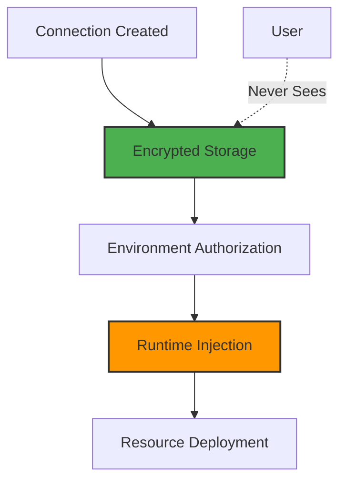
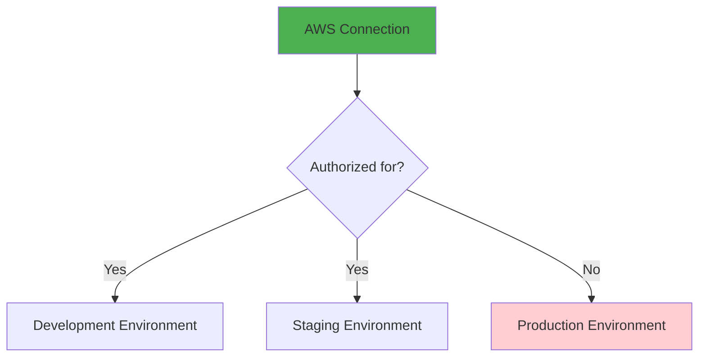

# Connections

## Your Bridge to the Cloud Ecosystem

Connections are how Planton Cloud integrates with your existing cloud accounts and services. Think of them as secure bridges that let the platform act on your behalf—whether that's creating AWS resources, pulling code from GitHub, or pushing images to Docker Hub.

> **The Connection Promise**: Connect once at the organization level, use everywhere. No more copying credentials between projects or exposing secrets in CI/CD pipelines.

## Understanding Connections

### What Are Connections?

Connections are secure, reusable integrations with external services. They store:
- Cloud provider credentials (AWS, GCP, Azure)
- Git repository access (GitHub, GitLab)
- Container registry authentication
- State backend configurations
- External Kubernetes cluster access

Once created, connections can be:
- Authorized for specific environments
- Used automatically by the platform
- Shared across your organization
- Updated without breaking deployments

### Connection Security Model



**Key security features**:
- Credentials encrypted at rest
- Never exposed in logs or UI
- Injected only during execution
- Audit trail for all usage
- Environment-level authorization

## Types of Connections

### Cloud Provider Connections

These let Planton Cloud create and manage infrastructure in your cloud accounts.

#### AWS
**Purpose**: Deploy resources to Amazon Web Services

**Required Information**:
- Access Key ID
- Secret Access Key  
- Default Region

**What it enables**:
- Create VPCs, EKS clusters, RDS databases
- Manage S3 buckets, Lambda functions
- Configure load balancers, Route53


#### Google Cloud Platform (GCP)
**Purpose**: Deploy resources to Google Cloud

**Required Information**:
- Project ID
- Service Account Key (JSON)

**What it enables**:
- Create GKE clusters, Cloud SQL databases
- Manage GCS buckets, Cloud Run services
- Configure load balancers, Cloud DNS

#### Azure
**Purpose**: Deploy resources to Microsoft Azure

**Required Information**:
- Subscription ID
- Tenant ID
- Client ID
- Client Secret

**What it enables**:
- Create AKS clusters, Azure SQL databases
- Manage blob storage, container instances
- Configure application gateways

#### Other Cloud Providers
- **DigitalOcean**: Droplets, managed databases, spaces
- **Scaleway**: Instances, Kubernetes Kapsule
- **Civo**: Kubernetes clusters, volumes
- **Cloudflare**: DNS, CDN, workers

### Git Provider Connections

These enable ServiceHub to access your code repositories.

#### GitHub
**Purpose**: Access repositories for automated builds

**Connection Method**: OAuth (recommended) or Personal Access Token

**What it enables**:
- Read repository code
- Create webhooks for commits
- Access private repositories
- Pull request deployments

> **Screenshot Placeholder**: GitHub OAuth connection flow

#### GitLab
**Purpose**: Access GitLab repositories

**Connection Method**: OAuth or Personal Access Token

**What it enables**:
- Same as GitHub
- Support for self-hosted GitLab

### Container Registry Connections

Store and retrieve container images for your services.

#### Docker Hub
- Public and private repositories
- Automated image pulls

#### Amazon ECR
- AWS-native container registry
- Integrated with ECS/EKS

#### Google Container Registry (GCR)
- GCP-native registry
- Integrated with GKE

### State Backend Connections

Store Terraform/Pulumi state files securely.

#### S3 Backend (Terraform)
**Required**:
- Bucket name
- Region
- State file key prefix

#### GCS Backend (Terraform)
**Required**:
- Bucket name
- State file prefix

### Kubernetes Connections

Connect to existing Kubernetes clusters.

**Use cases**:
- Deploy to non-Planton managed clusters
- Hybrid cloud deployments
- Migration scenarios

**Required**:
- Kubeconfig file or
- Cluster endpoint + credentials

## Creating and Managing Connections

### Step 1: Navigate to Connections

1. Click **"Connections"** in the sidebar
2. See available connection types as cards
3. Existing connections listed separately

> **Screenshot Placeholder**: Connections page overview


### Step 2: Create a Connection

Example: Connecting AWS

1. Click **"Connect"** on the AWS card
2. Fill in the connection form:
   ```yaml
   Name: "AWS Production Account"
   Access Key ID: "AKIA..."
   Secret Access Key: "*****"
   Region: "us-east-1"
   ```

3. **Critical**: Select authorized environments
   - This determines where these credentials can be used
   - You can update this later

4. Click **"Submit"**

> **Screenshot Placeholder**: Filled AWS connection form with environment checkboxes


### Step 3: Verify Connection

After creation:
- Connection appears in "Existing Connections"
- Shows authorized environments
- Displays last used timestamp
- Shows connection health status

> **Screenshot Placeholder**: Existing connections list


### Managing Existing Connections

Click on any connection to:
- View details (without secrets)
- Update authorized environments
- Rotate credentials
- View usage history
- Delete connection


## Environment Authorization

### How It Works

Connections exist at the organization level but must be authorized for specific environments:



### Authorization Patterns

#### Development Freedom
```yaml
Development Environment:
  - AWS Dev Account ✓
  - GCP Sandbox ✓
  - GitHub ✓
  - Docker Hub ✓
```

#### Production Lockdown
```yaml
Production Environment:
  - AWS Prod Account ✓ (different credentials)
  - GitHub ✓ (same connection)
  - Docker Hub ❌ (use ECR instead)
```

### Updating Authorizations

1. Go to connection details
2. Click "Manage Authorizations"
3. Check/uncheck environments
4. Save changes

Changes take effect immediately for new deployments.

## Connection Usage

### Automatic Selection

When you deploy resources, Planton Cloud automatically:

1. Identifies the required connection type
2. Looks for authorized connections in your environment
3. Uses the appropriate credentials
4. Handles authentication seamlessly

**Example**: Deploying an RDS database
```
Resource: AWS RDS
Environment: production
Automatic: Uses AWS connection authorized for production
```

### Multiple Connections

You can have multiple connections of the same type:

```yaml
AWS Connections:
  - aws-dev-account (for: development, testing)
  - aws-prod-account (for: staging, production)
  - aws-audit-account (for: compliance environment)
```

The platform uses the connection authorized for the current environment.

## Best Practices

### 1. Separate Credentials by Environment

**DO**:
- Use different AWS accounts for dev/prod
- Separate GCP projects by environment
- Isolate credentials for security

**DON'T**:
- Use production credentials in development
- Share credentials across all environments

### 2. Use Least Privilege

Create cloud credentials with only necessary permissions:

```json
// AWS IAM Policy Example (minimal EKS permissions)
{
  "Version": "2012-10-17",
  "Statement": [{
    "Effect": "Allow",
    "Action": [
      "eks:*",
      "ec2:*",
      "iam:*",
      "autoscaling:*"
    ],
    "Resource": "*"
  }]
}
```

### 3. Regular Rotation

- Rotate credentials every 90 days
- Update connections without breaking deployments
- Use AWS IAM roles when possible
- Enable MFA for sensitive accounts

### 4. Connection Naming

Use clear, descriptive names:

**Good**:
- `aws-prod-account`
- `github-acme-org`
- `dockerhub-acme`

**Bad**:
- `aws1`
- `github`
- `registry`

## Troubleshooting Connections

### "No connection available for provider"

**Check**:
1. Connection exists for the provider
2. Connection is authorized for your environment
3. You're in the correct environment context

### "Authentication failed"

**Common causes**:
- Expired credentials
- Incorrect permissions
- Wrong region/project
- Account restrictions

**Fix**:
1. Verify credentials work outside Planton
2. Update connection with new credentials
3. Check cloud provider logs

### "Connection not authorized for environment"

**Fix**:
1. Go to connection details
2. Add environment authorization
3. Save changes
4. Retry deployment

## Advanced Connection Features

### Connection Health Checks

Planton Cloud periodically verifies connections:
- Tests authentication
- Checks permissions
- Updates last verified timestamp
- Alerts on failures

### Usage Analytics

Track how connections are used:
- Which resources use which connections
- Deployment frequency
- Error patterns
- Cost attribution

### Connection Sharing

Within an organization:
- All authorized users can use connections
- Only admins can create/modify
- Full audit trail maintained
- No credential exposure

## Connection Examples

### Multi-Cloud Setup

```yaml
Organization: acme-corp
Connections:
  - aws-main (production workloads)
  - gcp-analytics (data platform)
  - azure-backup (disaster recovery)
  - github-acme (all environments)
```

### Per-Environment Isolation

```yaml
Development:
  - aws-dev-account
  - github-acme
  - dockerhub-public

Production:
  - aws-prod-account
  - github-acme (same)
  - ecr-private (different)
```

## What's Next?

With connections configured:

- **[Deploy Infrastructure](/docs/infra-hub/getting-started)** - Use connections to create resources
- **[Deploy Applications](/docs/service-hub/getting-started)** - Connect Git and deploy
- **[Teams & Access](/docs/platform/teams-and-access)** - Control who can use connections
- **[Billing](/docs/platform/billing)** - Understand usage and costs

> **Remember**: Connections are the secure bridges between Planton Cloud and your existing infrastructure. Set them up once, use them everywhere, sleep soundly knowing your credentials are safe.
