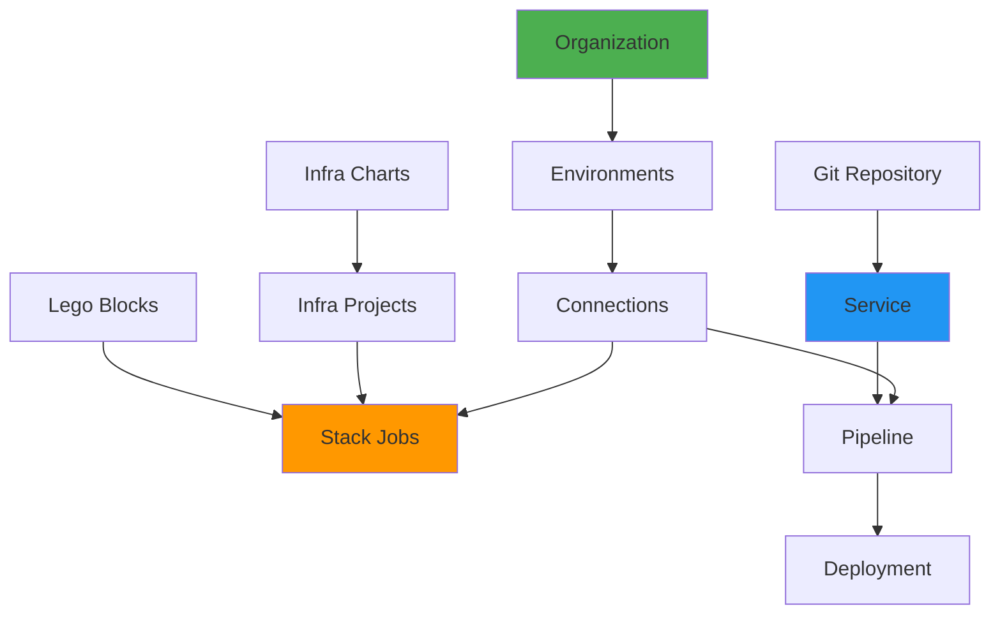

# Core Concepts

## The Building Blocks of Planton Cloud

Every platform has its own vocabulary—concepts that, once understood, make everything click. This page introduces the key concepts that power Planton Cloud. Master these, and you'll navigate the platform like a pro.

> **Learning tip**: Don't try to memorize everything at once. Read through, then refer back as you use the platform. The concepts will become second nature quickly.

## Infrastructure Concepts

### Lego Blocks

**What they are**: Individual cloud resources that you can deploy with one click.

**The analogy**: Just like LEGO® blocks, these are standardized, reusable pieces that snap together to build your infrastructure.

**Examples**:
- AWS VPC (networking)
- RDS Database (PostgreSQL/MySQL)
- EKS Cluster (Kubernetes)
- S3 Bucket (storage)
- Redis Cache

**Key characteristics**:
- Platform-provided and maintained
- Production-ready configurations
- Consistent interface across cloud providers
- Form-based deployment (no code needed)
- Available for AWS, GCP, Azure, Kubernetes

**How to use them**:
1. Browse the Deployment Component Store
2. Find the Lego block you need
3. Click "Deploy"
4. Fill out the form
5. Watch it build


### Infra Charts

**What they are**: Pre-composed collections of Lego blocks that work together.

**The analogy**: If Lego blocks are individual pieces, Infra Charts are the instruction manual for building a complete model—like a LEGO spaceship kit.

**Example**: AWS ECS Environment Chart includes:
- VPC (networking)
- ECS Cluster (container orchestration)  
- ALB (load balancer)
- Route53 Zone (DNS)
- Security Groups (firewall rules)
- IAM Roles (permissions)
- ECR Repositories (container registry)

**Key characteristics**:
- Deploy multiple resources in correct order
- Handle dependencies automatically
- Template-based with customizable values
- Show deployment progress as a DAG
- Much faster than deploying blocks individually

**When to use**:
- Setting up new environments
- Need standard infrastructure quickly
- Want platform best practices built-in


### Infra Projects

**What they are**: Running instances of Infra Charts with your specific configuration.

**The analogy**: If an Infra Chart is a recipe, an Infra Project is the actual cake you baked using that recipe.

**Key characteristics**:
- Created when you deploy an Infra Chart
- Tracks deployment progress
- Shows live DAG visualization
- Maintains deployment history
- Can be updated or destroyed as a unit

**The lifecycle**:
1. Choose Infra Chart (template)
2. Provide values (your configuration)
3. Infra Project created (instance)
4. Resources deployed in dependency order
5. Live progress tracking

### Stack Jobs

**What they are**: The execution units that actually create your infrastructure using Terraform or Pulumi.

**The analogy**: Think of them as the construction crew that takes your blueprint (configuration) and builds the actual infrastructure.

**Key characteristics**:
- Created automatically when you deploy
- Run multiple operations (init, plan, apply)
- Stream logs in real-time
- Handle credentials securely
- Manage state files automatically

**What triggers them**:
- Deploying a Lego block
- Deploying an Infra Chart
- Updating existing resources
- Manual refresh operations

**Typical Stack Job flow**:
```
Init → Refresh → Plan → Apply
 2s     5s        10s     2m
```

## Application Concepts

### Services

**What they are**: Your applications connected from Git repositories (GitHub/GitLab).

**The analogy**: Like projects in Vercel or Heroku—connect your repo, get automatic deployments.

**Key characteristics**:
- Connected to a Git repository
- Automatic webhook configuration
- Support for monorepos
- Flexible build configuration
- Deploy to your infrastructure

**Configuration options**:
- **Build Method**: Buildpacks (auto-detect) or Dockerfile
- **Trigger Paths**: Which files trigger rebuilds
- **Project Root**: For monorepo support
- **Pipeline Provider**: Platform-managed or custom

**Example Service**:
```yaml
Name: user-api
Repository: github.com/acme/services
Project Root: /services/user-api
Build: Buildpacks (auto-detect Node.js)
Deploy To: EKS cluster in production
```

### Pipelines

**What they are**: The automated CI/CD workflows that build and deploy your services.

**The analogy**: Your personal DevOps team that watches for code changes, builds your app, and deploys it—all automatically.

**Key characteristics**:
- Triggered by Git commits
- Two main stages: Build and Deploy
- Powered by Tekton under the hood
- Support for custom pipeline definitions
- Real-time log streaming

**Pipeline stages**:
1. **Trigger**: Git webhook received
2. **Clone**: Fetch your code
3. **Build**: Create container image
4. **Push**: Store in registry
5. **Deploy**: Update your service

**What makes them special**:
- Zero configuration for standard apps
- Automatic language detection
- Built-in caching for speed
- Preview environments for PRs

## Platform Concepts

### Connections

**What they are**: Integrations with external services and cloud providers.

**Types of connections**:
- **Cloud Providers**: AWS, GCP, Azure credentials
- **Git Providers**: GitHub, GitLab access
- **Container Registries**: Docker Hub, ECR, GCR
- **State Backends**: S3, GCS for Terraform state
- **Kubernetes Clusters**: External cluster access

**How they work**:
1. Create at organization level
2. Authorize for specific environments
3. Platform automatically uses them
4. Credentials never exposed to users

### Teams

**What they are**: Groups of users with shared permissions.

**Use cases**:
- **Dev Team**: Access to development environment
- **Ops Team**: Access to all environments
- **Contractors**: Limited access to specific resources

**How they work**:
- Create teams at organization level
- Add members to teams
- Grant team permissions to resources
- Simplifies access management

### Context

**What it is**: Your current position in the resource hierarchy (Organization/Environment).

**Why it matters**:
- Determines what resources you see
- Controls where new resources are created
- Affects which credentials are used
- Filters available actions

**How to read it**:
```
Acme Corp / production
    ↑          ↑
Organization  Environment
```

### Flow Control Policies

**What they are**: Rules that govern how infrastructure changes are deployed.

**What they control**:
- Require approval before deployment
- Skip refresh for faster deployments
- Require plan/preview before apply
- Pause between plan and apply

**Example policy**:
```yaml
Production Environment:
- Always show plan first
- Require manual approval
- Never skip refresh
```

## How Concepts Connect

Understanding how these concepts work together is key:



### Example Flow: Deploying a Complete Application

1. **Create Environment** (staging)
2. **Connect AWS Account** via Connections
3. **Deploy Infra Chart** (ECS Environment)
   - Creates Infra Project
   - Triggers multiple Stack Jobs
   - Provisions VPC, ECS, ALB, etc.
4. **Connect GitHub** via Connections  
5. **Create Service** from your repo
6. **Push Code** to trigger Pipeline
   - Builds container image
   - Deploys to ECS cluster
7. **Access Application** via ALB URL

## Concept Relationships

### Infrastructure Side
- **Lego Blocks** are deployed by **Stack Jobs**
- **Infra Charts** create **Infra Projects**
- **Infra Projects** orchestrate multiple **Stack Jobs**
- **Stack Jobs** use **Connections** for credentials

### Application Side  
- **Services** are linked to Git repositories
- **Pipelines** build and deploy **Services**
- **Services** deploy to infrastructure from **Lego Blocks**
- **Pipelines** use **Connections** for Git access

### Platform Side
- **Organizations** contain **Environments**
- **Environments** contain deployed resources
- **Teams** group users for permissions
- **Context** determines your current scope

## Quick Concept Lookup

| Concept | What it is | Analogy |
|---------|------------|----------|
| Lego Block | Individual cloud resource | LEGO brick |
| Infra Chart | Collection of resources | LEGO kit instructions |
| Infra Project | Deployed chart instance | Built LEGO model |
| Stack Job | Infrastructure executor | Construction crew |
| Service | Your application | Vercel project |
| Pipeline | Build & deploy workflow | Your DevOps team |
| Connection | External integration | API keys/passwords |
| Context | Current location | GPS coordinates |

## Common Confusions Clarified

### "What's the difference between a Lego Block and a resource?"
A Lego Block is the template/definition. When you deploy it, it creates actual cloud resources. Think class vs instance in programming.

### "When should I use Infra Charts vs individual Lego Blocks?"
Use Infra Charts when:
- Setting up new environments
- Need multiple related resources
- Want standard configurations

Use individual Lego Blocks when:
- Adding single resources
- Need specific customization
- Testing or experimenting

### "How do Services relate to Infrastructure?"
Services (your apps) run ON infrastructure (Lego Blocks):
- EKS cluster (infrastructure) hosts your containerized service
- RDS database (infrastructure) stores your service's data
- ALB (infrastructure) routes traffic to your service

### "What's the difference between Stack Jobs and Pipelines?"
- **Stack Jobs**: Deploy infrastructure (Terraform/Pulumi)
- **Pipelines**: Build and deploy applications (Docker/Kubernetes)

## What's Next?

Now that you understand the concepts:

- **[Connections](/docs/platform/connections)** - Deep dive into external integrations
- **[InfraHub](/docs/infra-hub)** - Master infrastructure deployment
- **[ServiceHub](/docs/service-hub)** - Master application deployment
- **[Teams & Access](/docs/platform/teams-and-access)** - Learn about collaboration

> **Remember**: These concepts will become second nature as you use the platform. Don't worry about memorizing everything—just start building!
