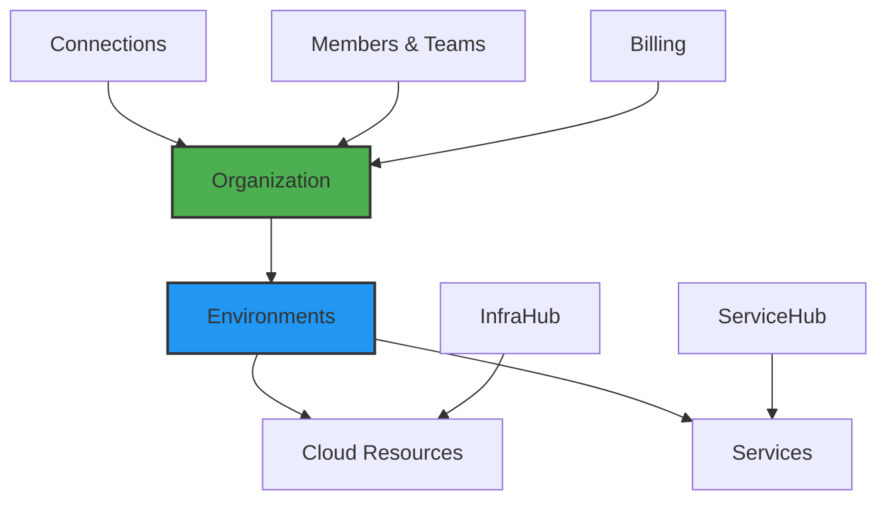

# Platform Overview

## Your Complete DevOps Platform in the Cloud

Imagine having Google Cloud Console's power, Vercel's deployment simplicity, and enterprise-grade governance—all in one platform. That's Planton Cloud. We've built a unified platform that brings together infrastructure provisioning, application deployment, and team collaboration into a cohesive experience.

> **The Platform Promise**: One platform to rule them all—from connecting your cloud accounts to deploying applications, from managing teams to tracking costs. Everything you need for modern cloud development, nothing you don't.

## Platform Architecture at a Glance

Planton Cloud is organized around a clear resource hierarchy and interconnected components:

## Core Platform Components

### 🏢 Resource Hierarchy
**Organization → Environments → Resources**  
Just like Google Cloud's organization/project model, but simpler. Everything starts with your organization, branches into environments (dev, staging, prod), and contains your actual resources.

### 🔌 Connections
**Your gateway to external services**  
Connect once, use everywhere. Whether it's AWS credentials, GitHub repositories, or Docker registries, Connections provide secure, reusable integrations.

### 🏗️ InfraHub
**Infrastructure as Lego blocks**  
Browse a catalog of pre-built components (Lego blocks), combine them into templates (Infra Charts), and deploy with one click. No more copying Terraform modules.

### 🚀 ServiceHub 
**Vercel-like experience for backends**  
Connect your Git repository, push code, get deployments. Automatic builds, preview environments, and GitOps workflow—all built in.

### 👥 Teams & Access
**Collaboration without chaos**  
Invite team members, organize them into teams, and manage permissions. Enterprise-grade access control that doesn't get in the way.

### 💰 Billing & Usage
**Transparent, seat-based pricing**  
Pay per developer seat, get generous automation minutes included. No surprise bills, no complex calculators.

## The Developer Journey

Here's how developers typically experience Planton Cloud:

### Day 1: Getting Started
1. **Sign up** with email or Google account
2. **Create your organization** (takes 30 seconds)
3. **Connect your cloud account** (AWS, GCP, or Azure)
4. **Create your first environment** (dev, staging, or prod)

> **Screenshot Placeholder**: Platform signup flow showing login/join beta buttons

### Day 2: First Infrastructure
1. **Browse the Component Store** for what you need
2. **Deploy a database** or other resource with one click
3. **Watch the deployment** progress in real-time
4. **Access your resource** immediately

### Day 3: First Application
1. **Connect GitHub or GitLab** with OAuth
2. **Create a Service** from your repository  
3. **Push code** and watch it build
4. **Get your live URL** automatically

### Week 2: Team Collaboration
1. **Invite team members** via email
2. **Create teams** for different projects
3. **Set up staging and production** environments
4. **Configure approval workflows** for production

## Key Platform Features

### Context-Aware Navigation
The context selector (top-left, next to logo) always shows where you are:
- **Organization Level**: Manage connections, billing, teams
- **Environment Level**: Deploy resources, view services

Just like Google Cloud Console, clicking any node in the hierarchy sets your context.

> **Screenshot Placeholder**: Context selector dropdown showing organization/environment hierarchy

### Unified Deployment Experience
Whether deploying infrastructure or applications:
- Same mental model (declare → deploy → manage)
- Same visibility (logs, status, history)
- Same governance (policies, approvals, audit)

### Visual Infrastructure Management
See your infrastructure as:
- **List View**: Traditional table of resources
- **Canvas View**: Visual graph showing relationships
- **DAG View**: Deployment dependencies and progress

> **Screenshot Placeholder**: Infrastructure canvas view showing resource relationships

### GitOps from the UI
Every configuration change:
- Creates a version (like Git commits)
- Shows what changed (diff view)
- Can be reverted if needed
- Triggers automatic deployments

## Platform Concepts Quick Reference

### Organizations
- Top-level container for everything
- Has billing, members, and settings
- Created by the first user (owner)

### Environments
- Logical separation (dev, staging, prod)
- Resources are deployed to environments
- Credentials are mapped per environment

### Connections
- External service integrations
- Authorized for specific environments
- Reusable across resources

### Lego Blocks
- Individual cloud resources (VPC, RDS, EKS)
- Platform-provided, production-ready
- Fill form → Deploy → Done

### Infra Charts
- Collections of Lego blocks
- Like Helm charts for cloud infrastructure
- Deploy entire environments at once

### Services
- Your applications from Git repositories
- Automatic CI/CD pipelines
- Deploy to infrastructure from InfraHub

### Stack Jobs
- Infrastructure deployment executions
- Show real-time Terraform/Pulumi progress
- Full audit trail and logs

### Pipelines
- Application build and deploy workflows
- Powered by Tekton
- Triggered by Git commits

## What Makes Planton Cloud Different

### 1. **Integrated, Not Fragmented**
Unlike stitching together multiple tools, everything works together:
- Infrastructure knows about applications
- Applications know about infrastructure  
- Everything shares the same identity and access model

### 2. **Visual, Not Just Code**
See what you're building:
- Browse components visually
- Watch deployments progress
- Understand relationships at a glance

### 3. **Opinionated, But Flexible**
We provide the golden path:
- Best practices built-in
- Escape hatches when needed
- Your cloud accounts, our automation

## Getting Started

Ready to experience the platform? Start here:

1. **[Platform Tour](/docs/platform/platform-tour)** - Interactive walkthrough of all features
2. **[Quick Start Guide](/docs/platform/getting-started)** - From signup to first deployment in 10 minutes
3. **[Resource Hierarchy](/docs/platform/resource-hierarchy)** - Deep dive into organizations and environments
4. **[Core Concepts](/docs/platform/core-concepts)** - Understand the building blocks

## Platform Sections

Explore each area of the platform:

- **[InfraHub](/docs/infra-hub)** - Infrastructure provisioning and management
- **[ServiceHub](/docs/service-hub)** - Application deployment and CI/CD
- **[Connections](/docs/platform/connections)** - External service integrations
- **[Teams & Access](/docs/platform/teams-and-access)** - Collaboration and permissions
- **[Billing](/docs/platform/billing)** - Subscriptions and usage tracking

---

> **Ready to dive in?** The best way to understand Planton Cloud is to use it. [Sign up for free](https://console.planton.ai) and follow our [quick start guide](/docs/platform/getting-started) to deploy your first resource in minutes.
