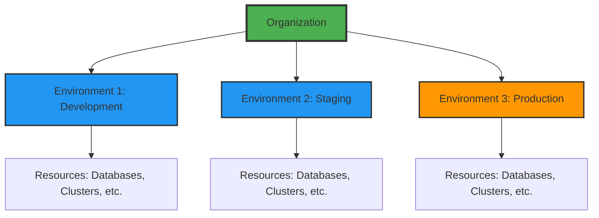
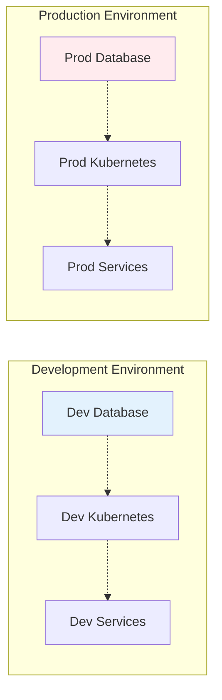

# Resource Hierarchy

## How Planton Cloud Organizes Your World

Just like a well-organized company has departments, teams, and projects, Planton Cloud uses a clear hierarchy to organize your cloud resources. This structure brings order to what could otherwise be cloud chaos, making it easy to manage resources at scale.

> **The Mental Model**: Think of it like a filing system: Organization (company) → Environments (departments) → Resources (actual stuff). Simple, logical, scalable.

## The Three-Level Hierarchy

Planton Cloud uses a three-level hierarchy that will feel familiar if you've used Google Cloud or AWS Organizations:



### Level 1: Organization

**What it is**: Your top-level container, typically representing your company or team.

**What it contains**:
- All environments
- Team members and their roles
- Billing and subscriptions
- Organization-wide settings
- Connections to external services

**Key facts**:
- Created once when you first sign up
- Has a unique ID across the platform
- The creator becomes the owner
- Can have multiple administrators

**Example**:
```yaml
Organization: Acme Corporation
ID: acme-corp
Owner: founder@acme.com
Members: 25
Environments: 3 (dev, staging, prod)
```

### Level 2: Environments

**What it is**: Logical groupings of resources, typically representing deployment stages.

**What it contains**:
- Cloud resources (via InfraHub)
- Deployed services (via ServiceHub)  
- Environment-specific configurations
- Access controls

**Key facts**:
- Created within organizations
- Names must be lowercase alphanumeric with hyphens
- Each has its own credential mappings
- Resources are isolated between environments

**Common patterns**:
- `development` or `dev`
- `staging` or `stage`
- `production` or `prod`
- `testing` or `test`
- Feature environments like `feature-auth-rework`

### Level 3: Resources

**What it is**: The actual cloud infrastructure and applications.

**Types of resources**:
- **Cloud Resources**: VPCs, databases, clusters, buckets (via InfraHub)
- **Services**: Your applications from Git repositories (via ServiceHub)
- **Configurations**: Secrets, policies, mappings

**Key facts**:
- Always belong to exactly one environment
- Can reference resources in the same environment
- Have unique IDs within their environment
- Lifecycle managed by Stack Jobs or Pipelines

## How the Hierarchy Works in Practice

### Context Selection

The context selector (top-left in console) shows your current position:

```
Acme Corp / production
    ↑          ↑
 Organization  Environment
```

Clicking either part changes your context:
- Click organization: See org-level resources
- Click environment: See environment resources

> **Screenshot Placeholder**: Context selector showing organization/environment selection

### Resource Isolation

Environments provide strong isolation:



Resources in development cannot directly access production resources. This isolation:
- Prevents accidents
- Simplifies security
- Makes permissions clearer
- Enables independent deployments

### Credential Mapping

Credentials are connected at the organization level but authorized per environment:

1. **Organization Level**: Store the actual credentials
2. **Environment Level**: Authorize which credentials to use
3. **Automatic Selection**: Platform picks the right credentials

**Example Flow**:
```
AWS Credentials (Org Level)
├── Dev Account → Authorized for: development
├── Staging Account → Authorized for: staging  
└── Prod Account → Authorized for: production
```

## Common Hierarchy Patterns

### Startup Pattern

Simple and effective for small teams:

```
my-startup/
├── dev/
│   ├── postgres-db
│   ├── redis-cache
│   └── api-service
└── prod/
    ├── postgres-db
    ├── redis-cache
    └── api-service
```

### Enterprise Pattern

More environments for larger organizations:

```
acme-corp/
├── dev/
│   └── (individual developer resources)
├── test/
│   └── (automated testing resources)
├── staging/
│   └── (pre-production validation)
├── prod-us/
│   └── (US production resources)
└── prod-eu/
    └── (EU production resources)
```

### Feature Branch Pattern

Dynamic environments for features:

```
feature-company/
├── main/
├── feature-new-ui/
├── feature-api-v2/
└── hotfix-security/
```

## Working with the Hierarchy

### Creating Organizations

Only needed once per company/team:

```yaml
# Organization creation (via UI)
Name: "Innovation Labs"
ID: "innovation-labs"  # Unique across platform
```

The person who creates it becomes the owner with full permissions.

### Creating Environments

Create as many as you need:

```yaml
# Environment creation (via UI)
Name: "development"
Type: "development"  # Helps with defaults
Description: "Shared development environment"
```

### Moving Between Contexts

**Via UI**:
- Click context selector
- Choose organization or environment
- UI updates to show relevant resources

**What changes with context**:
- Visible resources
- Available actions
- Default settings
- Credential selections

## Best Practices

### Organization Naming

**DO**:
- Use your company or team name
- Keep it short but meaningful
- Use hyphens for spaces

**DON'T**:
- Use personal names (unless personal account)
- Include environment names
- Use special characters

**Examples**:
- ✅ `acme-corp`
- ✅ `startup-labs`  
- ❌ `john-dev-account`
- ❌ `production-org`

### Environment Strategy

**Minimum Environments** (Recommended):
1. `development` - For active development
2. `staging` - For testing before production
3. `production` - For live services

**Additional Environments** (As Needed):
- `testing` - For automated tests
- `demo` - For sales/demos
- `training` - For onboarding
- Regional like `prod-us-east`

### Resource Naming

Create a naming convention:

```
{service}-{component}-{environment}

Examples:
- api-database-prod
- web-cache-dev
- auth-service-staging
```

## Security and Access Control

### Organization-Level Permissions

Set at the organization:
- **Owner**: Full control, billing, can delete org
- **Admin**: Manage members, environments, settings
- **Member**: Create and manage resources

### Environment-Level Permissions

More granular control:
- **Environment Admin**: Full control of environment
- **Developer**: Deploy and manage resources
- **Viewer**: Read-only access

### Inheritance Model

```
Organization Admin
    ↓ (has access to)
All Environments
    ↓ (has access to)
All Resources in those Environments
```

But:
```
Development Environment Admin
    ❌ (no access to)
Production Environment
```

## Common Questions

### Can I move resources between environments?

No, resources are created in a specific environment and stay there. This is by design for isolation and security. To "move" a resource, you typically:
1. Create the new resource in the target environment
2. Migrate data if needed
3. Delete the old resource

### Can I have multiple organizations?

Yes, but typically one per company is enough. Multiple organizations make sense for:
- Completely separate business units
- Consulting firms managing client infrastructure
- Strong isolation requirements

### How many environments should I have?

Start with 2-3 (dev, staging, prod). Add more only when you have a specific need. Too many environments can add complexity without value.

### Can environments span regions?

Yes! An environment is a logical grouping. You can have resources in multiple regions within the same environment. Use resource naming to indicate regions.

## Hierarchy in Action

### Example: Deploying a New Feature

1. **Development Environment**:
   - Developer creates feature branch
   - Deploys to dev environment
   - Tests with dev database

2. **Staging Environment**:
   - Merge to main branch
   - Auto-deploy to staging
   - Run integration tests

3. **Production Environment**:
   - Manual approval required
   - Deploy to production
   - Monitor and verify

Each environment has its own resources, credentials, and configurations.

## What's Next?

Now that you understand the hierarchy:

- **[Core Concepts](/docs/platform/core-concepts)** - Learn about other platform concepts
- **[Connections](/docs/platform/connections)** - Connect cloud accounts to environments
- **[Teams & Access](/docs/platform/teams-and-access)** - Manage permissions within the hierarchy

> **Remember**: The hierarchy is your friend. It brings order to cloud chaos and makes large-scale infrastructure manageable. Start simple, grow as needed.
