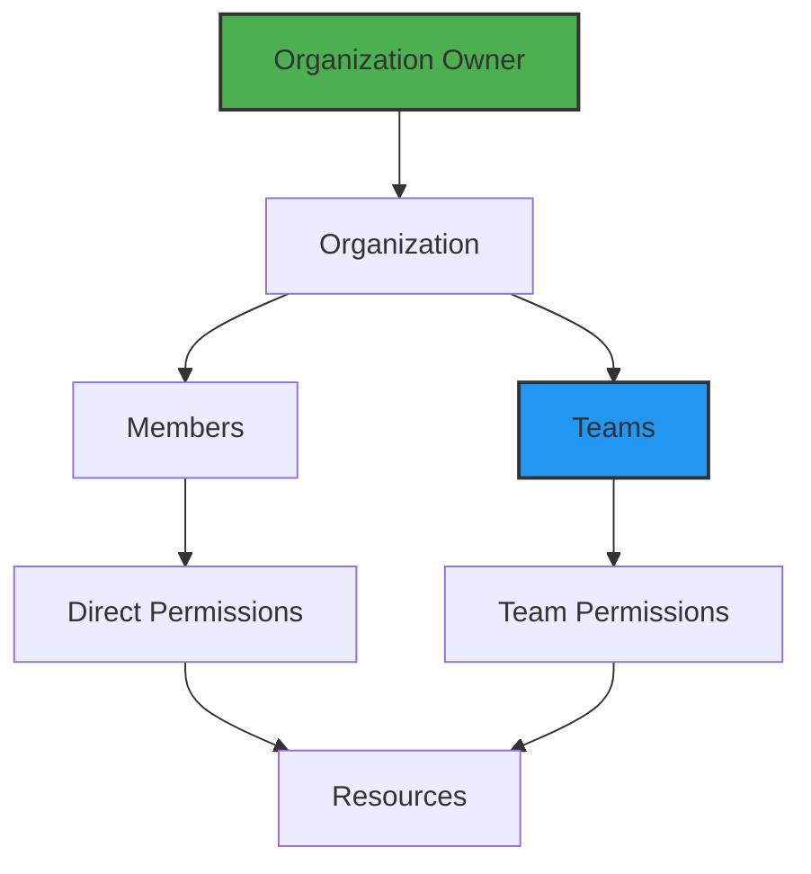

# Teams and Access

## Collaboration Without Chaos

Great platforms are built by teams, not individuals. Planton Cloud's team and access management features let you invite colleagues, organize them into teams, and control who can do what—all without the complexity of traditional IAM systems.

> **The Collaboration Promise**: Add team members in seconds, organize them into teams, and let the platform handle the permissions. No more sharing credentials or wondering who has access to what.

## Understanding Access Control

### The Access Model

Planton Cloud uses a simple but powerful access model:



**Key concepts**:
- **Organization Owner**: The person who created the organization (super admin)
- **Members**: Individual users invited to the organization
- **Teams**: Groups of members with shared permissions
- **Roles**: Permission sets (Owner, Admin, Member, Viewer)

## Inviting Team Members

### Step 1: Navigate to Members

1. Click **"Members"** in the sidebar
2. See current members and their roles
3. View pending invitations

> **Screenshot Placeholder**: Members page showing current members list

### Step 2: Invite New Members

1. Click **"Invite Members"** button
2. Enter invitation details:
   - **Email**: The invitee's email address
   - **Role**: Choose their initial role
   
3. Click **"Send Invitation"**

> **Screenshot Placeholder**: Invite member form with email and role selection

### Step 3: Invitation Process

What happens next:

1. **Email Sent**: Invitee receives an email invitation
2. **Accept Flow**:
   - If they have an account: Join organization directly
   - If new user: Create account first, then join
3. **Access Granted**: Based on assigned role

### Managing Invitations

**Pending invitations show**:
- Invitee email
- Invited by
- Date sent
- Status
- Actions (resend, cancel)

**Copy invitation link**: Share directly if email issues

> **Screenshot Placeholder**: Pending invitations list with actions

## Understanding Roles

### Organization-Level Roles

#### Owner
**Who**: Organization creator (usually one person)

**Permissions**:
- Full control over everything
- Manage billing and subscriptions
- Delete organization
- Transfer ownership
- All admin permissions

**Best practice**: Keep owner role limited to founders/executives

#### Admin  
**Who**: Senior team members, DevOps leads

**Permissions**:
- Invite/remove members
- Create/delete environments
- Manage all resources
- Configure organization settings
- Cannot delete organization or change billing

**Best practice**: For team leads and senior engineers

#### Member
**Who**: Regular developers and engineers

**Permissions**:
- Create and manage resources
- Deploy infrastructure and services
- View organization resources
- Cannot invite members or change settings

**Best practice**: Default role for most team members

#### Viewer
**Who**: Stakeholders, auditors, read-only users

**Permissions**:
- View all resources
- View logs and history
- Cannot make any changes
- Cannot deploy or delete

**Best practice**: For managers, compliance, or external consultants

## Working with Teams

### Why Use Teams?

Teams simplify permission management:
- Grant permissions to groups, not individuals
- Onboard new members quickly
- Consistent access patterns
- Easier audit and compliance

### Creating Teams

1. Go to **Settings** → **Teams**
2. Click **"Create Team"**
3. Configure team:
   ```yaml
   Name: "Backend Team"
   Description: "Backend services and infrastructure"
   Members: [alice@company.com, bob@company.com]
   ```

> **Screenshot Placeholder**: Create team form

### Common Team Patterns

#### By Function
```yaml
Teams:
  - backend-team (API developers)
  - frontend-team (UI developers)
  - devops-team (Infrastructure)
  - qa-team (Testing)
```

#### By Project
```yaml
Teams:
  - project-alpha-team
  - project-beta-team
  - maintenance-team
```

#### By Access Level
```yaml
Teams:
  - prod-deployers (Production access)
  - dev-only (Development only)
  - read-only-stakeholders
```

### Team Permissions

Teams can be granted permissions at different levels:

**Environment Level**:
```yaml
Team: backend-team
Environments:
  - development: Admin
  - staging: Admin
  - production: Member (deploy only)
```

**Resource Level**:
```yaml
Team: database-team
Resources:
  - All RDS instances: Admin
  - Other resources: Viewer
```

## Access Control in Practice

### Scenario 1: Onboarding a Developer

1. **Invite as Member**:
   ```yaml
   Email: newdev@company.com
   Role: Member
   ```

2. **Add to Teams**:
   - backend-team (for API access)
   - dev-environment-team (for development)

3. **Result**:
   - Can deploy to development
   - Can view production
   - Cannot modify organization settings

### Scenario 2: Contractor Access

1. **Invite as Member** (limited)
2. **Create specific team**:
   ```yaml
   Team: contractor-project-x
   Access: Only Project X resources
   ```
3. **Time-bound**: Remove after contract

### Scenario 3: Executive Visibility

1. **Invite as Viewer**
2. **No team needed**
3. **Can see**:
   - All resources and costs
   - Deployment history
   - Cannot make changes

## Managing Member Access

### Updating Roles

1. Go to **Members** page
2. Click member's current role
3. Select new role from dropdown
4. Confirm change

> **Screenshot Placeholder**: Member list with role dropdown

**Important**: Role changes take effect immediately

### Removing Members

1. Click member options menu
2. Select "Remove from organization"
3. Confirm removal

**What happens**:
- Immediate access revocation
- Running resources continue
- Audit log entry created
- Cannot undo (must re-invite)

### Viewing Access History

Track who did what:
- Member actions logged
- Role changes tracked
- Resource access recorded
- Available in audit logs

## Security Best Practices

### 1. Principle of Least Privilege

**Start restricted, expand as needed**:
- New members: Start as Viewer
- After onboarding: Upgrade to Member
- Special needs: Add to specific teams

### 2. Regular Access Reviews

**Monthly/Quarterly**:
- Review member list
- Check role assignments
- Remove inactive members
- Update team memberships

### 3. Team-Based Access

**Prefer teams over individual permissions**:
```yaml
# Good
Team: prod-deployers
Members: [senior-dev1, senior-dev2]
Access: Production deployment

# Avoid
Individual permissions for each member
```

### 4. Environment Isolation

**Separate access by environment**:
```yaml
Development: Most developers
Staging: Senior developers + QA
Production: Limited senior team only
```

## Common Access Patterns

### Startup (Small Team)

```yaml
Owner: founder@startup.com
Admins: 
  - cto@startup.com
Members:
  - dev1@startup.com
  - dev2@startup.com
```

Simple, flat structure with trust-based access.

### Scale-up (Growing Team)

```yaml
Teams:
  - engineering (all devs)
  - platform-team (infrastructure)
  - prod-access (senior only)
  
Roles:
  - Admins: Team leads
  - Members: All developers
  - Viewers: Product managers
```

### Enterprise (Large Organization)

```yaml
Teams:
  - backend-team-us
  - backend-team-eu
  - frontend-team
  - devops-team
  - security-team
  - compliance-viewers
  
Strict environment access:
  - Dev: All teams
  - Staging: Senior members
  - Prod: DevOps + selected seniors
```

## Integration with Platform Features

### Teams and Deployments

- Stack Jobs show who triggered them
- Pipelines track committer and deployer
- Audit trail for compliance

### Teams and Billing

- Billing based on seats (members)
- Viewers may not count as seats
- Team size affects subscription tier

### Teams and Notifications

- Set up team-based alerts
- Route notifications by team
- Escalation paths

## Troubleshooting Access Issues

### "Access Denied" Errors

**Check**:
1. Member role in organization
2. Team memberships
3. Current environment context
4. Resource-specific permissions

### "Cannot Invite Members"

**Only Owners and Admins can invite**
- Check your role
- Ask admin for help
- Consider team-based approach

### "Invitation Not Received"

**Try**:
1. Check spam folder
2. Resend invitation
3. Copy invitation link
4. Verify email address

## What's Next?

With your team onboarded:

- **[Platform Tour](/docs/platform/platform-tour)** - Show team the platform
- **[Getting Started](/docs/platform/getting-started)** - Team onboarding guide
- **[Billing](/docs/platform/billing)** - Understand seat-based pricing
- **[Core Concepts](/docs/platform/core-concepts)** - Team training material

> **Remember**: Good access management is invisible when done right. Set up teams thoughtfully, and permissions become automatic. Your team can focus on building, not requesting access.
