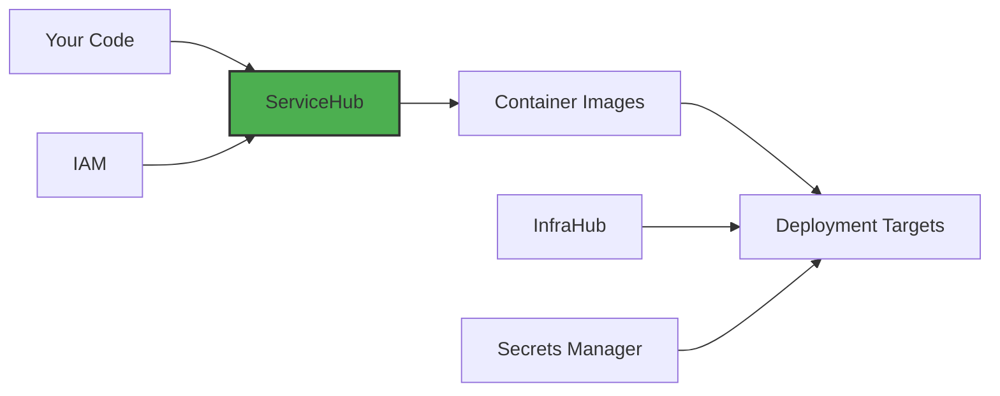

## Your Command Center for Modern Application Delivery

Remember when deploying code meant SSH-ing into servers, running scripts, and crossing your fingers? Or maybe you're currently maintaining a maze of CI/CD pipelines across different tools? ServiceHub changes all that.

ServiceHub is Planton Cloud's answer to the question: "Why can't deploying backend services be as simple as pushing to Vercel?" It's where your code meets the cloud, automatically and intelligently.

> **The ServiceHub Promise:** Push code to Git, get production deployments. No YAML wrestling, no pipeline debugging, no sleepless nights.

## What ServiceHub Does

Think of ServiceHub as your application delivery platform that handles the entire journey from code to cloud:

### 📦 Services
**Connect Git repos & configure builds**
Define what to build, from where, and how. Support for monorepos, custom triggers, and more.

### 🔄 Pipelines
**Automated CI/CD workflows**
Every commit triggers intelligent pipelines that build, test, and deploy your applications.

### 🚀 Deployments
**Multi-cloud, multi-platform delivery**
Deploy to Kubernetes, AWS ECS, Google Cloud Run, or anywhere else your apps need to live.

## The Developer Experience You Deserve

ServiceHub was born from a simple frustration: why is deploying applications still so hard? Here's how we've made it better:

### 1. **Connect Once, Deploy Forever**
```bash
# Traditional approach
- Set up CI/CD pipeline
- Configure build scripts
- Set up deployment scripts
- Configure webhooks
- Manage secrets
- Debug failed builds
- Repeat for each service...

# ServiceHub approach
- Connect your repo
- Push code
- Done.
```

### 2. **Intelligent Defaults, Full Control**

We make smart decisions so you don't have to, but give you escape hatches when you need them:

- **Auto-detect** your language and framework
- **Auto-build** using Cloud Native Buildpacks
- **Auto-deploy** to your configured environments
- **But also:** Bring your own Dockerfile, your own pipelines, your own everything if needed

### 3. **Monorepo-First Design**

Real applications aren't always neat single-repo projects. ServiceHub embraces complexity:

- Configure multiple services from one repository
- Set up smart triggers so only relevant services rebuild
- Use sparse checkout for faster clones
- Share code between services without deployment headaches

## How ServiceHub Fits in Planton Cloud

ServiceHub is one part of the larger Planton Cloud ecosystem:



- **InfraHub** provisions the infrastructure where your services run
- **ServiceHub** builds and deploys your applications to that infrastructure
- **Secrets Manager** provides runtime configuration
- **IAM** controls who can deploy what, where

## Getting Started

Ready to modernize your deployment workflow? Here's your path:

### 1. [Understand Services →](/docs/service-hub/what-is-a-service)
Learn the core concepts and how Services work

### 2. [Create Your First Service →](/docs/service-hub/getting-started)
Step-by-step guide to deploying your first application

### 3. [Master Pipelines →](/docs/service-hub/pipelines)
Deep dive into build configurations and customization

### 4. [Deploy to Production →](/docs/service-hub/deployment-stage)
Learn how your services are deployed across environments

### 5. [Manage Running Services →](/docs/service-hub/kubernetes-dashboard)
Explore and debug your deployments with the Kubernetes Dashboard

## ServiceHub by the Numbers

Here's what ServiceHub enables under the hood:

- **< 30 seconds** from commit to pipeline start
- **Zero-config** builds for 8+ major languages
- **Parallel builds** for monorepo services
- **Preview environments** for pull requests
- **Multi-cloud** deployment targets
- **Complete observability** of your build and deploy process

## Why Developers Love ServiceHub

> "It's like Vercel and Heroku had a baby, but for serious backend services. Push code, get deployments. Finally." - *A happy developer*

> "We went from 45-minute Jenkins pipelines to 5-minute ServiceHub builds. Our monorepo with 12 services just works." - *Platform team lead*

> "The preview environments for PRs changed how we do code reviews. Seeing is believing." - *Frontend developer*

## Dive Deeper

Explore more ServiceHub topics:

- **[Services](/docs/service-hub/what-is-a-service)** - Core building blocks
- **[Pipelines](/docs/service-hub/pipelines)** - Build and deployment automation
- **[Deployment Stage](/docs/service-hub/deployment-stage)** - How services are deployed to cloud platforms
- **[Kubernetes Dashboard](/docs/service-hub/kubernetes-dashboard)** - Visual debugging and management for Kubernetes deployments
- **[Monorepo Guide](/docs/service-hub/monorepo-guide)** - Best practices for complex repositories
- **[Custom Pipelines](/docs/service-hub/custom-pipelines)** - Advanced pipeline customization
- **[Troubleshooting](/docs/service-hub/troubleshooting)** - Common issues and solutions

---

> **Coming from other platforms?** Check out our migration guides for [GitHub Actions](/docs/service-hub/migrate/github-actions), [GitLab CI](/docs/service-hub/migrate/gitlab-ci), and [Jenkins](/docs/service-hub/migrate/jenkins).
