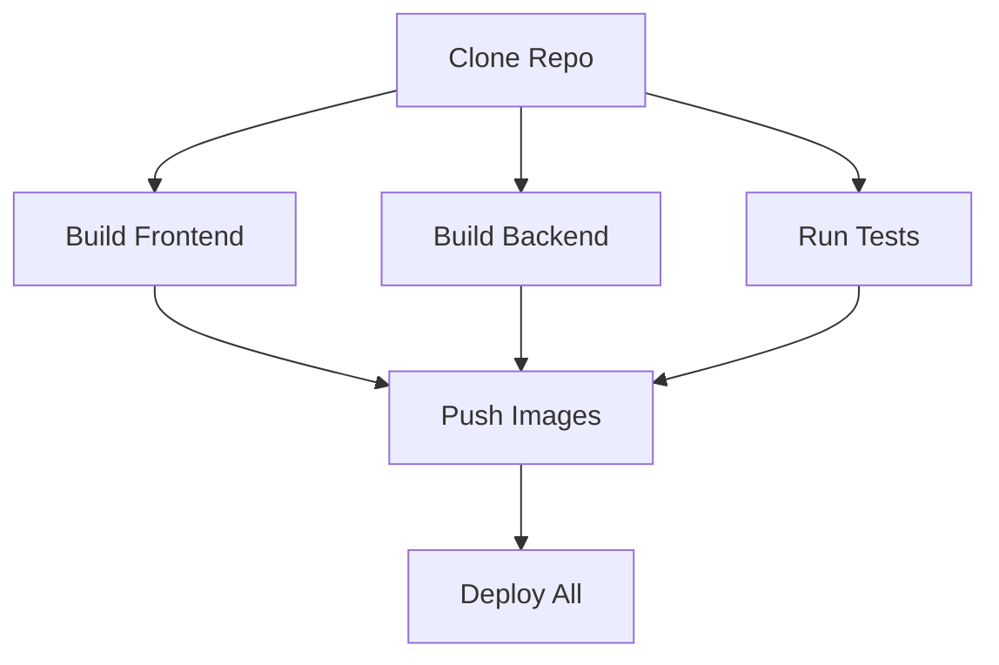

## Your Code's Journey from Commit to Cloud

Every time you push code, a Pipeline springs to life. It's the automated workflow that transforms your source code into a running application. Think of it as your personal deployment assistant that never sleeps, never makes mistakes, and always follows the same reliable process.

> **Pipeline Philosophy**: We believe deployments should be boring—predictable, fast, and forgettable. Pipelines make that happen.

## The Anatomy of a Pipeline

When you push code, here's what happens in your pipeline:


Let's break down each stage:

### 1. Trigger and Initialization

**🎯 Smart Triggering**

Pipelines start when:
- Code is pushed to your configured branch
- A pull request is opened (if enabled)
- You manually trigger a rebuild
- Relevant files change (based on trigger paths)

### 2. Repository Operations

The pipeline efficiently clones your code:

```yaml
# What happens behind the scenes
- task: git-clone
  params:
    url: $(params.repo-url)
    revision: $(params.commit-sha)
    sparse-checkout-directories: $(params.sparse-dirs)  # Optional
```

**Smart Features:**
- **Sparse Checkout**: Only clone what you need (great for monorepos)
- **Shallow Clones**: Faster clones for large repositories
- **Cached Layers**: Reuse unchanged dependencies

### 3. Build Stage

This is where the magic happens. Depending on your configuration:

### Buildpacks (Auto-Magic)

Cloud Native Buildpacks analyze your code and create an optimized image:

```bash
# Behind the scenes
Detecting language...       ✓ Node.js detected
Installing dependencies...  ✓ npm install
Building application...     ✓ npm run build
Creating layers...          ✓ Optimized for caching
Generating image...         ✓ Secure, minimal runtime
```

**What Buildpacks Do For You:**
- Select the right base image
- Install language runtime (correct version)
- Configure build environment
- Install dependencies efficiently
- Apply security patches automatically
- Optimize for container layer caching

### Dockerfile

Your Dockerfile is executed with build optimizations:

```dockerfile
# Your Dockerfile
FROM node:18-alpine
WORKDIR /app
COPY package*.json ./
RUN npm ci --production
COPY . .
EXPOSE 3000
CMD ["node", "server.js"]
```

> **Build Cache**: We cache Docker layers between builds. Structure your Dockerfile to copy dependencies first, code last.

### 4. Image Publishing

Once built, your container image is tagged and pushed:

```bash
# Image naming convention
<registry>/<image-repository-path>:<git-commit-sha>

# Example
us-central1-docker.pkg.dev/my-project/my-api:a3f4c2b7
```

**Key Points:**
- Images are tagged with the exact commit SHA
- Immutable tags ensure you can always rollback
- Registry is environment-specific (dev/staging/prod)

### 5. Deployment

The final stage deploys your new image:

**Kubernetes Deployments**
- Rolling updates with zero downtime
- Automatic rollback on failures
- Health checks before traffic
- Auto-scaling based on load

**Other Platforms**
- AWS ECS task definitions
- Google Cloud Run services
- Azure Container Instances
- Platform-specific optimizations

## Pipeline Performance

We've optimized pipelines for speed. Here's what makes them fast:

### Parallel Execution

When possible, tasks run in parallel:



### Intelligent Caching

**What Gets Cached:**

- **Dependency Cache**: npm modules, pip packages, Go modules, Maven dependencies
- **Layer Cache**: Docker layers between builds for faster image creation
- **Build Cache**: Compiled artifacts, build outputs
- **Test Cache**: Test results for unchanged code

### Resource Allocation

Pipelines get dedicated resources:
- **CPU**: 2-4 cores for build tasks
- **Memory**: 4-8GB RAM
- **Network**: High-speed registry access
- **Storage**: SSD-backed workspace

## Monitoring Your Pipelines

### Real-Time Logs

Follow your pipeline execution:

```bash
# Stream logs as they happen
planton pipeline logs <pipeline-id> --follow

# Get logs for a specific stage
planton pipeline logs <pipeline-id> --stage build
```

### Pipeline Status

Understand what's happening:

```bash
# Quick status check
planton pipeline status <pipeline-id>

# Output
Pipeline: pipeline-7f3a2b1c
Status: Running
Stage: Building Image (2/4)
Duration: 2m 34s
Commit: feat: add user authentication
```

### Notifications

Get notified about pipeline events:
- **Success**: Deployment complete
- **Failure**: Build or deploy failed
- **Manual Approval**: Waiting for approval
- **Rollback**: Automatic rollback triggered

## Advanced Pipeline Features

### Manual Gates

Add approval steps for production deployments:

```yaml
# In your pipeline configuration
stages:
  - name: build
    tasks: [...]
  - name: deploy-staging
    tasks: [...]
  - name: manual-approval
    type: manual
    approvers: ["platform-team", "product-owner"]
  - name: deploy-production
    tasks: [...]
    when: manual-approval.approved
```

### Conditional Execution

Run different pipelines based on conditions:

```yaml
# Deploy to production only from main branch
- task: deploy-production
  when:
    branch: main

# Run integration tests only for API changes
- task: integration-tests
  when:
    paths: ["api/**", "shared/**"]
```

### Custom Tasks

Extend pipelines with custom tasks:

```yaml
# Using Tekton tasks
- task: database-migration
  params:
    - name: migration-script
      value: $(workspaces.source.path)/migrations/latest.sql
    - name: database-url
      value: $(secrets.database.url)
```

## Pull Request Pipelines

When you enable PR deployments, each pull request gets:

**Preview Environment Features:**
- Isolated deployment of your branch
- Unique URL for testing (e.g., `pr-123.preview.your-domain.com`)
- Automatic cleanup when PR is closed
- Comments on PR with deployment status and URL

Enable it in your service:

```yaml
pipeline_configuration:
  enable_pull_request_deployments: true
```

## Debugging Failed Pipelines

When things go wrong (they sometimes do), here's how to debug:

### 1. Check the Logs

```bash
# Get detailed logs
planton pipeline logs <pipeline-id> -v

# Focus on the failed stage
planton pipeline logs <pipeline-id> --stage build --tail 100
```

### 2. Common Issues and Fixes

### Build fails with "out of memory"

Your build needs more resources. Add to your pipeline:
```yaml
resources:
  requests:
    memory: "8Gi"
    cpu: "4"
```

### Cannot find module/package

Ensure all dependencies are properly declared:
- Node.js: Check `package.json`
- Python: Check `requirements.txt`
- Go: Run `go mod tidy`

### Deployment times out

Check your health checks and startup time:
- Increase `initialDelaySeconds` in health checks
- Ensure your app starts within the timeout
- Check for missing environment variables

### 3. Re-run with Debug Mode

```bash
# Re-run pipeline with verbose logging
planton pipeline rerun <pipeline-id> --debug

# This enables:
# - Verbose build output
# - Detailed dependency resolution
# - Step-by-step execution logs
```

## Pipeline Best Practices

### 1. Optimize Build Times

- **Use specific base images** in Dockerfiles
- **Order Dockerfile commands** for better caching
- **Minimize build context** with `.dockerignore`
- **Parallelize independent tasks**

### 2. Secure Your Pipelines

- **Never hardcode secrets** - use Secrets Manager
- **Pin dependency versions** for reproducibility
- **Scan images** for vulnerabilities (automatic)
- **Use least-privilege** service accounts

### 3. Make Pipelines Reliable

- **Add health checks** to catch issues early
- **Use retry logic** for flaky operations
- **Set resource limits** to prevent runaway builds
- **Monitor pipeline metrics** for trends

## What's Next?

Now that you understand pipelines, explore:

- **[Custom Pipelines](/docs/service-hub/custom-pipelines)** - Write your own Tekton pipelines
- **[Pipeline Optimization](/docs/service-hub/pipeline-optimization)** - Make builds even faster
- **[CI/CD Best Practices](/docs/service-hub/cicd-best-practices)** - Industry patterns
- **[Monitoring & Alerts](/docs/service-hub/monitoring)** - Stay informed about your deployments

> **Remember**: The best pipeline is one you don't have to think about. Set it up once, let it run forever.
