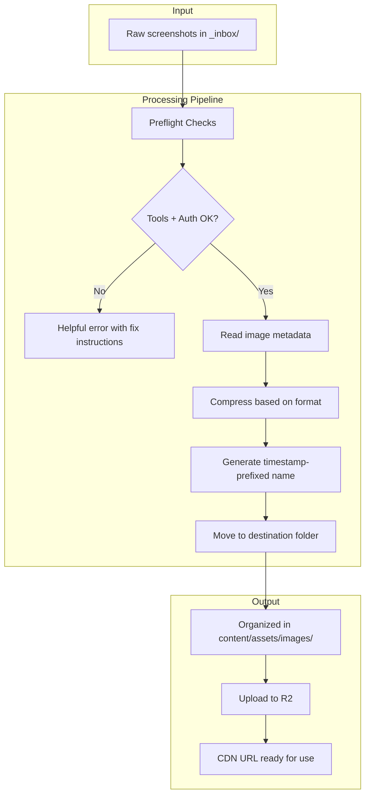
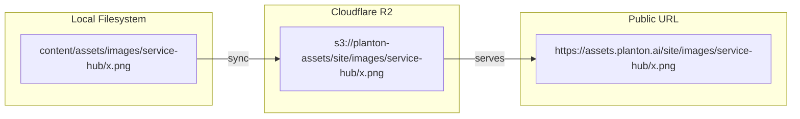

# Image Processor

A Python CLI tool for compressing, organizing, and uploading images to Cloudflare R2 with excellent developer experience.

## Why it exists

Git repositories grow silently. A 2 MB screenshot here, a 5 MB screen recording there—before you know it, cloning takes minutes and every `git pull` drags. Meanwhile, those same images serve users at full, unoptimized size, slowing page loads and burning bandwidth.

The image processor solves both problems in one workflow:

1. **Keep the repo lean**: Compress images before committing (60-70% size reduction typical for PNGs)
2. **Speed up delivery**: Optimized images load faster for website visitors
3. **Consistent organization**: Predictable naming and folder structure across the team
4. **CDN-ready**: Direct upload to Cloudflare R2 with proper content types

Think of it as a preprocessing pipeline: raw screenshots go in, optimized and organized images come out, ready for use in docs and marketing pages.

## Architecture



## How it works

### Compression strategy

The tool uses specialized compressors for each format, prioritizing quality over maximum compression:

| Format | Tool       | Strategy                                                   |
| ------ | ---------- | ---------------------------------------------------------- |
| JPEG   | jpegoptim  | Strip metadata, optimize Huffman tables, cap quality at 90 |
| PNG    | pngquant   | Lossy compression with quality floor of 80%                |
| GIF    | Copy as-is | Animated GIFs shouldn't be recompressed                    |
| WebP   | Copy as-is | Already an efficient format                                |

Typical results:

- PNG screenshots: 60-70% size reduction
- JPEG photos: 20-40% size reduction
- Total savings: ~4 MB per batch of 3 screenshots

### Naming convention

Every image gets a predictable, collision-free name:

```
YYYY-MM-DD-HHMMSS-context-description.ext
│          │       │       │
│          │       │       └── What the image shows
│          │       └── Feature area (service-hub, kubernetes-dashboard, etc.)
│          └── Timestamp (HHMMSS)
└── Date (YYYY-MM-DD)
```

Examples:

- `2025-12-31-103045-service-hub-deployment-pipeline-overview.png`
- `2025-12-31-143500-kubernetes-dashboard-pod-exec-terminal.png`

The timestamp prefix ensures uniqueness and creates natural chronological ordering when browsing the folder.

### R2 mirror structure

The `content/assets/` folder mirrors directly to R2:



Mental model: If a file exists at `content/assets/foo/bar.png`, it's available at `https://assets.planton.ai/site/foo/bar.png`.

## Components

```
image_processor/
├── cli.py           # Main entry point with Click commands
├── preflight.py     # Tool and auth verification
├── compressor.py    # JPEG/PNG compression logic
├── organizer.py     # Naming and file organization
├── uploader.py      # R2 sync with progress
└── config.py        # Bucket names, paths, quality settings
```

### Preflight checks

Before processing, the tool verifies the environment is ready:

1. **jpegoptim** installed (for JPEG compression)
2. **pngquant** installed (for PNG compression)
3. **AWS CLI** configured with `r2` profile
4. **R2 bucket** accessible with valid credentials

If anything fails, you get a clear error with exact fix instructions:

```
Preflight Checks
  ✓ jpegoptim found (jpegoptim v1.5.6)
  ✗ pngquant not found

╭─────────────── To fix pngquant ───────────────╮
│  brew install pngquant                        │
╰───────────────────────────────────────────────╯
```

No cryptic error messages. No guessing what went wrong.

## Usage

### Commands

```bash
# Activate virtual environment first
source .venv/bin/activate

# Check if all tools are installed and R2 is accessible
python -m tools.image_processor check

# List images waiting in the inbox
python -m tools.image_processor inbox

# Process images with context
python -m tools.image_processor process \
  --context "service-hub" \
  --description "deployment-pipeline-overview"

# Sync assets folder to R2 (without processing)
python -m tools.image_processor sync
```

### Typical workflow

1. **Drop screenshots** in `content/assets/_inbox/`

2. **Run the processor** with context about what the images are:

```bash
python -m tools.image_processor process \
  --context "kubernetes-dashboard" \
  --description "pod-logs-streaming"
```

3. **Watch the output**:

```
Processing Images

  [1/3] Screenshot 2025-12-31 at 10.15.32.png
        → 2025-12-31-103045-kubernetes-dashboard-pod-logs-streaming-1.png
        Compressing... 2.4 MB → 890 KB (63% saved)
        Destination: content/assets/images/kubernetes-dashboard/
        ✓ Moved

Uploading to R2
  Syncing assets/ → assets.planton.ai/site/
  ✓ 3 files uploaded

URLs
  https://assets.planton.ai/site/images/kubernetes-dashboard/2025-12-31-103045-kubernetes-dashboard-pod-logs-streaming-1.png
```

4. **Use the URLs** in docs or website components.

### Makefile targets

For convenience, the root Makefile wraps common operations:

```bash
make check-images     # Run preflight checks
make inbox            # List inbox contents
make sync-content     # Sync to R2
```

## Integration with cursor rules

The tool is designed to be invoked by the `@process-planton-ai-images` cursor rule in `content/assets/_rules/`. When you drop images in the inbox and invoke the rule with context about what the images are, the AI:

1. Analyzes your context to determine appropriate naming
2. Generates the CLI command with correct flags
3. Executes the processor
4. Reports the resulting URLs

This keeps the human in the loop for naming decisions while automating the mechanical work of compression and upload.

## Configuration

All configuration lives in `config.py`:

```python
# R2 bucket settings
R2_BUCKET = "planton-assets"
R2_ENDPOINT = "https://074755a78d8e8f77c119a90a125e8a06.r2.cloudflarestorage.com"
R2_PROFILE = "r2"
R2_BASE_PATH = "site/content"
R2_PUBLIC_URL = "https://assets.planton.ai"

# Compression quality
JPEG_QUALITY_MAX = 90
PNG_QUALITY_RANGE = "80-95"
```

These defaults prioritize quality. If you need smaller files at the cost of some quality, lower the quality values.

## Prerequisites

### CLI tools

```bash
brew install jpegoptim pngquant awscli
```

### Python environment

```bash
# Create virtual environment (one-time)
python3 -m venv .venv

# Activate and install dependencies
source .venv/bin/activate
pip install -r tools/image_processor/requirements.txt
```

### R2 credentials

Get API tokens from the Cloudflare dashboard and configure AWS CLI:

```bash
aws configure --profile r2
# Access Key ID: (from Cloudflare)
# Secret Access Key: (from Cloudflare)
# Region: auto
# Output format: json
```

## Dependencies

| Package | Version | Purpose                                                   |
| ------- | ------- | --------------------------------------------------------- |
| rich    | ≥13.0.0 | Beautiful terminal output (colors, tables, progress bars) |
| click   | ≥8.1.0  | CLI argument parsing                                      |
| Pillow  | ≥10.0.0 | Image metadata reading                                    |
| boto3   | ≥1.34.0 | S3/R2 uploads                                             |

## Design decisions

### Why Python over Go?

The planton.ai website is a Next.js project. Adding a Go binary would require cross-compilation and more complex build setup. Python with a virtual environment:

- Works on any developer machine with Python 3
- Dependencies install with `pip`
- Easy to modify and extend
- Rich library ecosystem for terminal UX

### Why CLI tools for compression?

jpegoptim and pngquant are battle-tested, widely available, and produce better results than pure Python libraries. The subprocess overhead is negligible compared to the compression time savings.

### Why not a GitHub Action?

This tool runs locally, before commit. Benefits:

- Immediate feedback while authoring
- No waiting for CI to process images
- Images are already optimized when pushed
- R2 sync happens from the developer's machine

A GitHub Action could be added later for enforcement, but the local workflow is the primary path.

## Troubleshooting

### "No module named tools.image_processor"

Ensure you're in the planton.ai root directory and have activated the virtual environment:

```bash
cd /path/to/planton.ai
source .venv/bin/activate
python -m tools.image_processor check
```

### R2 bucket not accessible

1. Verify the bucket exists (may need to deploy via Pulumi first)
2. Check AWS CLI profile: `aws configure list --profile r2`
3. Test access directly: `aws s3 ls s3://planton-assets --profile r2 --endpoint-url https://074755a78d8e8f77c119a90a125e8a06.r2.cloudflarestorage.com`

### Images not compressing much

Some images are already optimized. The tool reports when compression doesn't reduce size and keeps the original quality.

## Related files

- `content/assets/_inbox/` - Drop zone for raw images
- `content/assets/_rules/process-images.mdc` - Cursor rule that invokes this tool
- `content/assets/_rules/README.md` - Workflow documentation with diagrams
- `Makefile` - Convenience targets for common operations
